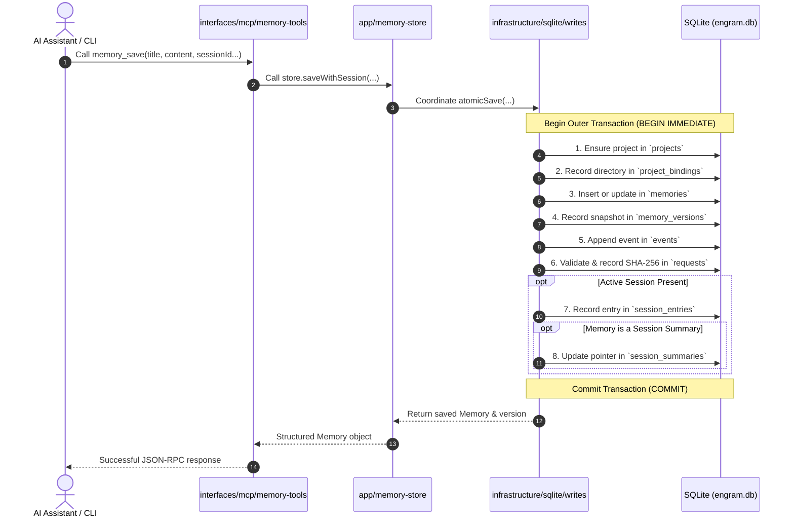

# 05 (EN). Internal Architecture, Modular Monolith, FTS5, and Ranking Formulas

> **Stage:** Feature-Oriented Modular Monolith, Progressive Memory Sessions, Ranked Context, Local MCP (10 Tools), Assistant TUI Menu & PostgreSQL Replica Format 2
> **Release Versions:** Program 0.5.0 | Configuration Formats 2 (local) / 3 (with sync) | SQLite Schemas 3 (local) / 4 (with sync) | SQLite Schemas 5 (assistant integration & local bindings) / 6 (progressive memory sessions & ranked context) | PostgreSQL Formats 1 & 2
> **Status:** Current & Active (369 total tests across 69 files: 361 passed and 8 skipped without isolated PostgreSQL test binaries; 369 passed, 0 failures, 1891 assertions with `FORGE614_TEST_POSTGRES_BIN` configured on macOS with Bun 1.3.8)
> **Sister translation:** [05. Arquitectura Interna, Monolito Modular por Funcionalidad, SQLite FTS5 y Fórmulas Matemáticas](../es/05-arquitectura-interna-y-formulas.md)

This document provides a technical thesis on the internal architecture of Forge614 Engram: the foundations of the **feature-oriented modular monolith** refactoring, prior architectural challenges and evaluated alternatives, the real directory tree and component responsibilities, import dependency rules and automated AST auditing, composite outer transactions, the change placement guide, colocated testing architecture, preserved invariants, pattern boundaries, low-level SQLite engine pragmas, relational schemas v3 to v6, the stdio MCP server exposing 10 tools, and mathematical formulas for BM25, recency ranking, and payload byte budgets.

---

## 1. The Chosen Pattern: Feature-Oriented Modular Monolith

### 1.1. Pattern Name and Definition
The architectural pattern implemented in this release is the **Feature-Oriented Modular Monolith**.

- **Monolith:** The system compiles, packages, and runs as a single deployable executable binary (`forge614-engram`) running within a single local operating system process on your machine. It is not partitioned into distributed microservices, uses zero internal inter-service network calls, and requires no auxiliary background daemon processes.
- **Feature-Oriented Modular:** The internal codebase is partitioned along cohesive business concept boundaries (memory, projects, sessions, search, synchronization, workspace, assistants), rather than purely by technical layer. Each feature module owns its validation rules and exposes an explicit public boundary (`index.ts`).

> [!NOTE]
> **A Contextual Choice, Not a Universal Mandate:** The selection of a feature-oriented modular monolith is a pragmatic engineering decision tailored for a local CLI utility and synchronous TypeScript SDK sharing a single database file (`~/.forge614/engram.db`) and a single configuration file (`~/.forge614/.env`). It is not promoted here as an absolute dogma or universal standard for all software development.

### 1.2. Concrete Prior Problems and Refactoring Motivation
Prior to this release, Engram's codebase had grown organically to approximately **3,154 lines of production code** with notable cohesion challenges:
1. **Flat Root Directory Congestion:** Storage SQL, domain types, session lifecycle checks, FTS5 retrieval queries, assistant configuration files, terminal UI logic, and MCP tools were intermingled in the root of `src/`.
2. **`MemoryStore` God Object:** The `MemoryStore` class (in legacy `src/store.ts`) accumulated DDL migrations, project mutations, immutable version snapshotting, event transaction auditing, progressive session tracking, search scoring, and replication snapshot export.
3. **Coupling of Presentation and Infrastructure:** The terminal user interface (TUI) resolved binary paths, launched sub-process self-tests, and modified configuration files directly, complicating isolated testing.
4. **Fragile Relative Test Paths:** Tests frequently reached across deep relative paths into internal modules, breaking when internal files moved.

### 1.3. Evaluated Alternatives and Real Architectural Costs

```text
┌─────────────────────────────────────────────────────────────────────────────────┐
│                     ARCHITECTURAL COMPARISON MATRIX                             │
├───────────────────────┬───────────────────────────────┬─────────────────────────┤
│ Approach              │ Strengths                     │ Real Costs / Trade-offs │
├───────────────────────┼───────────────────────────────┼─────────────────────────┤
│ Global Layered        │ Intuitive initial structure   │ Feature dispersion:     │
│ Architecture          │ (models/, services/, repos/). │ modifying sessions      │
│ (Layered)             │                               │ requires edits across   │
│                       │                               │ 4 distant directories.  │
├───────────────────────┼───────────────────────────────┼─────────────────────────┤
│ Strict Hexagonal      │ Total abstract replacability  │ Massive over-engineering│
│ Architecture          │ via ports and adapters for    │ for a local CLI:        │
│ (Ports & Adapters)    │ all operations.               │ generic repositories,   │
│                       │                               │ DI container, 3x boilerplate.│
├───────────────────────┼───────────────────────────────┼─────────────────────────┤
│ Feature-Oriented      │ Cohesion by business concept, │ Requires strict import  │
│ Modular Monolith      │ direct synchronous SQL, clean │ discipline, barrel      │
│ (CHOSEN)              │ public barrels, AST automated │ maintenance, and AST    │
│                       │ dependency enforcement.       │ architectural checks.   │
└───────────────────────┴───────────────────────────────┴─────────────────────────┘
```

- **Why Global Layered Architecture Was Rejected:** Grouping files into global technical buckets (`src/models/`, `src/services/`, `src/repositories/`) scatters feature logic. A single change to progressive memory sessions required navigating distant directories, obscuring functional cohesion.
- **Why Strict Hexagonal Architecture Was Rejected:** Introducing generic repository interfaces, dependency injection containers, and separate domain ports for every SQLite query was excessive for a local, single-process, synchronous tool.
- **Not Full DDD or Microservices:** We do not claim strict *Domain-Driven Design* (DDD) purity, event-sourcing architectures, or microservices. Pragmatic boundaries were drawn without superfluous ceremony.
- **Real Incurred Costs:** Maintaining explicit barrel exports (`index.ts`), enforcing strict boundary layers, and writing a dedicated TypeScript AST analyzer to prevent illegal imports.

---

## 2. Actual Tree and Directory Responsibilities

The production source tree in `src/` is structured into four concentric conceptual layers, plus a minimal entry runner and shared error primitives:

```text
src/
├── cli.ts                         # [Minimal Bootstrap] 2-line runner delegating to CLI
├── index.ts                       # [Public SDK Barrel] Immutable external entry point
│
├── app/                           # [Flow Coordination & Workflows]
│   ├── index.ts                   # Application barrel
│   ├── memory-store.ts            # Compatible facade preserving legacy MemoryStore
│   ├── workspace.ts               # Central workspace lifecycle (MemoryWorkspace)
│   ├── project-context.ts         # Git identity and path resolution coordinator
│   ├── synchronization.ts         # Replication coordinator (pure logic, no terminal I/O)
│   ├── setup.ts                   # Setup workflow state machine (SetupIO)
│   └── assistants.ts              # Assistant discovery and configuration workflow
│
├── modules/                       # [Pure Business Rules & Types] (Zero I/O)
│   ├── memory/                    # Memory domain types, validation, topic policies
│   ├── projects/                  # Immutable UUID project identity rules
│   ├── sessions/                  # Progressive session rules, summaries, inference
│   ├── search/                    # Query terms, Unicode code point & byte boundaries
│   ├── synchronization/           # Snapshot models and 3-way merge logic
│   ├── workspace/                 # Central workspace configuration contracts
│   └── assistants/                # Assistant catalog, memory protocol, and hooks
│
├── infrastructure/                # [Concrete I/O Adapters]
│   ├── sqlite/                    # SQLite engine adapters partitioned by feature
│   │   ├── connection.ts          # WAL connection with strict pragmas
│   │   ├── schema.ts              # DDL for Schemas 3, 4, 5, and 6
│   │   ├── projects.ts            # Project queries and local bindings
│   │   ├── memory.ts              # Memory queries and version reads
│   │   ├── writes.ts              # Atomic composite outer transactions
│   │   ├── sessions.ts            # Session queries and entry recordings
│   │   ├── search.ts              # SQLite FTS5 trigram queries and projections
│   │   ├── snapshots.ts           # Local snapshot serialization and CAS checks
│   │   └── workspace-database.ts  # Database file lifecycle
│   ├── postgres/                  # Remote PostgreSQL replica transport (replica.ts)
│   ├── filesystem/                # System paths (paths.ts), .env atomic I/O, backups
│   ├── git/                       # Canonical repository resolution (--git-common-dir)
│   └── assistants/                # Assistant file adapters and process self-test
│
├── interfaces/                    # [Delivery & User/Assistant Interaction]
│   ├── cli/                       # Argument parsing, command dispatch, JSON output
│   ├── mcp/                       # Stdio server, Zod schemas, memory tools dispatch
│   ├── tui/                       # Full-screen TUI terminal state, ANSI render, keyboard
│   └── terminal/                  # Interactive setup I/O, OS signals, sync-watch loop
│
└── shared/                        # [Shared Fundamental Primitives]
    └── errors.ts                  # Single unified MemoryError class for the system
```

### Component Responsibilities:
1. **`src/cli.ts` (Minimal CLI Bootstrap):**
   Contains exactly **two lines of code**: imports `main` from `./interfaces/cli/main` and runs it passing `process.argv.slice(2)`. Contains zero business logic, verified by standalone installer tests in an isolated PTY.
2. **`src/index.ts` (Public SDK Barrel):**
   Immutable public entry point for TypeScript consumers. **Internal repository code never imports `src/index.ts`**, preventing circular dependencies from export definitions back into implementation components.
3. **`src/app/memory-store.ts` (Compatible Facade):**
   Implements the Facade design pattern: preserves 100% of historical `MemoryStore` method signatures and behavior while delegating internally to specialized partitioned modules in `src/infrastructure/sqlite/`.
4. **`src/infrastructure/sqlite/writes.ts` (Composite Transaction Coordinator):**
   Owns the single shared SQLite database connection and executes composite outer transactions atomically (`BEGIN IMMEDIATE ... COMMIT`) across projects, bindings, memories, versions, events, requests, session entries, and summary pointers.

---

## 3. Before/After Mapping and Public API Stability

The table below details the exact mapping from legacy flat files in `src/` to their modular destinations:

| Original Flat File | Modular Destination | Extracted Responsibility |
| :--- | :--- | :--- |
| `src/domain.ts` | `src/modules/memory/` & `src/modules/projects/` | Domain types (`Memory`, `Project`, etc.). `MemoryError` moved to `src/shared/errors.ts`. |
| `src/identity.ts` | `src/modules/projects/identity.ts` | UUIDv4 format validation and generation. |
| `src/session-types.ts` & `src/sessions.ts` | `src/modules/sessions/` & `src/infrastructure/sqlite/sessions.ts` | Session business rules separated from SQLite queries and persistence. |
| `src/retrieval-types.ts` & `src/retrieval.ts` | `src/modules/search/` & `src/infrastructure/sqlite/search.ts` | Terms and boundary limits in module; FTS5 queries in infrastructure. |
| `src/store.ts` | `src/app/memory-store.ts` + `src/infrastructure/sqlite/*` | Facade in `app/` and SQL operations partitioned functionally. |
| `src/schema.ts` | `src/infrastructure/sqlite/schema.ts` | DDL statements and schema version validation (v3 to v6). |
| `src/sync-snapshot.ts` | `src/modules/synchronization/` | Snapshot data models and 3-way reconciliation algorithms. |
| `src/sync-local.ts` | `src/infrastructure/sqlite/snapshots.ts` | Local snapshot extraction and application on SQLite. |
| `src/sync-postgres.ts` | `src/infrastructure/postgres/replica.ts` | Remote PostgreSQL replica transport and CAS verification. |
| `src/synchronize.ts` & `src/sync-runner.ts` | `src/app/synchronization.ts` & `src/interfaces/terminal/sync-watch.ts` | Workflow coordination in `app/`; clock loop, signals, and terminal output in `interfaces/`. |
| `src/paths.ts` | `src/infrastructure/filesystem/paths.ts` | User directory paths (`~/.forge614/`) and environment defaults. |
| `src/workspace-config.ts` | `src/infrastructure/filesystem/workspace-config.ts` | Atomic read/write operations and `.config-lock` over `~/.forge614/.env`. |
| `src/workspace-database.ts` | `src/infrastructure/sqlite/workspace-database.ts` | Database file validation and opening. |
| `src/workspace.ts` | `src/app/workspace.ts` | Central user workspace coordination (`MemoryWorkspace`). |
| `src/project-context.ts` | `src/app/project-context.ts` + `src/infrastructure/git/` | Project resolution coordination with Git root detection. |
| `src/setup.ts` | `src/app/setup.ts` | Configuration wizard logic (`SetupFlow`) with abstract `SetupIO` interface. |
| `src/setup-terminal.ts` | `src/interfaces/terminal/setup.ts` | Interactive TTY terminal implementation of `SetupIO`. |
| `src/cli.ts` (legacy) | `src/cli.ts` (minimal) + `src/interfaces/cli/*` | Command argument parser, help text, and dispatch handlers. |
| `src/mcp.ts` & `src/mcp-tools.ts` | `src/interfaces/mcp/*` | Stdio server transport, Zod schemas, and tool execution handlers. |
| `src/memory-protocol.ts` | `src/modules/assistants/protocol.ts` | Memory protocol guidelines for coding assistants. |
| `src/assistants/catalog.ts` | `src/modules/assistants/catalog.ts` + `infrastructure/assistants/` | Assistant metadata in module; filesystem detection in infrastructure. |
| `src/assistants/configuration.ts` | `src/infrastructure/assistants/configuration.ts` | Adapters for Claude Code, Codex, Cursor, OpenCode, and Gemini CLI. |
| `src/assistants/files.ts` | `src/infrastructure/filesystem/private-files.ts` | Safe file mutations with `0600`/UUID backups and locks. |
| `src/assistants/hooks.ts` | `src/modules/assistants/` + `src/interfaces/terminal/hooks.ts` | Hook templates in module; CLI hook dispatch in interfaces. |
| `src/assistant-self-test.ts` | `src/infrastructure/assistants/self-test.ts` | Sub-process self-test for MCP server validation. |
| `src/assistant-tui.ts` & `render.ts` | `src/interfaces/tui/controller.ts` & `src/interfaces/tui/render.ts` | TUI state machine, ANSI rendering, and keyboard event handling. |

> [!WARNING]
> **Deep Internal Paths Removed:** Previous direct paths (such as `import { MemoryStore } from "./store"`) have been deleted. External consumers must import strictly from `src/index.ts` or `@forge614/engram`.

---

## 4. Allowed and Forbidden Dependencies & AST Architecture Auditor

### 4.1. Dependency Rules Matrix
To prevent architectural degradation and cross-layer coupling, strict import rules are enforced:

```text
┌─────────────────┐       ┌─────────────────┐
│   interfaces    │ ────► │       app       │
└────────┬────────┘       └────────┬────────┘
         │                         │
         │ (types/shared)          ├────────────────┐
         ▼                         ▼                ▼
┌─────────────────┐       ┌─────────────────┐ ┌──────────────┐
│     modules     │ ◄──── │ infrastructure  │ │    shared    │
└─────────────────┘       └─────────────────┘ └──────────────┘
```

1. **`modules` Layer (Pure Business Rules):**
   - **Allowed:** Pure TypeScript types, cryptographic hash utilities (`node:crypto` for payload hashing, `node:util`), and directed cross-module dependencies (e.g., `memory` imports `projects`; `sessions` imports `memory` and `projects`).
   - **Forbidden:** Never imports `app`, `interfaces`, `infrastructure`, `bun:sqlite`, `node:fs`, `node:net`, or child processes.
2. **`infrastructure` Layer (Concrete Adapters):**
   - **Allowed:** Imports public entries of `modules` and `shared`. Performs I/O on databases, filesystem, git, or child processes.
   - **Forbidden:** Never imports `app` or `interfaces`.
3. **`app` Layer (Workflow Coordinators):**
   - **Allowed:** Connects and coordinates `modules`, `infrastructure`, and `shared`.
   - **Forbidden:** **Never imports `interfaces`**. Does not print to stdout or dispatch JSON-RPC frames.
4. **`interfaces` Layer (Presentation & Transport):**
   - **Allowed:** Consumes `app`, `modules`, and `shared`. The CLI interface (`interfaces/cli/main.ts`) may compose sibling interfaces `interfaces/mcp/server`, `interfaces/tui/controller`, and `interfaces/terminal/setup`.
   - **Forbidden:** **Never imports `infrastructure` directly**. Never executes direct SQL statements.
5. **Public SDK Isolation:**
   - **Strict Rule:** Internal production code within `src/` cannot import `src/index.ts`. This ensures that the public export barrel cannot introduce circular dependencies into the components it re-exports.

### 4.2. Circular Dependency Detection via TypeScript AST
A circular dependency occurs when module A imports module B, and module B directly or indirectly imports module A ($A \to B \to C \to A$). This causes tight coupling, breaks unit testing, and risks runtime initialization errors (`TDZ` reference errors).

To prevent this automatically, Engram includes a **TypeScript AST Architecture Auditor** (`tests/architecture/import-rules.ts`):
- Parses all TypeScript source files using the TypeScript compiler API without external linting plugins.
- Builds a directed graph of components (`graph.set(from, to)`).
- Executes a Depth-First Search (DFS) tracking traversal state via two sets: `visiting` (active call stack) and `visited` (fully inspected paths).
- If DFS encounters a node already present in `visiting`, it halts the test suite and reports: `component cycle: A -> B -> C -> A`.

---

## 5. Complete Execution Flows and Composite Outer Transactions

### 5.1. Atomic Save Flow and Outer Transactions
When saving a memory from the CLI or via the MCP tool `memory_save`, multiple database tables must update as an indivisible unit:



- **Shared Single Connection:** All persistence writes route through `infrastructure/sqlite/writes.ts`. Table helpers (`memory.ts`, `projects.ts`, `sessions.ts`) receive the **same active database connection** and participate within the outer transaction (`BEGIN IMMEDIATE ... COMMIT`). No individual helper commits independently, guaranteeing transactional integrity.

### 5.2. Search Execution Flow
1. **Interface (`interfaces/mcp/` or `interfaces/cli/`):** Receives query string, limit, and `--preview` flag.
2. **Coordination (`app/memory-store.ts`):** Dispatches to synchronous search.
3. **Module (`modules/search/`):** Normalizes terms, validates byte limits and Unicode boundaries.
4. **Infrastructure (`infrastructure/sqlite/search.ts`):** Queries `memories_fts` using trigram weights, evaluates BM25 recency formulas, and formats truncated or full text projections.

### 5.3. Synchronization Flow and 3-Way Reconciliation
1. **Coordination (`app/synchronization.ts`):** Fetches local snapshot from `infrastructure/sqlite/snapshots.ts` and remote state from `infrastructure/postgres/replica.ts`.
2. **Module (`modules/synchronization/`):** Performs pure deterministic 3-way merge logic without network I/O.
3. **Infrastructure (`infrastructure/postgres/replica.ts`):** Publishes the merged snapshot to PostgreSQL using a Compare-and-Swap (CAS) lock on the state header hash. If another machine pushed concurrently, CAS rejects the mutation with `SYNC_CONFLICT`.

---

## 6. Where to Put a Change: Developer Placement Guide

Use this reference table to locate the exact destination for new features or modifications:

| Type of Change | Target Layer | Exact File Paths |
| :--- | :--- | :--- |
| **New memory validation rule** (e.g. title character length limit) | `modules` | `src/modules/memory/validation.ts` (pure logic, no SQL or filesystem). |
| **New memory type** (e.g. `checklist` category) | `modules` | `src/modules/memory/types.ts` and update `memoryTypes` array. |
| **New CLI terminal command** | `interfaces` | `src/interfaces/cli/commands.ts` (execution) and `src/interfaces/cli/arguments.ts` (argument parsing). |
| **New MCP server tool** | `interfaces` | `src/interfaces/mcp/memory-tools.ts` or `sessions-tools.ts`, schema in `schemas.ts`, register in `server.ts`. |
| **New SQLite query or table** | `infrastructure` | `src/infrastructure/sqlite/<area>.ts` and update DDL in `schema.ts`. |
| **New interactive TUI screen** | `interfaces` | `src/interfaces/tui/render.ts` (ANSI drawing) and `src/interfaces/tui/controller.ts` (key/state management). |
| **New interactive terminal prompt** (questions / secrets) | `interfaces` | `src/interfaces/terminal/<name>.ts`, coordinated via abstract interface in `app/`. |
| **Future Vector Embedding Provider (Phase 5)** | `modules` & `infrastructure` | Contracts and ranking in `src/modules/search/`, vector inference adapter in `src/infrastructure/search/` (or dedicated adapter). **Do not couple with CLI commands or claim it exists yet.** |

---

## 7. Colocated Testing Architecture and Verified Evidence

### 7.1. Colocated Testing Philosophy
The organizing unit for tests in Forge614 Engram is the **behavior owner**, not the abstract test category:
- **Colocated Sibling Tests (`<name>.test.ts`):** Every behavior-bearing implementation file has its own sibling test file located directly alongside it (e.g., `src/infrastructure/sqlite/memory.ts` is paired with `src/infrastructure/sqlite/memory.test.ts`). All **46 logic-bearing implementation files** have an individual sibling test.
- **Local Collaboration Suites (`__tests__/`):** When multiple components within a feature collaborate closely (such as `MemoryStore` with SQLite and sessions), collaboration tests reside in a local `__tests__/` subfolder within that feature's directory (e.g. `src/app/__tests__/sessions.integration.test.ts`).
- **Strict Suite Rule:** Test suites import production code; **test suites never import other test suites**.
- **Root `tests/` Reserved for Cross-Cutting Checks:**
  - `tests/architecture/`: Import boundary audits (`import-rules.ts`) and test placement enforcement (`test-layout.ts`).
  - `tests/e2e/`: Standalone compiled executable installation, stdio MCP handshake, and PTY virtual terminal tests.
  - `tests/fixtures/`: Synthetic test helpers and historical fixtures (e.g. Format 1 snapshots).
  - `src/index.test.ts`: Public SDK contract and immutable export verification.

> [!IMPORTANT]
> **File Pairing $\neq$ 100% Branch Coverage:** Having a sibling test file for every logic-bearing file demonstrates that every component has an identified test owner, but **does not equate to an assertion of 100% branch coverage**. Collaboration suites and meaningful behavioral assertions remain necessary.
>
> **Justified Exceptions:** Files containing solely type definitions (`types.ts`), static configuration, or re-exports require no artificial tests. The 2-line executable runner `src/cli.ts` delegates to `interfaces/cli/main.ts` and is verified via standalone binary installation tests.

### 7.2. Verification Commands and Observed Evidence

```bash
# 1. Run the complete automated test suite
bun test

# 2. Verify architectural import boundaries and test layout
bun test tests/architecture

# 3. Verify strict TypeScript compilation (zero errors)
bun run typecheck

# 4. Verify clean Git formatting
git diff --check
```

### 7.3. Test Count Evolution

```text
┌─────────────────────────────────────────────────────────────────────────────────┐
│                       TEST VERIFICATION MILESTONES                              │
├───────────────────────────────┬──────────────┬───────────────┬──────────────────┤
│ Verification Milestone        │ Tests        │ Files         │ Assertions       │
├───────────────────────────────┼──────────────┼───────────────┼──────────────────┤
│ Prior Baseline (Handoff 09)   │ 250 pass     │ 18 files      │ 1506 assertions  │
├───────────────────────────────┼──────────────┼───────────────┼──────────────────┤
│ First Modular Reorganization  │ 289 pass     │ 30 files      │ 1583 assertions  │
├───────────────────────────────┼──────────────┼───────────────┼──────────────────┤
│ Final Colocated Test Suite    │ 369 pass*    │ 69 files      │ 1891 assertions  │
│ (Entrega 10)                  │ (361 pass /  │               │ (30.69s)         │
│                               │  8 skip PG)  │               │                  │
└───────────────────────────────┴──────────────┴───────────────┴──────────────────┘
* Note: The 8 skipped tests are PostgreSQL replication scenarios when FORGE614_TEST_POSTGRES_BIN
  is not configured in the local shell. When an isolated test PostgreSQL binary is provided,
  all 369 tests pass with 0 failures.
```

---

## 8. What Did NOT Change in This Release

To guarantee absolute backward compatibility for existing users and tools, the following invariants were preserved:
1. **SQLite Database Schemas:** Schemas 3, 4, 5, and 6 retain identical DDL, column types, FTS5 virtual tables, and `PRAGMA application_id = 1177956660`.
2. **PostgreSQL Replication Formats:** Snapshots Format 1 and Format 2, table schemas, SHA-256 hashing, and atomic CAS promotions remain unchanged.
3. **TypeScript SDK Public Signatures:** `MemoryWorkspace`, `WorkspaceConfig`, `MemoryStore`, `MemoryError`, and their synchronous methods maintain identical signatures in `src/index.ts`.
4. **Terminal CLI Commands & Flags:** All commands (`save`, `get`, `search`, `timeline`, `context`, `session-start`, `session-end`, `session-summary`, `tui`, `setup`, `sync`, etc.) preserve their syntax, exit codes, and JSON outputs.
5. **MCP Server Protocol & Catalog:** The stdio server retains **all 10 native tools**, clean stdout JSON-RPC channels, and identical Zod schemas.
6. **Central User Paths & Permissions:** Directory `~/.forge614/`, configuration `.env`, database `engram.db`, and secure permissions (`0700` / `0600`) remain intact.
7. **Standalone Binary Name:** The compiled executable remains `forge614-engram`.

---

## 9. Architectural Boundaries and Pattern Limits

We transparently state what this architectural pattern **does not** do:
1. **Does not eliminate software bugs automatically:** Partitioning code clarifies ownership, but does not prevent logic errors, race conditions, or unhandled exceptions.
2. **Does not distribute processes over the network:** Engram remains a single-process local monolith; it does not introduce network microservices.
3. **Does not make components hot-swappable at runtime:** Decoupling helps developer maintenance, but does not allow swapping modules dynamically without rebuilds.
4. **Requires continuous import discipline:** Without the automated AST auditor running in CI, modular boundaries would erode over time through accidental imports.
5. **Does not introduce AI models or semantic search:** This refactoring is purely structural. Vector embeddings, cosine similarity, and hybrid search belong to Phase 5.

---

## 10. SQLite Low-Level Pragmas, WAL Concurrency, and Relational Schemas

Forge614 Engram executes over Bun's embedded SQLite engine (`bun:sqlite`), initialized in `src/infrastructure/sqlite/connection.ts` with strict operational directives:

1. **`PRAGMA foreign_keys = ON;`**
   Enforces absolute referential integrity across memories, versions, events, sessions, and bindings.
2. **`PRAGMA busy_timeout = 5000;`**
   If concurrent writers collide, SQLite waits up to **5,000 milliseconds (5 seconds)** before raising a busy error.
3. **`PRAGMA application_id = 1177956660;`**
   Unique application identifier verified before interacting with any database file.
4. **`PRAGMA user_version = 3`, `4`, `5`, or `6`;**
   - **Version 3:** Pure local storage without sync or assistant bindings.
   - **Version 4:** Storage with PostgreSQL sync enabled (adds `sync_checkpoints`).
   - **Version 5:** Storage with assistant integration and local bindings (adds `project_bindings`).
   - **Version 6:** Storage with progressive memory sessions and ranked context (`sessions`, `session_entries`, `session_summaries`, `local_session_bindings`, `local_manual_sessions`).
   - **Opening Rule:** Standard database opens, queries, and MCP startup **never auto-migrate the database**.
5. **`PRAGMA journal_mode = WAL;` (Write-Ahead Logging)**
   - Readers never block writers and writers never block readers.
   - Cold read-only queries on macOS are ensured by executing an immediate empty transaction (`BEGIN IMMEDIATE; COMMIT;`) upon creation.

---

## 11. Search Mathematical Formulas and Data Budgets

### 11.1. BM25 Ranking in SQLite FTS5
SQLite FTS5 ranks matches using the BM25 formula (*Best Matching 25*):

$$\text{BM25}(D, Q) = \sum_{i=1}^{N} \text{IDF}(q_i) \cdot \frac{f(q_i, D) \cdot (k_1 + 1)}{f(q_i, D) + k_1 \cdot \left(1 - b + b \cdot \frac{|D|}{\text{avgdl}}\right)}$$

- Engine parameters: $k_1 = 1.2$, $b = 0.75$.
- Column weights: `title: 5.0`, `topic_key: 3.0`, `content: 1.0`.
- **Negative values in SQLite:** SQLite FTS5 `bm25()` returns negative floats where more negative values indicate stronger relevance.

### 11.2. Pinned and Recency Multiplier
To integrate user pinning and temporal freshness with BM25:

$$\text{multiplier} = 1 + 0.10 \times \text{pinned} + \frac{0.06}{1 + \frac{\text{ageDays}}{30}}, \quad (\text{ageDays} \ge 0)$$

where:
- $\text{pinned} \in \{0, 1\}$: 1 if pinned, 0 otherwise.
- $\text{ageDays} = \max\left(0, \text{julianday}('now') - \text{julianday}(m.\text{updated\_at})\right)$.
- New ($\text{ageDays} = 0$) and pinned ($\text{pinned} = 1$) memories reach a maximum multiplier of $1.16$.
- As time passes, recency smoothly decays toward 0, with multiplier converging to $1.00$ (or $1.10$ if pinned).

**Order Score Calculation:**
$$\text{orderScore} = \text{bm25} \times \text{multiplier}$$

Queries sort ascending by `bm25 * multiplier ASC, m.id ASC`, prioritizing relevant and recent memories while breaking ties deterministically with UUID `m.id`.

### 11.3. Distinct Boundaries: Code Points vs JSON Bytes vs Tokens
Engram applies three distinct limit metrics:
1. **Unicode Code Points:**
   - In `memory_search` with `--preview` and `memory_context`: bounded to **300 Unicode code points** with `truncated: true`.
   - In `memory_timeline`: focus bounded to **500 code points**, neighbors to **150 code points**.
2. **UTF-8 JSON Serialization Bytes (`--max-bytes`):**
   - In `memory_context`: bounds total UTF-8 bytes of serialized JSON output between `1024` and `65536` bytes (default `16384` bytes / 16 KiB).
3. **LLM Token Budgets:**
   - **Neither metric represents model tokens.** AI clients manage their own context windows according to their specific tokenizer.

---

## 12. Design Lineage and Attribution

Forge614 Engram formally credits its design lineage:
- **Gentleman Programming Inspiration:** Progressive lookup, preview cards, versioned reads, and session timelines were inspired by Gentleman Programming concepts.
- **Forge614 Native Innovations:**
  - Feature-oriented modular monolith architecture with automated AST dependency enforcement.
  - Immutable UUID project identity decoupled from filesystem paths or display names.
  - Canonical Git resolution across linked worktrees via `--git-common-dir`.
  - Deterministic session inference (0, 1, or multiple candidates).
  - Direct PostgreSQL 3-way synchronization with atomic CAS Format 2 promotion.
  - Systematic colocated sibling testing with 1:1 pairing for all logic-bearing files.
