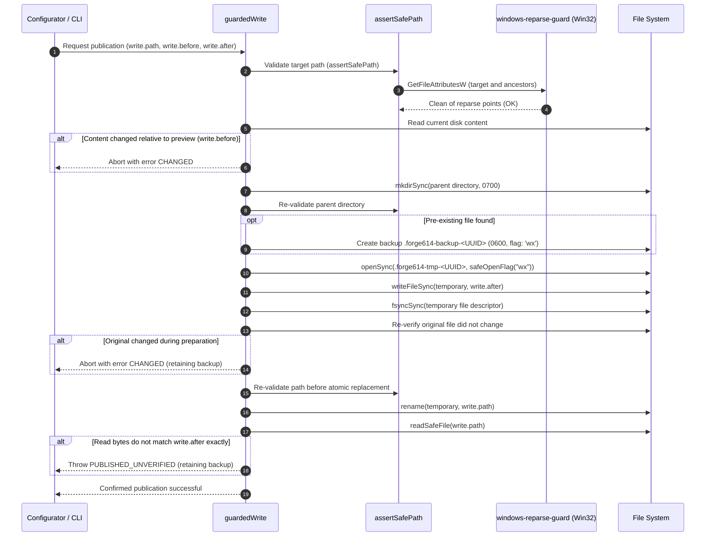

# 05 (EN). Internal Architecture, Modular Monolith, FTS5, and Ranking Formulas

> **Stage:** Nonvisual Engine Transition (Task 1: Inspection & Preview, Task 2: Atomic Initialization Application), Ecosystem Contract (`FORGE614_ECOSYSTEM_CONTRACT.md`), TUI Control Center, Reinforced FTS5 (No Embeddings), Feature-Oriented Modular Monolith, Progressive Memory Sessions, Ranked Context, Local MCP (10 Tools), Product Home (`~/.forge614/engram/`), Safe Legacy Migration, Coordinated Uninstaller, Assistant TUI Menu & PostgreSQL Replica Formats 1, 2, and 3
> **Release Versions:** Program 1.1.0-beta.2 | Configuration Formats 2 (local) / 3 (with sync) | SQLite Schemas 3 (local) / 4 (with sync) / 5 (assistants & local bindings) / 6 (progressive memory sessions & ranked context) / 7 (immutable confirmations & search reinforcement) | PostgreSQL Formats 1, 2, and 3
> **Status:** Current & Active (582 tests passed, 15 skipped across 92 files on macOS ARM64 with Bun 1.3.8; native Windows tests validated on release binaries in GitHub Actions)
> **Sister translation:** [05. Arquitectura Interna, Monolito Modular por Funcionalidad, SQLite FTS5 y Fórmulas Matemáticas](../es/05-arquitectura-interna-y-formulas.md)

This document presents the internal architecture of Forge614 Engram with thesis-level technical rigor: the foundations of the **Feature-Oriented Modular Monolith**, the concrete problems resolved, the physical directory structure and responsibilities, strict dependency rules enforced via TypeScript AST auditing, the design of the **Terminal Control Center (TUI)**, compound atomic transactions, directory change guidelines, colocated testing conventions, relational SQLite Schemas 3 to 7, the PostgreSQL Formats 1 to 3 replication protocol, dedicated product home isolation (`~/.forge614/engram/`), safe legacy data migration, guarded coordinated uninstallation, and the exact mathematical formulas for weighted BM25, 30-day recency, asymptotic stability saturation via immutable confirmations, and sliding window deduplication without embeddings.

---

## 1. The Chosen Pattern: Feature-Oriented Modular Monolith

### 1.1. Name and Definition of the Pattern
The architectural pattern implemented in Forge614 Engram is the **Feature-Oriented Modular Monolith**.

- **Monolith:** The system is compiled, packaged, and distributed as a single executable binary (`forge614-engram`) running within a single local OS process. It is not partitioned into distributed network microservices, does not require internal IPC over networks, and requires no background daemon processes.
- **Feature-Oriented Modular:** Internal source code is partitioned along cohesive domain boundaries (memory, confirmations, projects, sessions, search, control center, synchronization, workspace, assistants) rather than purely by technical layer. Each module encapsulates its business logic and exposes an explicit public boundary (`index.ts`).

> [!NOTE]
> **Contextual Design Choice, Not Universal Dogma:** The adoption of a feature-oriented modular monolith is a deliberate, contextual engineering decision tailored for a local CLI and synchronous SDK operating on a single environment file (`~/.forge614/engram/.env`) and a single SQLite database (`~/.forge614/engram/engram.db`) within its dedicated product home. It is not presented as an abstract dogma for every software system.

### 1.2. Concrete Historical Problems and Reorganization Drivers
Prior to modularization, Engram's codebase suffered from cohesion degradation:
1. **Indiscriminate Root Sprawl in `src/`:** SQL persistence, data types, session validation, FTS5 queries, configuration adapters, terminal menus, and MCP handlers all resided in a flat root folder.
2. **`MemoryStore` Hypertrophy:** The `MemoryStore` class acted as a God Object, consolidating DDL schema migrations, project records, version trees, audit events, session tracking, ranking math, and replication snapshots into a single file.
3. **Presentation & Infrastructure Coupling:** Terminal TUI code directly inspected disk binaries, spawned self-test child processes, and modified assistant configurations, preventing isolated UI unit testing.
4. **Fragile Deep Test Imports:** Tests imported deeply nested internal paths, breaking under simple refactoring.

### 1.3. Evaluated Architectural Alternatives and Real Trade-offs

```text
┌─────────────────────────────────────────────────────────────────────────────────┐
│                     COMPARATIVE ARCHITECTURAL ASSESSMENT                        │
├───────────────────────┬───────────────────────────────┬─────────────────────────┤
│ Approach              │ Advantages                    │ Costs / Drawbacks       │
├───────────────────────┼───────────────────────────────┼─────────────────────────┤
│ Global Layered        │ Intuitive initial technical   │ Functional fragmentation:│
│ (models/, services/,  │ separation.                   │ a single feature        │
│ repos/)               │                               │ spans 4 distant folders.│
├───────────────────────┼───────────────────────────────┼─────────────────────────┤
│ Strict Hexagonal      │ Complete abstract             │ Massive over-engineering:│
│ (Ports & Adapters     │ substitutability via pure     │ generic repos, DI       │
│ with DI Container)    │ interfaces.                   │ containers, and 3x class│
│                       │                               │ overhead for a local CLI│
├───────────────────────┼───────────────────────────────┼─────────────────────────┤
│ Feature-Oriented      │ Conceptual cohesion, low      │ Requires import         │
│ Modular Monolith      │ coupling, synchronous SDK,    │ discipline, explicit    │
│ (CHOSEN)              │ direct SQL, and automated     │ barrels, and continuous │
│                       │ AST validation.               │ AST lint enforcement.   │
└───────────────────────┴───────────────────────────────┴─────────────────────────┘
```

- **Why Global Layered Architecture Was Rejected:** Grouping by technical layer (`src/models/`, `src/services/`, `src/repositories/`) scatters features across the tree. Modifying memory confirmations or sessions required touching files across multiple remote directories, destroying cohesive context.
- **Why Strict Hexagonal Architecture Was Rejected:** Creating abstract repository interfaces, generic port boundaries, and dependency injection containers for a synchronous local SQLite CLI introduced excessive boilerplate without delivering tangible user value.
- **Not Purist DDD or Microservices:** Engram adopts domain boundaries without distributed saga patterns, domain event buses, or microservice operational complexity.

---

## 2. Production Source Tree and Directory Responsibilities

The production code in `src/` is structured across four concentric layers, plus an entry binary and a public shared library:

```text
native/                                # [Native Operating System Extensions]
└── windows-reparse-guard/             # Windows native C++ Node-API addon
    ├── addon.cc                       # Direct query to Win32 GetFileAttributesW
    └── binding.gyp                    # MSBuild build configuration

src/
├── cli.ts                             # [Minimal Startup] Exactly 2 lines of delegation
├── index.ts                           # [Public SDK API] Stable, immutable public barrel
│
├── app/                               # [Flow Orchestration]
│   ├── index.ts                   # Coordination exports
│   ├── memory-store.ts            # Backwards-compatible MemoryStore Facade
│   ├── workspace.ts               # Central workspace lifecycle & connection
│   ├── project-context.ts         # Git identity & directory binding resolution
│   ├── control-center.ts          # Safe read-only state assembly & TUI mutation coordinator
│   ├── synchronization.ts         # Replica & snapshot coordination (no CLI I/O)
│   ├── setup.ts                   # Guided setup flow (SetupIO interface)
│   ├── uninstall.ts               # Guarded uninstaller & Atlas coordination
│   └── assistants.ts              # Assistant detection and configuration coordination
│
├── modules/                           # [Pure Domain Rules & Types] (Zero I/O)
│   ├── memory/                    # Types, validation, confirmations, and ranking
│   │   ├── index.ts
│   │   ├── types.ts
│   │   ├── validation.ts
│   │   ├── confirmations.ts       # Pure confirmation interfaces & logic
│   │   └── ranking.ts             # Ranking formulas & explanation builders
│   ├── control-center/            # TUI snapshot, capabilities, & mutation types
│   │   ├── index.ts
│   │   └── types.ts
│   ├── projects/                  # Immutable project identity (UUIDv4)
│   ├── sessions/                  # Session lifecycle, stamping, & inference
│   ├── search/                    # Query terms, Unicode code point/byte budgets
│   ├── synchronization/           # Snapshot validation & 3-way merge logic
│   │   ├── index.ts
│   │   ├── snapshot.ts
│   │   └── confirmations.ts       # Confirmation snapshot serialization & merge
│   ├── workspace/                 # Workspace environment configuration contracts
│   └── assistants/                # Assistant catalog, protocol & hook contracts
│
├── infrastructure/                    # [Concrete I/O Adapters]
│   ├── sqlite/                    # SQLite connection, schemas, & queries
│   │   ├── connection.ts          # WAL mode, busy timeout, strict pragmas
│   │   ├── schema.ts              # Schemas 3, 4, 5, 6, and 7 DDL migrations
│   │   ├── projects.ts            # Project queries & bindings
│   │   ├── control-center.ts      # Aggregated queries without memory content for TUI
│   │   ├── memory.ts              # Memory queries & version history
│   │   ├── confirmations.ts       # Confirmations & request persistence
│   │   ├── writes.ts              # Outer compound atomic transactions
│   │   ├── sessions.ts            # Session records & chronological entries
│   │   ├── search.ts              # SQLite FTS5 queries & projections
│   │   ├── snapshots.ts           # Format 3 local snapshot read/write
│   │   └── workspace-database.ts  # Database lifecycle manager
│   ├── postgres/                  # CAS optimistic replica adapter (replica.ts)
│   ├── filesystem/                # File I/O (.env, permissions 0700/0600, locks)
│   │   ├── paths.ts               # Product home canonical paths (~/.forge614/engram)
│   │   ├── product-home.ts        # Product home isolation and atomic migration
│   │   ├── path-publication.ts    # Surgical publication and removal in PATH files
│   │   ├── workspace-config.ts    # .env config, concurrency lock & permission repair
│   │   ├── windows-reparse-guard.ts # Node-API native addon TypeScript loader
│   │   ├── private-files.ts       # Path safety validation & assertSafePath
│   │   ├── guarded-write.ts       # Atomic publication and backup protocol
│   │   └── file-locks.ts          # On-disk concurrency locks
│   └── assistants/                # Client adapters, JSONC, TOML, & async self-test
│
├── interfaces/                    # [Presentation & Ingress Adapters]
│   ├── cli/                       # Argument parser, commands, & JSON formatters
│   ├── mcp/                       # Native stdio MCP server (10 tools)
│   ├── terminal/                  # Native assistant hook adapters
│   └── tui/                       # Terminal Control Center and assistant configurator
│       ├── control-center-state.ts  # Pure state machine (keys -> pages/intents)
│       ├── control-center-render.ts # Bounded rendering and output sanitization
│       ├── control-center.ts        # TTY terminal lifecycle and orchestration
│       ├── controller.ts            # Sequential assistant subflow: selection & self-test
│       └── render.ts                # Assistant configurator renderer
│
└── shared/                        # [Cross-Cutting Primitives]
    └── errors.ts                  # MemoryError class and official error codes
```

---

## 3. Dependency Hierarchy and Automated AST Auditing

To maintain modular decoupling, source code follows a strictly unidirectional import flow:

```text
interfaces  ──►  app  ──►  modules  ──►  shared
     │            │
     ▼            ▼
infrastructure ───┘
```

### Strict Import Rules:
1. `modules/` never imports from `infrastructure/`, `app/`, or `interfaces/`. It contains pure domain TypeScript without disk or network I/O.
2. `infrastructure/` implements concrete persistence adapters; it never depends on `interfaces/` or `app/`.
3. `app/` orchestrates use cases by invoking `modules/` and `infrastructure/`.
4. `interfaces/` receives user/assistant requests and delegates to `app/`.
5. `src/index.ts` is the sole entry point for external SDK consumers; internal production modules are forbidden from importing from `src/index.ts`.

### AST Architecture Auditor (`tests/architecture/import-rules.ts`):
- Parses TypeScript AST for all `import`, `export`, `import(...)`, and `require` statements.
- Builds a directed dependency graph (`graph.set(from, to)`).
- Executes Depth-First Search (DFS) tracking active traversal using `visiting` and `visited` sets.
- Detects cycles immediately and fails the test suite with: `component cycle: A -> B -> C -> A`.

---

## 4. SQLite Relational Schemas (Schemas 3 to 7)

SQLite tracks schema state via `PRAGMA user_version`.

```text
┌─────────────────────────────────────────────────────────────────────────────────┐
│                       SQLITE SCHEMA EVOLUTION IN ENGRAM                         │
├─────────┬───────────────────────────────────┬───────────────────────────────────┤
│ Schema  │ Added Tables                      │ Purpose                           │
├─────────┼───────────────────────────────────┼───────────────────────────────────┤
│ 3       │ projects, memories,               │ Baseline local storage with       │
│         │ memory_versions, events, requests │ immutable version history.        │
├─────────┼───────────────────────────────────┼───────────────────────────────────┤
│ 4       │ sync_checkpoints                  │ PostgreSQL replica support.       │
├─────────┼───────────────────────────────────┼───────────────────────────────────┤
│ 5       │ project_bindings                  │ Assistant hooks and directory     │
│         │                                   │ bindings to projects.             │
├─────────┼───────────────────────────────────┼───────────────────────────────────┤
│ 6       │ sessions, session_entries,        │ Progressive work sessions, event  │
│         │ session_summaries,                │ timelines, and 3-tier ranked      │
│         │ local_session_bindings,           │ context dossiers.                 │
│         │ local_manual_sessions             │                                   │
├─────────┼───────────────────────────────────┼───────────────────────────────────┤
│ 7       │ confirmations,                    │ Immutable confirmation tracking   │
│         │ confirmation_requests             │ and reinforced FTS5 search        │
│         │                                   │ ranking without embeddings.       │
└─────────┴───────────────────────────────────┴───────────────────────────────────┘
```

### 4.1. Schema 7 DDL (Confirmations and Reinforced Ranking)

```sql
-- Immutable confirmation records for repeated memory observations
CREATE TABLE IF NOT EXISTS confirmations (
  confirmation_id TEXT PRIMARY KEY,
  memory_id TEXT NOT NULL REFERENCES memories(id) ON DELETE CASCADE,
  version INTEGER NOT NULL,
  recorded_at TEXT NOT NULL,
  session_id TEXT REFERENCES sessions(session_id) ON DELETE SET NULL
);

CREATE INDEX IF NOT EXISTS idx_confirmations_memory_id ON confirmations(memory_id);
CREATE INDEX IF NOT EXISTS idx_confirmations_recorded_at ON confirmations(recorded_at);

-- Idempotent request replay tracking
CREATE TABLE IF NOT EXISTS confirmation_requests (
  memory_id TEXT NOT NULL REFERENCES memories(id) ON DELETE CASCADE,
  request_key TEXT NOT NULL,
  payload_hash TEXT NOT NULL,
  expected_version INTEGER,
  confirmation_id TEXT NOT NULL,
  response_json TEXT NOT NULL,
  created_at TEXT NOT NULL,
  PRIMARY KEY (memory_id, request_key)
);

CREATE INDEX IF NOT EXISTS idx_confirmation_requests_key ON confirmation_requests(request_key);
```

---

## 5. Mathematical Formulas for Reinforced FTS5 Search (No Embeddings)

Engram's search engine optimizes textual retrieval in SQLite FTS5 by combining lexical BM25 matching with recency decay and asymptotic stability saturation derived from immutable confirmations.

### 5.1. Lexical BM25 Scoring in SQLite FTS5

SQLite FTS5 computes document relevance using the BM25 formula:

$$\text{BM25}(D, Q) = \sum_{i=1}^{N} \text{IDF}(q_i) \cdot \frac{f(q_i, D) \cdot (k_1 + 1)}{f(q_i, D) + k_1 \cdot \left(1 - b + b \cdot \frac{|D|}{\text{avgdl}}\right)}$$

- **Engine Parameters:** $k_1 = 1.2$, $b = 0.75$.
- **Column Weights in Engram:**
  - `title`: weight $5.0$
  - `topic_key`: weight $3.0$
  - `content`: weight $1.0$
- **Score Polarity in SQLite FTS5:** SQLite's native `bm25(memories_fts, 5.0, 3.0, 1.0)` function yields **negative values**, where more negative scores denote stronger lexical matches.

### 5.2. The Three Factors of the Reinforcement Multiplier

For each candidate note, Engram computes five support variables against a single deterministic query clock (`request_clock = nowMs`):
1. $\text{revisionCount} = \text{version} - 1$ (historical revisions excluding creation).
2. $\text{duplicateCount} = \text{count}(\text{confirmations})$ (number of immutable confirmations recorded).
3. $\text{lastSeenAt} = \max(\text{updatedAt}, \max(\text{recordedAt}))$ (most recent observation or confirmation timestamp).
4. $\text{ageDays} = \max\left(0, \frac{\text{nowMs} - \text{lastSeenAtMs}}{86,400,000}\right)$ (decimal age in days).
5. $n = \text{revisionCount} + \text{duplicateCount}$ (aggregate observations and revisions).

The total reinforcement multiplier is formulated as:

$$\text{multiplier} = 1 + \underbrace{0.10 \times \text{pinned}}_{\text{Pinned Boost}} + \underbrace{\frac{0.06}{1 + \frac{\text{ageDays}}{30}}}_{\text{Recency Boost}} + \underbrace{0.04 \times \frac{n}{n + 4}}_{\text{Stability Boost}}$$

```text
┌─────────────────────────────────────────────────────────────────────────────────┐
│                     REINFORCEMENT MULTIPLIER BREAKDOWN                          │
├─────────────────────┬──────────────┬──────────────┬─────────────────────────────┤
│ Component           │ Max Boost    │ Range        │ Behavior                    │
├─────────────────────┼──────────────┼──────────────┼─────────────────────────────┤
│ Baseline            │ 1.00         │ 1.00         │ Minimum neutral multiplier. │
│ Pinned Boost        │ +0.10        │ {0, 0.10}    │ 0.10 if pinned is true;     │
│                     │              │              │ 0 if false.                 │
│ Recency Boost       │ +0.06        │ (0, 0.06]    │ 30-day half-life scale:     │
│                     │              │              │ 0.06 at age 0;              │
│                     │              │              │ 0.03 at 30 days;            │
│                     │              │              │ smoothly decays toward 0.   │
│ Stability Boost     │ +0.04        │ [0, 0.04)    │ Asymptotic saturation:      │
│                     │              │              │ n=0 -> 0.00                 │
│                     │              │              │ n=1 -> 0.008                │
│                     │              │              │ n=4 -> 0.020                │
│                     │              │              │ n=8 -> 0.0267               │
│                     │              │              │ converges to 0.04 at inf.   │
├─────────────────────┼──────────────┼──────────────┼─────────────────────────────┤
│ Total Multiplier    │ 1.20         │ [1.00, 1.20] │ Bounded dynamic range.      │
└─────────────────────┴──────────────┴──────────────┴─────────────────────────────┘
```

### 5.3. Order Score and Ascending (ASC) Direction

$$\text{orderScore} = \text{BM25} \times \text{multiplier}$$

**Why Sorting Uses ASC Direction:**
- Because BM25 scores in SQLite are **negative** (e.g., $-2.0$), multiplying by $\text{multiplier} > 1.0$ makes the product **more negative** (algebraically smaller).
- **Worked Tie-Breaking Example:**
  - Note A: $\text{BM25} = -2.0$, $\text{multiplier} = 1.18 \implies \text{orderScore} = -2.36$.
  - Note B: $\text{BM25} = -2.0$, $\text{multiplier} = 1.06 \implies \text{orderScore} = -2.12$.
  - Comparison: $-2.36 < -2.12$.
  - When ordered ascending (`ORDER BY orderScore ASC, id ASC`), Note A (higher multiplier) appears **first** in the results.

### 5.4. Deterministic Single-Clock Evaluation and Order Before LIMIT
- **Single Query Clock:** Engram evaluates a single timestamp `request_clock(nowMs)` per search query. It avoids repetitive system clock invocations per row, preventing mid-query drift on large databases.
- **Ordering Before LIMIT:** Multiplier computation and `orderScore ASC` ordering are applied in SQL **before any `LIMIT` clause**. This guarantees that the top-$K$ results represent globally optimal matches rather than an arbitrary pre-truncated sample.
- **Literal Search Fallback:** When a search does not match FTS5 terms or executes a literal query, `bm25` and `orderScore` are `null`. Ordering falls back to:
  ```sql
  ORDER BY m.pinned DESC, last_seen_at DESC, m.id ASC
  ```

---

## 6. Sliding Window Deduplication, Request Replay, and Conflict Handling

### 6.1. 15-Minute Sliding Window for Memories Without Topic
When saving a memory note without a topic (`topicKey: null`):
- Engram searches active candidates with identical title, content, type, and pinned status.
- **Strict Temporal Bound:** Only candidates observed within the last **15 minutes** are considered (inclusive interval between `nowMs - 900,000` and `nowMs`).
- Future timestamps are discarded.
- If multiple candidates exist within the window, the candidate with the latest `lastSeenAt` is selected, breaking ties with `id ASC`.
- If more than 15 minutes have passed, Engram creates a separate new memory to preserve temporal independence.

### 6.2. Idempotent Request Replay (*Request Key Replay*)
- If a request is submitted with an existing `requestKey` and the SHA-256 cryptographic hash of its payload matches the entry in `confirmation_requests`, Engram returns the cached response immediately.
- **No confirmations are added and versions are not incremented.**

### 6.3. Payload Conflict on Key Reuse (`REQUEST_CONFLICT`)
- If an existing `requestKey` is reused with divergent content or title (mismatched SHA-256 hash), the operation aborts with `REQUEST_CONFLICT`.

### 6.4. Clock Skew Protection (`CLOCK_SKEW`)
- If the local system clock is earlier than the timestamp recorded on the confirmed memory version, the operation halts with `CLOCK_SKEW` to maintain strictly monotonic chronological causality.

---

## 7. PostgreSQL Replication Protocol and Format 3

### 7.1. Stable Remote Physical Schema (`state.format = 1`)
On the remote PostgreSQL server, the synchronization table `forge614_sync.state` retains its structural column `format = 1`:
- The physical database schema requires no disruptive DDL alterations or production migrations.
- Format progression is managed within the JSON snapshot envelope payload.

### 7.2. Format 3 Snapshot Payload
Format 3 expands the snapshot envelope by adding two collections:
- `confirmations`: Array of immutable confirmation records (`confirmationId`, `memoryId`, `version`, `recordedAt`, `sessionId`).
- `confirmationRequests`: Array of cached idempotent requests.

### 7.3. Atomic CAS Promotion and `sync-watch` Guardrail
- **Controlled Promotion:** Promoting a replica to Format 3 requires executing `forge614-engram sync --upgrade-format`.
- **Rejected in Continuous Mode:** `sync-watch` strictly rejects `--upgrade-format` with `INVALID_INPUT` to prevent automated unattended processes from promoting formats without operator supervision.
- **Peer Device Compatibility:** All peer machines must be upgraded to Schema 7 (`reinforcement-enable`) prior to syncing against a Format 3 replica. If an unreinforced client attempts to sync a Format 3 snapshot, it safely halts with `REINFORCEMENT_REQUIRED`.

---

## 8. Colocated Tests and Official Verification Metrics

### 8.1. One-to-One Colocated Test Layout
All **58 production files containing business logic** have a colocated sibling test file (`<name>.test.ts`):
- `src/infrastructure/sqlite/confirmations.ts` $\leftrightarrow$ `confirmations.test.ts`
- `src/infrastructure/sqlite/control-center.ts` $\leftrightarrow$ `control-center.test.ts`
- `src/modules/memory/ranking.ts` $\leftrightarrow$ `ranking.test.ts`
- `src/modules/memory/confirmations.ts` $\leftrightarrow$ `confirmations.test.ts`
- `src/modules/synchronization/confirmations.ts` $\leftrightarrow$ `confirmations.test.ts`
- `src/app/control-center.ts` $\leftrightarrow$ `control-center.test.ts`
- `src/interfaces/tui/control-center-state.ts` $\leftrightarrow$ `control-center-state.test.ts`
- `src/interfaces/tui/control-center-render.ts` $\leftrightarrow$ `control-center-render.test.ts`
- `src/interfaces/tui/control-center.ts` $\leftrightarrow$ `control-center.test.ts`
- Collaborative integration test suites in `src/app/__tests__/` and `src/interfaces/tui/__tests__/`:
  - `confirmations.integration.test.ts`
  - `confirmations-sync.integration.test.ts`
  - `control-center.integration.test.ts`

### 8.2. Test Suite Progression

```text
┌─────────────────────────────────────────────────────────────────────────────────┐
│                        TEST VERIFICATION HISTORY                                │
├───────────────────────────────┬──────────────┬───────────────┬──────────────────┤
│ Milestone                     │ Tests        │ Files         │ Assertions       │
├───────────────────────────────┼──────────────┼───────────────┼──────────────────┤
│ Baseline (Handoff 09)         │ 250 pass     │ 18 files      │ 1,506 assertions │
├───────────────────────────────┼──────────────┼───────────────┼──────────────────┤
│ Modular Monolith (Handoff 10) │ 369 pass*    │ 69 files      │ 1,891 assertions │
├───────────────────────────────┼──────────────┼───────────────┼──────────────────┤
│ Reinforced FTS5 (Stage 11)    │ 439 pass**   │ 76 files      │ 2,274 assertions │
│                               │ (430 pass /  │               │ (38.62s)         │
│                               │  9 skip PG)  │               │                  │
├───────────────────────────────┼──────────────┼───────────────┼──────────────────┤
│ Control Center (Stage 12)     │ 504 pass***  │ 82 files      │ 2,566 assertions │
│                               │ (495 pass /  │               │ (39.76s)         │
│                               │  9 skip PG)  │               │                  │
└───────────────────────────────┴──────────────┴───────────────┴──────────────────┘
* Note: With temporary isolated PG binary configured (361 passed / 8 skipped without binary).
** Note: 430 passed and 9 skipped without isolated PG binary. With FORGE614_TEST_POSTGRES_BIN
   configured, runs and passes 439 pass, 0 fail, 2,274 assertions in 38.62s.
*** Note: 495 passed and 9 skipped without isolated PG binary. With FORGE614_TEST_POSTGRES_BIN
    configured, runs and passes 504 pass, 0 fail, 2,566 assertions in 39.76s.
```

### 8.3. Windows Installer: Reliable Release Metadata Parsing and Native Testing (`scripts/install.ps1` / `scripts/__tests__/install.ps1.test.ps1`)

Like a sealed aerodynamic wind tunnel designed to test vehicle performance under controlled extreme conditions before hitting public highways: the Windows validation suite executes isolated end-to-end integration tests ensuring the PowerShell installer (`scripts/install.ps1`) provides identical atomic guarantees, platform detection, and security safeguards as its Unix counterpart (`scripts/install.sh`).

#### 1. Purpose and Release Metadata Download
The Windows installer (`scripts/install.ps1`) downloads GitHub Release metadata to locate two critical release assets:
1. `SHA256SUMS` (the official cryptographic digest manifest).
2. The exact executable binary for the target architecture (`forge614-engram-windows-x64.exe` for AMD64 or `forge614-engram-windows-arm64.exe` for ARM64).

#### 2. Root Cause: Byte Unrolling in PowerShell Pipelines
In Windows PowerShell (particularly Windows PowerShell 5.1 and certain PowerShell Core configurations), `Invoke-WebRequest` may deliver the HTTP response payload via its `.Content` property as a raw byte array (`System.Byte[]`) rather than a parsed text string (`System.String`).

The prior code passed those bytes directly through a pipeline to `ConvertFrom-Json`:
```powershell
# Vulnerable prior code
$releaseResponse = Invoke-WebRequest -Uri $releaseJsonUrl -UseBasicParsing
$release = $releaseResponse.Content | ConvertFrom-Json
```
Because PowerShell pipelines unwrap collection objects into individual stream items, PowerShell processed each byte individually as an 8-bit integer. Consequently, the JSON failed to convert into a valid release object. The `.assets` property was left null or empty, causing the installer to falsely report:
```text
The release is missing SHA256SUMS.
```
even though the manifest was present on the server.

#### 3. Production Bugfix: Explicit UTF-8 Decoding and Scalar `-InputObject`
The fix explicitly inspects the type of `$releaseRawContent`. If it is a byte array, it converts the entire byte array into a single UTF-8 string before invoking `ConvertFrom-Json -InputObject`:
```powershell
# Robust parsing fix
$releaseResponse = Invoke-WebRequest -Uri $releaseJsonUrl -UseBasicParsing
$releaseRawContent = $releaseResponse.Content
$releaseJson = if ($releaseRawContent -is [byte[]]) {
  [System.Text.Encoding]::UTF8.GetString($releaseRawContent)
} else {
  [string]$releaseRawContent
}
$release = ConvertFrom-Json -InputObject $releaseJson
```
If PowerShell already delivers a string, the installer retains that path directly without redundant conversion.

#### 4. Strict Security Invariants
This fix does not reduce or bypass any security safeguards:
- The installer strictly requires HTTPS in production (`Test-ReleaseUri` enforces `https://`, allowing loopback HTTP with explicit ports only for local test fixtures).
- It verifies `SHA256SUMS` hash integrity before publishing/installing the binary.
- It rejects overwriting existing installations without explicit `-Force`.
- It does not execute `forge614-engram setup`.
- It does not modify system or user `PATH`.
- It does not create `~/.forge614` or `engram.db`.
- It does not touch assistant configuration files (`.claude`, `.codex`, etc.).

#### 5. Ephemeral Loopback HTTP Release Mock Server
To avoid external dependencies on the GitHub API or exhausting rate limits during automated CI runs, the test suite launches a background job (`Start-Job`) hosting an ephemeral local HTTP server via `[System.Net.HttpListener]` bound strictly to loopback (`127.0.0.1`) on a dynamic unprivileged port (range `49152`–`65535`):
- **Comprehensive API and asset simulation:** The mock server responds to installer requests by serving release metadata JSON (`/releases/tags/v1.2.3`), the cryptographic checksum manifest `SHA256SUMS` (`/download/SHA256SUMS`), and mock binary payloads (*fixture binaries*).
- **Total test isolation:** The entire execution operates inside a disposable temporary folder (`[System.IO.Path]::GetTempPath()\forge614-installer-<GUID>`), redirecting the temporary `HOME` environment variable to ensure real user settings are never touched and `~/.forge614` is never created prematurely.
- **Test Objective:** Specifically verifies that the installer operates correctly when PowerShell receives release metadata as raw bytes (`System.Byte[]`), not merely as text strings.

#### 6. Exhaustive Validation Matrix
The test script verifies five critical operational scenarios:
1. **AMD64 architecture installation:** Simula `$env:PROCESSOR_ARCHITECTURE = 'AMD64'`, downloading `forge614-engram-windows-x64.exe`, and asserting that the installed executable matches the expected SHA-256 digest byte-for-byte.
2. **ARM64 architecture installation:** Simula `$env:PROCESSOR_ARCHITECTURE = 'ARM64'`, verifying proper resolution and atomic placement of `forge614-engram-windows-arm64.exe`.
3. **Strict checksum mismatch rejection:** Routes requests through `/mismatch/` (where `SHA256SUMS` serves an invalid hash); asserts that the installer immediately exits with an error code (`ExitCode != 0`) and that **no output binary is created in the destination directory**.
4. **Overwrite protection without `-Force`:** Attempts to install into a destination with a pre-existing binary without passing `-Force`; asserts that the installer fails and that pre-existing destination bytes remain 100% unaltered.
5. **No premature storage initialization:** Formally asserts that the installer does not create the `~/.forge614` user database folder.

#### 7. Test-Exclusive Diagnostics Following Real-World Failure Triage
Prompted by an actual CI failure on Windows where the installer reported missing `SHA256SUMS`, dedicated diagnostic telemetry was introduced into `$diagnosticFile` (`fixture-server.log`):
1. **Requested HTTP routes:** Every incoming request path is logged chronologically (`request-path=$path`).
2. **Asset names served in release metadata:** An explicit list of assets packaged into the release manifest (`release-asset-names=$assetNames`).
3. **Exact JSON payload string:** The exact JSON string generated and transmitted to the client (`release-json=$payload`).

Prior to verifying the AMD64 installation, the test executes explicit assertions against this diagnostic stream:
- Asserts that the expected canonical release route was requested (`/good/repos/jotredev/forge614-engram/releases/tags/v1.2.3`).
- Asserts that the release manifest includes exactly: `SHA256SUMS`, `forge614-engram-windows-x64.exe`, and `forge614-engram-windows-arm64.exe`.
- Clearly differentiates between HTTP route routing errors, mock JSON serialization issues, or PowerShell object parsing issues.

```powershell
# Diagnostic assertions prior to installer execution checks
$amd64Diagnostics = Get-FixtureDiagnostics
Assert-That ($amd64Diagnostics.Contains('/good/repos/jotredev/forge614-engram/releases/tags/v1.2.3')) `
  "AMD64 fixture route mismatch: $amd64Diagnostics"
Assert-That ($amd64Diagnostics.Contains('release-asset-names=SHA256SUMS,forge614-engram-windows-x64.exe,forge614-engram-windows-arm64.exe')) `
  "AMD64 fixture asset names mismatch: $amd64Diagnostics"
Assert-That ($amd64.ExitCode -eq 0) `
  "AMD64 installer failed: $($amd64.Output) Fixture diagnostics: $amd64Diagnostics"
```

##### 8. CI Validation Status and Cross-Platform Stability Criteria
The suite is executed in automated workflows using:
```powershell
pwsh -NoProfile -File scripts/__tests__/install.ps1.test.ps1
```

> [!NOTE]
> **CI Validation Status:** The PowerShell installer test suite was successfully executed and verified in GitHub Actions on `windows-latest` runners (**Verify Run ID `35427426902`**, commit `f047693b9e27368d104cfc945c0e419af4a1d4b9`). The suite utilizes in-memory `PathReader` and `PathWriter` abstractions to guarantee runner registry and user PATH isolation, and includes regression tests against blocked assistant descriptors.

---

## 9. Windows Native Reparse Point Guard Architecture and Protected Publication Protocol (`guardedWrite`)

### 9.1. Rationale for Native C++ Component (Node-API vs FFI vs Subprocesses)
On Unix platforms (macOS and Linux), security against malicious symbolic links is natively enforced via POSIX octal permissions (`0700` and `0600`) and direct kernel open flags (`O_NOFOLLOW`). On Windows, POSIX permissions do not exist natively (they map onto NTFS Access Control Lists, ACLs) and Bun on Windows lacks direct `O_NOFOLLOW` flag equivalents in standard file opening.

To solve this Windows security challenge without sacrificing performance, three alternatives were evaluated:
1. **Subprocess Spawning (`powershell.exe` or `fsutil.exe`):** Rejected. Spawning a PowerShell subprocess or console utility for each path check consumes 150 ms to 400 ms per call, degrades user responsiveness, and requires elevated administrative privileges for certain `fsutil` operations.
2. **Bun FFI (*Foreign Function Interface*):** Rejected. While Bun FFI allows invoking dynamic libraries at runtime, official Bun documentation explicitly characterizes its FFI subsystem as experimental and advises against its use in standalone compiled production executables.
3. **Native C++ Node-API Module (`native/windows-reparse-guard/addon.cc`):** **Chosen.** Bun supports Node-API (.node) as its stable native binary interface for C/C++ extensions. It compiles into an ultralightweight shared library loaded directly into Engram's process memory, querying Microsoft's official Win32 API without external overhead:
   ```c
   DWORD attributes = GetFileAttributesW(path);
   bool isReparsePoint = (attributes != INVALID_FILE_ATTRIBUTES) &&
                         ((attributes & FILE_ATTRIBUTE_REPARSE_POINT) != 0);
   ```

### 9.2. Cobertura de Redirecciones y Modelo a Prueba de Fallos (*Fail-Closed*)
The attribute `FILE_ATTRIBUTE_REPARSE_POINT` (hex `0x400`) identifies any NTFS filesystem object whose standard resolution is altered by a system filter driver. This allows comprehensive detection and blocking of:
- **File symbolic links** (*file symlinks*, `symlinkSync(..., 'file')`).
- **Directory symbolic links** (*directory symlinks*).
- **Directory junctions** (*junctions*, `symlinkSync(..., 'junction')` or `mklink /J`).
- **Volume mount points** (*volume mount points*, created via `mountvol.exe`).

#### Ascending Recursive Path Traversal:
The validator `assertNoWindowsReparsePoints` in `src/infrastructure/filesystem/private-files.ts` does not simply check the leaf file, but recursively ascends through all existing ancestor directories until reaching the volume root (`while (current !== root)`):
- If the destination or any existing parent directory possesses the reparse point attribute, execution halts immediately with `UNSAFE_PATH`.
- **Fail-Closed Architecture:** If the native addon cannot be loaded, throws an unhandled Win32 error, or returns a non-boolean result, validation fails closed with `UNSAFE_PATH`.
- **Concurrency and TOCTOU Boundaries:** Strict pre-write inspection ensures no redirection exists at check time. However, it cannot provide absolute guarantees against concurrent race conditions where a privileged external process alters directories between check time and open time (*Time-of-Check to Time-of-Use*). Engram mitigates this via re-validations before directory creation, atomic renaming, and post-publication byte verification.

### 9.3. Sequence Diagram of Protected Publication Protocol (`guardedWrite`)

The protected write protocol guarantees assistant configurations (such as Antigravity, Cursor, or Claude Code) are never corrupted or diverted:



### 9.4. Platform Differences in File Opening and CI Incident
To materialize temporary files and backups on disk, Engram uses secure descriptors managed by `safeOpenFlag`:
* **Textual Modes on Windows (`"r"` and `"wx"`):**
  - `"r"`: Simple read mode.
  - `"wx"`: Exclusive write mode (*write exclusive*). The `"x"` flag requires the file not to exist previously; if present, the operating system immediately rejects the call with `EEXIST`.
* **Numeric Bitwise Flags on Unix (macOS and Linux):**
  - Reading: `constants.O_RDONLY | constants.O_NOFOLLOW`.
  - Exclusive creation: `constants.O_WRONLY | constants.O_CREAT | constants.O_EXCL | constants.O_NOFOLLOW` with octal `0600`.
* **CI Technical Incident on Windows Runners:**
  During GitHub Actions test execution, calling `openSync` in Bun on Windows returned `ENOENT` when supplied with bitwise numeric flags (`O_WRONLY | O_CREAT | O_EXCL`). However, backup creation using textual mode `{ flag: 'wx' }` succeeded reliably. Centralizing file creation under `safeOpenFlag(unixFlags, windowsFlag)` resolved the issue.

### 9.5. Central Storage Privacy and Automatic Permission Repair (`repairExistingRoot`)

The Engram dedicated product home `~/.forge614/engram/` stores highly sensitive technical data: the central SQLite database `engram.db`, temporary WAL journals containing recent uncheckpointed memory mutations in plaintext, concurrency lockfiles (`.config-lock`), and the `.env` settings file which may contain remote PostgreSQL credentials.

#### Justification for Strict Privacy Permissions (`0700` and `0600`)
In multi-user operating systems (such as shared development servers, cloud workstations, or lab environments), standard directory permissions like `0755` (`rwxr-xr-x`) allow any other local user account to list, inspect, or copy stored memories and configuration files. To guarantee complete privacy:
- Engram's product home directory `~/.forge614/engram/` must strictly enforce octal permissions `0700` (`rwx------`, read/write/execute for the owner only). The shared `~/.forge614/` container is validated for safety but is not chmodded by Engram because it can contain sibling products.
- The `.env` configuration file and database `engram.db` must enforce permissions `0600` (`rw-------`, read/write for the owner only).

#### Automatic Repair Without User Friction
Previously, if the directory pre-existed with standard umask permissions (such as `0755`), Engram refused execution with `CONFIG_INVALID`, requiring the user to understand UNIX permissions and manually execute `chmod 0700`.

To eliminate this friction while preserving strict security guarantees, `WorkspaceConfig` provides `repairExistingRoot()`:
1. **Pre-prompt Invocation in `setup` and `init`:** Both interactive `setup` (before showing prompts or reading existing config) and headless `init`, as well as `MemoryWorkspace.init()`, invoke `config.repairExistingRoot()`.
2. **Inspection Without Creation:** `repairExistingRoot()` invokes internal `directory(create: false, repair: true)`. If the directory does not exist (`ENOENT`), it returns `false` immediately without touching the filesystem.
3. **Strict Ownership Verification:** Reads directory stats using `lstatSync` (never following symbolic links) and verifies that the path is an ordinary directory, is not a symbolic link, and is owned by the current process user (`stat.uid === process.getuid()`).
4. **Automatic Tightening:** If group or other permission bits are open (`(stat.mode & 0o077) !== 0`), it executes `chmodSync(this.root, 0o700)`.
5. **Post-Repair Re-Verification:** Re-inspects the directory with `lstatSync` to certify that the resulting directory is ordinary, non-symlinked, and strictly private (`privateOwned`).
6. **Fail-Closed Architecture:** If the path is a symbolic link, a regular file, is owned by another user, or permissions cannot be restricted, it fails immediately with `failure("CONFIG_INVALID")`.
7. **Clean Cancellation Semantics:** If the user cancels `setup` after permission repair, `.env`, `engram.db`, projects, and memories remain completely uncreated; only the pre-existing directory permissions were tightened.

### 9.6. Native Compilation Toolchain and Executable Resolution
Compiling the native addon on Windows utilizes `scripts/build-windows-reparse-addon.ps1`:
- **Node.js (22.14.0 in CI):** Required strictly at compile time to run `node-gyp`. Not needed by end users at runtime.
- **`node-gyp` (version 12.1.0 pinned in `devDependencies`):** Pinned version required to ensure full compatibility between Node.js 22 and Visual Studio 2026.
- **Python (3.12+):** Required internally by GYP for generating MSBuild project files.
- **Visual Studio 2026 Build Tools (v18):** Official Microsoft C++ compiler toolset on `windows-latest` runners.
- **Single-Candidate `node.exe` Resolution (`Resolve-NodeExecutable`):** In CI virtual machines with multiple Node.js installations in PATH, this function filters output to select strictly one valid executable path, preventing PowerShell string concatenation bugs.

### 9.7. Standalone Release Packaging, Addon Embedding, and Strengthened Smoke Test (release.yml)
To distribute single-file standalone executables without requiring developer tools on the end user's machine, the release workflow (`.github/workflows/release.yml`) implements a rigorous packaging architecture:
* **Dual Execution Modes (Manual vs. Official Release):**
  - Manual execution (`workflow_dispatch`): Allows compiling all 6 platform installers, running isolated profile packaged checks, and verifying `SHA256SUMS` without publishing a GitHub Release or touching tags.
  - Official release (`push: tags: ['v*']`): Gated strictly on tag pushes, ensuring public releases occur only upon deliberate human decision.
* **Strict Windows Build Pipeline Ordering:**
  1. Dependency installation (`bun install --frozen-lockfile --ignore-scripts`).
  2. Native Node-API C++ addon compilation (`scripts/build-windows-reparse-addon.ps1 -Architecture ${{ matrix.addon_architecture }}`) for the target architecture (`x64` or `arm64`).
  3. Standalone executable compilation with Bun (`bun build ./src/cli.ts --compile ...`). Bun automatically embeds the `.node` binary into the standalone executable via literal `require()` detection.
* **Packaged Executable Verification and Strengthened Smoke Test:**
  On Windows runners, each newly compiled `.exe` is tested under an isolated temporary user profile (`RUNNER_TEMP`, random GUID) invoking `assistant-list`:
  - **Defect observed and resolved:** It was observed that `assistant-list` returned all 5 assistant identifiers even if the native addon failed to load (catching the error and assigning `configuration.status = "blocked"`). Checking only exit code and IDs did not guarantee in-memory addon loading.
  - **Strict `absent` assertion:** The smoke test now strictly requires that, under an empty temporary profile, all 5 assistants (`claude-code`, `codex`, `cursor`, `opencode`, `antigravity`) report exactly one entry with status `absent`. Any `blocked`, missing, or duplicate result immediately fails the job.
  - **Isolation verification:** Certifies zero storage footprint (does not create `~/.forge614/`).
* **Release Contract Regression Prevention Test:**
  The test file `scripts/__tests__/release-windows-native-addon.test.ts` statically verifies workflow syntax, isolated profiles, and proper failure behavior when blocked descriptors are returned.
* **Verified CI Evidence:**
  1. `Verify` Workflow: Successfully passed on Ubuntu, macOS, and Windows x64 native.
  2. `Release standalone artifacts` Workflow: Successfully built and validated all 6 standalone binaries (macOS x64/ARM64, Linux x64/ARM64, Windows x64/ARM64 with embedded addon), verified `SHA256SUMS` (six `OK` checks).
* **Local Test Suite Evidence:**
  The full test suite finished with **572 passed, 15 skipped, 0 failed** across 90 files; `bun run typecheck`, `git diff --check`, and `bash -n` all completed with exit code 0.

### 9.8. Validation Status and Baseline for Version 1.1.0
With dedicated product home isolation, safe atomic migration, and the guarded uninstaller, Forge614 Engram reaches version `1.1.0`. All architectural contracts are verified:
1. **Family Directory Isolation:** Engram coexists peacefully in `~/.forge614/engram/` without touching `shell/` or `atlas/`.
2. **Atomic Migration Tested:** Rigorous unit and integration tests cover clean migrations, orphaned WAL journals, corrupted permissions, and file collision scenarios.
3. **Guarded Uninstallation Coordinated with Atlas:** Thoroughly validated via unit tests across Unix and Windows platforms.
4. **Cross-Platform Verification in CI:** macOS ARM64/x64, Linux x64/ARM64, and Windows x64/ARM64 validated on GitHub Actions runners.

### 9.9. Product Home Architecture and Safe Legacy Migration (`EngramProductHome`)
To eliminate collisions between tools in the Forge614 suite and give Engram an independent lifecycle, `src/infrastructure/filesystem/product-home.ts` implements the `EngramProductHome` class:
- **Family Container vs. Product Subfolder:**
  - The root directory `~/.forge614/` belongs to the entire Forge614 product family.
  - Each product owns its exclusive subdirectory: `shell/`, `atlas/`, and `engram/`.
  - Engram reads, writes, and removes files exclusively within `~/.forge614/engram/`. It never inspects, modifies, or deletes sibling directories.
- **Safe Automatic Legacy Migration Protocol (`migrateLegacyWorkspace`):**
  When `prepare()` is called in `WorkspaceConfig`:
  1. **Strict Legacy Name Detection:** Searches strictly for five exact filenames at the root of `~/.forge614/`: `.env`, `engram.db`, `engram.db-wal`, `engram.db-shm`, and `.config-lock`. Any other file or directory is ignored.
  2. **Fail-Closed Safety Validations:**
     - If the container root or any legacy file is a symbolic link, owned by another user, or fails permission checks, aborts with `LEGACY_UNSAFE`.
     - If the target subdirectory `~/.forge614/engram/` already contains files that would collide, or if orphaned WAL/SHM journals exist without a primary database, aborts with `LEGACY_CONFLICT`.
  3. **Atomic Move with Rollback:**
     - Files are sequentially moved to the destination subfolder.
     - If any I/O error occurs midway, Engram catches the error and atomically rolls back all moved files to their original location in `~/.forge614/`, throwing `LEGACY_MIGRATION_FAILED` without data loss.
  4. **Idempotency:** If `~/.forge614/engram/` already exists and no loose legacy files remain, the migration performs no operations.

### 9.10. Guarded Uninstaller Architecture and Atlas Coordination (`uninstallEngram`)
Located in `src/app/uninstall.ts`, the `uninstallEngram` function executes the full product removal protocol:
- **Dual-Level Confirmation Phrase:**
  - Engram standalone: `--confirm "REMOVE FORGE614-ENGRAM"`.
  - Atlas installed in `~/.forge614/atlas/`: `--confirm "REMOVE FORGE614-ENGRAM AND FORGE614-ATLAS"`.
  - If the phrase does not match exactly, aborts with `UNINSTALL_CONFIRMATION` without making any changes.
- **Prior Atlas Coordination:**
  - If Atlas is installed, Engram executes the Atlas uninstaller first: `~/.forge614/atlas/bin/forge614-atlas uninstall --from forge614-engram --confirmed`.
  - If the executable is missing or fails, Engram immediately stops with `ATLAS_UNINSTALL_REQUIRED` or `ATLAS_UNINSTALL_FAILED` without modifying any files.
- **Surgical Assistant Removal:**
  - Inspects configurations for Claude Code, Codex, Cursor, OpenCode, and Antigravity.
  - Surgically removes managed MCP sections and hooks. If any config file is corrupted or inaccessible, aborts with `ASSISTANT_REMOVE_FAILED`.
- **Surgical PATH Cleanup (`path-publication.ts`):**
  - On Unix: Locates the delimited block `# >>> forge614-engram PATH >>>` in shell dotfiles (`.zshrc`, `.bashrc`, etc.) and surgically removes it. If the block was altered manually, aborts with `PATH_CONFLICT` to protect user dotfiles.
  - On Windows: Atomically removes the Engram entry from the User PATH registry.
- **Exclusive Product Home Removal:**
  - Deletes only the `~/.forge614/engram/` subdirectory.
  - The family root container `~/.forge614/` and sibling tools remain untouched.

### 9.11. Forge614 Ecosystem Hierarchy and Nonvisual Transition Contract (`src/app/initialization.ts`)

With the formalization of the master ecosystem contract (`FORGE614_ECOSYSTEM_CONTRACT.md`), Forge614 establishes a clear product hierarchy with explicit boundaries:

```text
forge614-ai                         Core and ecosystem orchestrator (future owner of forge614 init)
├─ forge614-shell                   The only visual experience for human users
├─ forge614-engines                 Installed-AI discovery and adapters (internal dependency)
├─ forge614-engram                  Persistent memory engine (SQLite, FTS5, optional replica, MCP & SDK)
└─ forge614-atlas                   Deep repository contextualization (deposits into Engram)
```

**Key Hierarchy Principles:**
1. **One Single Visual Experience:** Forge614 Shell is the sole interface featuring interactive windows or terminal screens (TUI) for humans during initial onboarding. All other products operate as engines, services, or headless tools without their own graphical or terminal screens.
2. **Engram is a Memory Engine, Not a Setup Wizard:** Engram owns its dedicated local storage (`~/.forge614/engram/`), SQLite, FTS5, search, project identities (`projectId`), and synchronization. Long term, Engram does not maintain its own TUI or duplicate Shell's setup screens.
3. **Shell Runtime Role (Optional in Daily Work):** Forge614 Shell is the official visual onboarding and guided setup environment, but **running Shell is strictly optional and not required during day-to-day coding**. Connected external AI assistants (ADE Orca, Claude Code, Codex, Antigravity) communicate directly with Engram via its local stdio MCP server, without needing Shell to remain open or running in the background.
4. **Retirement of `setup` in Favor of `init` (`COMMAND_RETIRED`):** Aligning with ecosystem convergence, the legacy command `forge614-engram setup` has been **completely retired** (returning structured error `COMMAND_RETIRED` with exit code 1). Initialization is channeled exclusively through `forge614-engram init` (interactive guided terminal mode delegating to `assistantTui`) and `forge614-engram init --json` (non-interactive mode for scripts, automation, and SDK).
5. **Global Command Ownership:** The future global `forge614 init` command will belong to `forge614-ai`. No other product (including Engram) owns or implements `forge614 init`.

**Nonvisual Module Architecture (`src/app/initialization.ts`):**
Located in `src/app/initialization.ts` and exported from the package root (`src/index.ts`), this module implements the Task 1 and Task 2 contracts for the nonvisual engine transition:

- **`inspectMemoryInitialization(config?: WorkspaceConfig): MemoryInitializationStatus`:**
  - Passively inspects `~/.forge614/engram/` without causing any side effects.
  - If the directory does not exist, returns `{ initialized: false, storage: "sqlite", postgresConfigured: false, reinforcementEnabled: false }` without touching the disk.
  - If it exists, opens SQLite in read-only mode (`open(true)`), verifies the presence of the `confirmations` table (Schema 7), and immediately closes the handle in a `finally` block.
  - Checks if `POSTGRES_URL` is defined in `.env` and returns strictly a boolean flag, preventing credential leaks.

- **`previewMemoryInitialization(request: MemoryInitializationRequest, config?: WorkspaceConfig): Promise<MemoryInitializationPreview>`:**
  - Processes an initialization request `{ postgresUrl: string | null, enableReinforcement: boolean }`.
  - Writes no files, creates no directories, and executes no migrations.
  - Validates `postgresUrl` syntax locally using `postgresOptions()`, ensuring URL safety without opening network sockets to remote servers.
  - Reads the current configuration fingerprint via `config.revision()` (`expectedRevision`), allowing callers to detect concurrency races if another process edits `.env` before human confirmation.
  - Projects required changes using boolean flags (`initializesStorage`, `configuresPostgres`, `enablesReinforcement`).

- **`applyMemoryInitialization(request: MemoryInitializationRequest, expectedRevision: string | null, config?: WorkspaceConfig): Promise<MemoryInitializationResult>`:**
  - Atomically applies the initialization approved by the user in Shell.
  - **Optimistic Concurrency Control:** Compares `config.revision() === expectedRevision`. If external drift is detected, it strictly aborts throwing `CONFIG_CHANGED` without touching the disk.
  - **Pre-Flight PostgreSQL Connectivity Check:** When `postgresUrl` is provided, it runs a transient test connection and read (`PostgresReplica.connect(url, true); await replica.read(); await replica.close()`) **before performing any local mutations**. If the connection fails, it aborts cleanly without leaving files or configuration in an inconsistent state.
  - **Idempotent Initialization:** Executes `workspace.init()` to ensure restrictive permissions (`0700` directory and `0600` for `.env`/`engram.db`), preserving pre-existing data.
  - **Additive Reinforcement (No Downgrade):** When `enableReinforcement` is `true`, it activates `store.enableSearchReinforcement()`. When `false`, it never disables or downgrades existing reinforcement.
  - Atomically writes the PostgreSQL URL via `config.configurePostgres(request.postgresUrl)` and returns the final inspected state.

**Isolation Invariants:**
Engram operates exclusively inside `~/.forge614/engram/`. It never reads, modifies, or removes sibling directories `shell/`, `engines/`, or `atlas/`, respecting the sovereignty of each component in the ecosystem.

---

## 10. Design Attribution and Lineage

- **Gentleman Programming Inspiration:** The progressive retrieval model featuring bounded previews, on-demand version reads, session timelines, and relevance reinforcement is inspired by concepts developed by Gentleman (linked to commit `2cdda9041c1bff86f6b769171fd407fa677027cb`).
- **Forge614 Innovations:**
  - Interactive Terminal Control Center with read-only by default navigation, strict two-step confirmation (`confirm` + Enter), exhaustive ANSI/bidi/URL sanitization, and clean sequential assistant subflows.
  - Exact mathematical ordering formula $\text{BM25} \times \text{multiplier}$ with asymptotic saturation $\frac{n}{n+4}$ and smooth 30-day half-life decay.
  - Single evaluation clock `request_clock(nowMs)` per search query to prevent mid-query drift.
  - Dedicated `confirmations` table recording immutable observations without fabricating redundant versions.
  - 15-minute sliding window deduplication for memories without a topic.
  - Cryptographic SHA-256 idempotent request cache with `REQUEST_CONFLICT` detection.
  - Atomic CAS Format 3 promotion with physical schema stability on PostgreSQL (`state.format = 1`).
  - Feature-oriented modular monolith with 58 logical components supported by colocated tests and AST import enforcement.
  - Native C++ reparse point guard and atomic `guardedWrite` protocol for secure configuration and tool publication across Windows and Unix.
