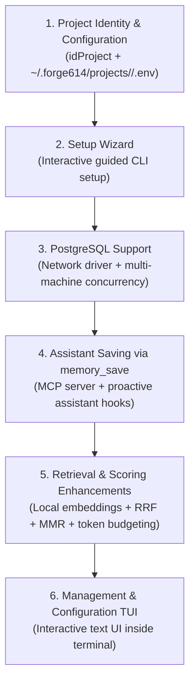

# 08. Stage 1 Boundaries and Planned Roadmap

> **Stage:** Stage 1 — Local Memory  
> **Status:** Current & Active (Includes approved design pending implementation)  
> **Sister translation:** [08. Límites de la Etapa 1 y Hoja de Ruta Futura](../es/08-limites-y-roadmap.md)

This document provides a transparent overview of capabilities verified in **Stage 1**, current technical boundaries, architectural comparisons with Gentleman Programming and Softmax Data, the approved architectural design for project identity (`idProject`), and the official prioritized backlog for subsequent phases.

---

## 1. Verified and Completed Capabilities (Stage 1)

The following capabilities are fully implemented in this repository and verified by automated tests (`bun test`):

- [x] **Centralized User Database:** SQLite managed in `~/.forge614/engram.db` in WAL mode with foreign key enforcement and a 5,000ms busy timeout.
- [x] **Standalone Binary Installer:** Script `scripts/install.sh` that compiles an independent executable (`forge614-engram`) into `$HOME/.local/bin/` runnable without Bun or Node in PATH.
- [x] **Immutable Version History:** Every update to a topic retains a historical JSON snapshot in `memory_versions`.
- [x] **Optimistic Concurrency Control:** Topic updates require `--expected-version`, preventing stale overwrites across concurrent processes.
- [x] **Idempotency Safeguards:** SHA-256 payload verification via `requestKey`.
- [x] **Explainable Text Retrieval:** SQLite FTS5 with trigram tokenization and weighted columns (title: 5.0, topic: 3.0, content: 1.0).
- [x] **Mathematical Ranking:** Hybrid BM25 score combined with priority boosting (`pinned`) and recency decay ($r$).
- [x] **Literal Fallback Mode:** Seamless handling of short search terms (<3 characters) with case-insensitive Unicode folding.
- [x] **Reversible Archiving:** Archive memories to remove them from active search without erasing historical versions; restore anytime.
- [x] **Strict CLI Interface:** Command `forge614-engram` supporting `--version`, complete pre-storage validation, and formatted JSON output.
- [x] **TypeScript SDK:** Clean `MemoryStore` programmatic API defaulting to user storage.

---

## 2. Current Boundaries and Restrictions in Stage 1

To prevent false assumptions, note the following boundaries currently in place:

1. **Explicit Manual Saving (No Silent Chat Observation):**  
   Storage occurs exclusively upon running `forge614-engram save` or software calling `store.save(...)`. There is no background daemon silently scanning chats.
2. **Name-Based Scoping (`--project`):**  
   The current release uses textual project names to isolate memories. Immutable identity via `idProject` is an approved future design not yet implemented.
3. **Word-Matching Search Only (No Semantic Vectors):**  
   The current search matches exact tokens and trigrams. It does not understand synonyms or paraphrasing (e.g. searching *"automobile"* will not find notes containing only *"car"*).
4. **No AI Token Budget Limiting:**  
   Search returns the complete content of matching memories without trimming or snippet summarization.
5. **No Network Server or MCP Protocol:**  
   Stage 1 contains no HTTP daemon or Model Context Protocol (MCP) server. Execution is strictly local via CLI or TypeScript imports.
6. **No Session Tracking or Handoffs:**  
   Sessions and work handoff summaries are not yet implemented.
7. **No Reinforcement Feedback or Star Ratings:**  
   Memories do not track execution success/failure or adjust salience dynamically.
8. **No Backup Export/Import Commands:**  
   Archiving only modifies database visibility flags. Exporting or importing database dumps is not yet provided.
9. **No Permanent Destructive Erasure:**  
   There is no `delete` command; obsolete memories remain archived.

---

## 3. Comparing Storage Approaches: How Do Gentleman, Softmax, and Forge614 Save?

A common question is: *why does Gentleman Programming seem to avoid manual save commands?*

<table header-row="true">
<tr>
<td>Criterion</td>
<td>🎩 Gentleman Programming</td>
<td>🧩 Softmax Data</td>
<td>🧠 Forge614 Engram</td>
</tr>
<tr>
<td>**Who Decides What to Save?**</td>
<td>**The coding assistant itself** (Claude, Cursor) instructed by system prompts (*skills*) that command it to call `mem_save` when it resolves a bug or makes a decision.</td>
<td>**A secondary server extractor model** (*Reflector*) that scans the entire raw conversation.</td>
<td>**Stage 1:** Manual (user or code).<br>**Stage 2 (Planned):** Assistant-driven proactive save via MCP + extraction rules.</td>
</tr>
<tr>
<td>**Passive Capture / Hooks**</td>
<td>Uses client hooks (e.g. `SubagentStop` in Claude Code) that pipe conversation chunks into regex scripts (`ExtractLearnings`).</td>
<td>Sends raw text to the server API.</td>
<td>**Planned for Stage 2.**</td>
</tr>
<tr>
<td>**Token Cost**</td>
<td>Consumes context window and tool invocations in the assistant's own session (not zero token cost).</td>
<td>Burns OpenAI API tokens for the server Reflector and embeddings.</td>
<td>**0 USD:** 100% local, zero tokens in Stage 1. Will use local tooling in Stage 2.</td>
</tr>
</table>

> [!NOTE]
> No memory system "magically eavesdrops" on chats just by being installed on your machine. Every tool requires an integration bridge (an MCP server or client hooks) that feeds data into the memory store.

---

## 4. Approved Design: Project Identity (`idProject`) and Secure Configuration

> [!IMPORTANT]
> **STATUS: APPROVED DESIGN PENDING IMPLEMENTATION.**  
> Concepts detailed in this section represent approved architectural decisions for upcoming releases. They are **NOT yet implemented in the current codebase**. Do not run non-existent commands or assume `~/.forge614/projects/` is active today.

### 4.1. Core Identity Principles of `idProject`
1. **Unique and Stable Identifier (`idProject`):**  
   Every project will possess a unique, immutable, and stable identifier named exactly `idProject`. It will be the identical identifier used both in local machine configuration and within the database schema to bind memories to their respective project.
2. **Display Name Decoupled from Identity:**  
   The human-readable project name (e.g. *"Online Store"*) will serve purely as a descriptive label independent of the identifier. Renaming a project will neither change its identity nor revoke access to its stored memories.
3. **Duplicate Display Names Supported:**  
   Distinct projects may share identical display names without collision, as each will retain a distinct `idProject`.
4. **Cross-Machine Reuse:**  
   When another computer, VM, or secondary developer environment connects to an existing project, **it must reuse the existing `idProject`** rather than provisioning a new one.
5. **Shared Server Multi-Tenancy:**  
   Sharing a database server (such as a central PostgreSQL instance) does not conflate project scopes: multiple projects will coexist within the same database, cleanly isolated by their respective `idProject`.
6. **`idProject` Is Not a Secret:**  
   An `idProject` establishes project identity; it is not a credential and does not replace system authentication or database access permissions.
7. **Specifications Pending Implementation:**  
   The precise identifier format (e.g. UUID, alphanumeric prefix), generation routines, and terminal management commands will be established during implementation.
8. **Lossless Migration of Existing Records:**  
   Pre-existing memories from Stage 1 stored under legacy project names will receive a secure, lossless migration path into `idProject` mapping. This migration does not yet exist.

---

### 4.2. Configuration Structure and Security

```text
user home directory (~/)
  └── .forge614/
        ├── engram.db                      (local SQLite user store)
        └── projects/                      (PENDING IMPLEMENTATION)
              └── <idProject>/
                    └── .env               (private configuration for this project)
```

1. **Private User Directory Storage:**  
   Each project's configuration will reside in `~/.forge614/projects/<idProject>/.env`. Projects may configure distinct storage targets (e.g. local SQLite for one project, remote PostgreSQL for another).
2. **Never Stored in Code Repositories:**  
   The `.env` file resides strictly within the user's operating system home directory, **never inside the project's Git repository tree**, preventing accidental secret commits.
3. **Hidden Files Are Not Encrypted:**  
   A dotfile (`.env`) in Unix/macOS is merely hidden from default file listings; it is not encrypted. Therefore:
   - Configuration files must use strict filesystem permissions (e.g. `chmod 600`).
   - Database credentials and connection secrets **must never appear in terminal logs, screenshots, agent chat messages, or public documentation**.
4. **Database Initialization and Migration Rules:**  
   - Automatic initialization is permitted **only for empty, dedicated databases**.
   - Connecting to an existing compatible database must reuse data without deleting memories and **without automatically altering table schemas upon connection**.
   - `CREATE TABLE IF NOT EXISTS` **does not substitute** for structural validation and explicit schema version verification (`user_version` / migrations).

---

## 5. Official Work Backlog (Prioritized Order)

Future development follows this strict sequence of releases:



1. **Project Identity and Configuration:** Implementation of `idProject`, user directory storage at `~/.forge614/projects/<idProject>/.env`, and migration of legacy records.
2. **Setup Wizard:** Guided interactive terminal prompt to initialize projects, paths, and connections without editing text files manually.
3. **PostgreSQL Support:** PostgreSQL adapter enabling network-accessible, concurrent team storage.
4. **Assistant Saving via `memory_save`:** Model Context Protocol (MCP) server and client hooks allowing AI assistants to proactively record learnings during active sessions.
5. **Retrieval and Scoring Enhancements:** Hybrid retrieval with local semantic embeddings, Reciprocal Rank Fusion (RRF), Maximal Marginal Relevance (MMR), and strict token budget enforcement.
6. **Management and Configuration TUI:** Interactive visual terminal interface for project and connection administration.

---

## 6. Initial Proposed Scope for the TUI

### What is a TUI?
**TUI** stands for **"visual interface inside the terminal"** (*Text-based User Interface*).  
Unlike a traditional CLI that requires remembering and typing arguments, a TUI renders interactive visual panels, status badges, and lists navigable using keyboard arrow keys and Enter directly inside your standard terminal window—without opening a web browser or running heavy desktop GUI frameworks.

### Initial Approved Scope for Phase 6:
- **Project Inventory:** View a formatted table of all locally configured projects showing their display name and `idProject`.
- **Backend Indicator:** Clearly display whether each project points to **local SQLite** or **PostgreSQL**.
- **Project Management:** Add new projects or link existing projects by reusing their `idProject`.
- **Safe Connection Diagnostics:** Inspect and test database connectivity (ping and schema check) without rendering sensitive passwords on screen.
- **Active Project Context:** Select the active working project and inspect memory count and storage health.
- **Safe Detachment:** Detach a project from the local machine without deleting or altering records in the underlying database.

> [!NOTE]
> Additional visual capabilities for the TUI remain open for definition and will be scoped during Phase 6 development.
