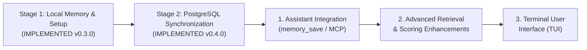

# 08 (EN). Stage Boundaries and Evolutionary Roadmap

> **Stage:** Local Memory & Optional PostgreSQL Synchronization
> **Release Versions:** Program 0.4.0 | Configuration Format 2 (local) / 3 (with sync) | SQLite Schema 3 (local) / 4 (with sync)
> **Status:** Current & Verified (90 total tests: 86 passed and 4 skipped without PostgreSQL test binaries; 90 passed, 0 failures, 645 assertions with isolated PostgreSQL 17.6 on macOS with Bun 1.3.8)
> **Sister translation:** [08. Límites de la Etapa y Hoja de Ruta Futura](../es/08-limites-y-roadmap.md)

This document declares with absolute transparency which capabilities are fully implemented in this delivery (including the interactive `setup` wizard and optional direct PostgreSQL sync), what technical boundaries currently exist, the approved future policy for AI assistants, an architectural comparison against Gentleman Programming and Softmax Data, and the official roadmap for the 3 remaining development phases.

---

## 1. Verified & Completed Capabilities (Current Delivery)

The following capabilities are 100% implemented in `src/`, tested, and verified across the 90 automated test specifications:

- [x] **Interactive Onboarding Setup Assistant (`setup`):** Human-facing console walkthrough for interactive terminals (TTY), explaining global paths (`~/.forge614/.env` and `~/.forge614/engram.db`), offering optional PostgreSQL sync with exact choices `No` and `Sí, configurar PostgreSQL`, accepting connection URLs via masked hidden input (`[oculto]`), warning about full workspace scope, requesting confirmation (`¿Confirmar? [si/NO]:`), returning exit code `130` on cancellation, and safely rejecting non-interactive environments with `INTERACTIVE_REQUIRED` (code `1`).
- [x] **Direct & Optional PostgreSQL Synchronization:** Replicates the entire workspace to an operator-controlled PostgreSQL database without requiring vendor cloud subscriptions, middle tiers, or telemetry.
- [x] **Safe Synchronization Commands:** On-demand single-round command `sync` with structured JSON output, and foreground continuous watcher `sync-watch` with configurable interval (`--interval <1..3600>`, default 30 seconds) and clean `Ctrl+C` interruption (code `130`).
- [x] **Offline Resilience:** SQLite and FTS5 remain 100% local. All save, get, search, and history operations execute locally in SQLite with zero network latency; a PostgreSQL outage never blocks local writes or degrades local CLI operations.
- [x] **Additive Local Schema Migration (Schema 4):** Validated addition of `sync_checkpoints` upon enabling sync in `setup`, without dropping, truncating, or rewriting existing memory tables. Disabling PostgreSQL sync retains schema 4 and local checkpoints intact.
- [x] **Dedicated Remote Schema & Verification (`forge614_sync`):** Creates and verifies canonical `revisions` and `state` tables, acquires transaction advisory locking (`pg_advisory_xact_lock`) during DDL creation, and strictly verifies absence of foreign triggers, procedures, or rewrite rules.
- [x] **CAS Concurrency Control & Immutable Revisions:** Protects head publications in PostgreSQL using `SELECT head ... FOR UPDATE` (Compare-And-Swap) to prevent concurrent write collisions, storing immutable snapshots keyed by SHA-256 hash (`ON CONFLICT (hash) DO NOTHING`).
- [x] **Deterministic 3-Way Snapshot Merge Protocol:** Reconciles the base checkpoint (`base`), local state (`local`), and remote head (`remote`), cleanly merging changes across distinct projects and memories, while asserting via `assertExtension` that history is never truncated or rewritten.
- [x] **Single Configuration and Single Database:** Global storage in `~/.forge614/` with one configuration file `.env` (format 2 local, format 3 with sync, permissions `0600`) and one SQLite database `engram.db` (permissions `0600`) under a private directory (`0700`).
- [x] **Stable Project Identity (`projectId`):** Registered projects in the `projects` table keyed by lowercase UUIDv4. Renaming a project never alters identity, history, or access to memories.
- [x] **Two Memory Scopes (`scope`):** Clean separation between project-scoped memories (`scope: "project"`, linked to `projectId`) and universal shared preferences (`scope: "shared"`, with null `projectId`, stored once).
- [x] **Combined Search with Smart Topic Overrides:** Searching from a project (`search --project-id <UUID>`) defaults to `--scope all`. If a project defines an active memory with the identical `topicKey` as a shared guideline, the project decision overrides the shared rule.
- [x] **Reversible Topic Overrides:** Archiving a project override re-exposes the shared rule; restoring it reinstates the project's exception.
- [x] **Immutable Version Audit Tree:** JSON snapshots in `memory_versions` for every topic update, along with auditable lifecycle events (`events`).
- [x] **Optimistic Concurrency Control:** Mandatory `--expected-version` for updating topic memories, preventing blind overwrites.
- [x] **Idempotency Protection:** Replay protection using `--request-key` with SHA-256 fingerprinting of normalized payloads.
- [x] **Local Explainable FTS5 Retrieval:** Trigram index with column weighting (title 5.0, topic 3.0, content 1.0), priority multiplier (`pinned`), and 30-day half-life recency decay.
- [x] **Fallback Literal Search:** Substring search with Unicode case-folding for queries under 3 characters.
- [x] **Synchronous TypeScript SDK:** Clean synchronous `MemoryWorkspace`, `WorkspaceConfig`, and `MemoryStore` classes, keeping synchronization modules as internal infrastructure.

---

## 2. Active Technical Boundaries and Current Limits

To maintain realistic expectations, the following boundaries remain active in the current implementation:

1. **8 MiB Snapshot Size Limit:**
   Full workspace snapshots are constrained to a strict 8 MiB boundary (`SYNC_TOO_LARGE`). Workspaces exceeding this size cannot synchronize until older notes are archived or future incremental streaming protocols are implemented.
2. **No Automated Conflict Resolution:**
   If two machines make conflicting modifications to the same entity relative to their common base, the system raises `SYNC_CONFLICT` and halts the round. **There is no automated text-merging heuristic or interactive 3-way editor in this release**. Never delete tables or checkpoints to force a sync.
3. **Full Snapshot Transport Cost:**
   Synchronization transfers complete workspace snapshots rather than streaming per-event deltas. It does not include in-flight gzip compression or application-layer end-to-end encryption beyond connection TLS.
4. **`sync-watch` is a Foreground Terminal Process:**
   Does not install background system daemons (*systemd*, *launchd*) or cron entries. If the terminal window running `sync-watch` is closed, polling stops. Local data remains safe in SQLite and will sync on the next run.
5. **SQLite & FTS5 are Strictly Local:**
   PostgreSQL does not maintain a `tsvector` column, `ts_rank_cd` queries, or a `postgres-fts` mode. Full-text search always runs **locally in SQLite**.
6. **No Semantic Vector Embeddings:**
   The search engine relies on exact character trigrams and BM25 ranking. It does not perform semantic synonym matching.
7. **No Context Token Budgeting:**
   The `search` command returns full memory cards without truncation or automated token-window fitting.
8. **No Proactive Assistant Integration / MCP Server:**
   There is no background MCP (*Model Context Protocol*) daemon or automatic capture hook. Saving memories is strictly manual or programmatic.
9. **No Multi-User Authorization Within Storage:**
   The `projectId` provides logical data separation, not multi-user security. Any process running under your local operating system user account can access the local database.

---

## 3. Architectural Comparison: Gentleman, Softmax, and Forge614

<table header-row="true">
<tr>
<td>Criterion</td>
<td>🎩 Gentleman Programming</td>
<td>🧩 Softmax Data</td>
<td>🧠 Forge614 Engram (Current Delivery)</td>
</tr>
<tr>
<td>**Data Location**</td>
<td>SQLite files or folders per project.</td>
<td>Proprietary cloud database server.</td>
<td>**Single local database (`~/.forge614/engram.db`) with optional direct PostgreSQL sync replica.**</td>
</tr>
<tr>
<td>**Initial Setup**</td>
<td>Manual or ad-hoc scripts.</td>
<td>Cloud provisioning and sign-up.</td>
<td>**Friendly interactive assistant (`setup`) with optional PostgreSQL configuration.**</td>
</tr>
<tr>
<td>**Shared Memories**</td>
<td>Not native (isolated per project).</td>
<td>Cloud workspaces.</td>
<td>**Native (`scope: shared`): stored once, accessible from all projects, synchronized across replicas.**</td>
</tr>
<tr>
<td>**Rule Overrides**</td>
<td>Manual prompt engineering.</td>
<td>Vector weight adjustments.</td>
<td>**Deterministic SQL Topic Overrides with instant reversible archival.**</td>
</tr>
<tr>
<td>**Multi-Device Sync**</td>
<td>Unavailable (isolated disks).</td>
<td>Centralized on vendor servers.</td>
<td>**Direct to your own PostgreSQL (`sync` / `sync-watch`) without intermediate cloud vendors.**</td>
</tr>
<tr>
<td>**Who Decides What to Save?**</td>
<td>Assistant via skills and `mem_save`.</td>
<td>Background extraction model (*Reflector*).</td>
<td>**Current:** Manual / TypeScript SDK. **Future:** Proactive assistant integration via `memory_save` with strict scoping.</td>
</tr>
<tr>
<td>**Cost & Privacy**</td>
<td>$0 storage; consumes chat tokens.</td>
<td>Consumes paid API calls (OpenAI embeddings).</td>
<td>**$0:** 100% local, zero tokens, no vendor lock-in or telemetry.</td>
</tr>
</table>

---

## 4. Approved Future Assistant Integration Policy

> [!IMPORTANT]
> **STATUS: APPROVED POLICY PENDING IMPLEMENTATION.**
> When proactive assistant integrations (Claude Code, Cursor, Antigravity) are connected via `memory_save` / MCP, they must adhere to the following operational invariants:

1. **Default Project Scope (`scope: "project"`):**
   Technical decisions, architectural agreements, build instructions, and bug fixes discovered during a session are bound to the active project's `projectId`.
2. **Promotion to Shared (`scope: "shared"`) Requires Explicit Global Intent:**
   A memory may only be stored as shared if the user explicitly specifies that the directive applies universally across projects, evaluated within full conversational context.
3. **No Automatic Fallback to Shared on Ambiguity:**
   If an assistant cannot determine the active `projectId`, it must prompt the user for clarification rather than defaulting to `scope: "shared"`.

---

## 5. Evolutionary Roadmap (3 Remaining Phases)

> [!NOTE]
> Prior stages **Interactive Setup Assistant** (v0.3.0) and **PostgreSQL Synchronization** (v0.4.0) are **COMPLETED**. The remaining 3 phases represent the official implementation sequence:

### 1. Proactive Assistant Integration via `memory_save`
Building Model Context Protocol (MCP) servers and runtime hooks allowing artificial intelligence assistants (Claude Code, Cursor, Antigravity) to proactively record project decisions under the approved scoping policy.

### 2. Advanced Retrieval and Scoring Enhancements
Context pruning heuristics, LLM token budget management, dictionary-backed synonym expansion, and refined mathematical ranking formulas.

### 3. Terminal User Interface (TUI)
An interactive terminal interface to browse projects, inspect memory cards, audit version trees, and manage archival states via keyboard navigation without leaving the console.

---

## 6. Official Test Verification Report

This release is backed by reproducible automated test suites on **macOS with Bun 1.3.8**:

- **Unit & Integration Suite:** **90 total tests** across 11 test files:
  - **86 passed and 4 skipped** under standard invocation (the 4 skipped tests require real PostgreSQL binaries configured via `FORGE614_TEST_POSTGRES_BIN`).
  - **90 passed (0 failures) and 645 assertions** when executed against an isolated loopback PostgreSQL 17.6 cluster.
- **Verified Test Files:** `store.test.ts`, `install.test.ts`, `sync.test.ts`, `workspace.test.ts`, `projects.test.ts`, `setup-terminal.test.ts`, `shared.test.ts`, `postgres-sync.test.ts`, `cli.test.ts`, `setup.test.ts`, `workspace-config.test.ts`.
- **TypeScript Type Verification:** `bun run typecheck` (`tsc --noEmit`) exited with **0 errors**.
- **Code Consistency:** `git diff --check` clean with zero trailing whitespace or format errors.
- **Disconnection & Concurrency Verification:** Verified that `sync-watch` handles network outages gracefully, enables uninterrupted local SQLite operations, and terminates cleanly on `Ctrl+C` with exit code 130.
