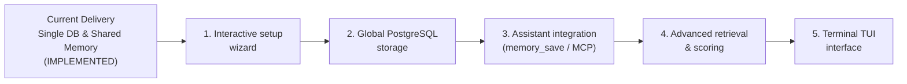

# 08. Stage Boundaries and Evolutionary Roadmap

> **Stage:** Stage 1 — Local Memory (Single Database and Shared Memory)
> **Release Versions:** Program 0.2.0 | Configuration Format 2 | SQLite Schema 3
> **Status:** Current & Verified (65 tests passed, 0 failures on macOS with Bun 1.3.8)
> **Sister translation:** [08. Límites de la Etapa y Hoja de Ruta Futura](../es/08-limites-y-roadmap.md)

This document declares with complete transparency which capabilities are fully implemented in this release, active technical boundaries, architectural comparisons with Gentleman Programming and Softmax Data, and the official 5-stage evolutionary roadmap pending implementation.

---

## 1. Completed and Verified Capabilities (Current Delivery)

The following capabilities are 100% implemented in `src/` and verified by the automated test suite of 65 tests:

- [x] **Single Configuration and Single Database:** Central user storage in `~/.forge614/` with a single `.env` file (mode `0600`) and a single SQLite database `engram.db` (mode `0600`) inside a private directory (mode `0700`).
- [x] **Stable Project Identity (`projectId`):** Registered projects in the `projects` table using lowercase UUIDv4 identifiers. Display name is cosmetic; renaming via `project-rename` never affects identity or memories.
- [x] **Two Memory Scopes (`scope`):** Clear logical separation between project memories (`scope: "project"`, linked to `projectId`) and universal shared memories (`scope: "shared"`, with `projectId: null`, stored once).
- [x] **Combined Search with Smart Topic Overrides:** Project queries (`search --project-id <UUID>`) default to `--scope all`. If the project possesses an active memory with the identical `topicKey` as a shared guideline, the project decision overrides the shared rule for that project.
- [x] **Reversible Topic Overrides:** Archiving the project's exception re-exposes the shared guideline; restoring the exception re-applies project priority.
- [x] **Immutable History and Auditing:** Snapshot copies saved in `memory_versions` upon each topic update, with audit records logged in `events`.
- [x] **Optimistic Concurrency Control:** Enforced `--expected-version` on topic updates, guarding against stale overwrites.
- [x] **Idempotency and Duplicate Prevention:** Native support for `--request-key` with SHA-256 payload hashing and partial unique indexes.
- [x] **Explainable SQLite FTS5 Search:** Trigram index with field weighting (title 5.0, topic 3.0, content 1.0), priority boost (`pinned`), and recency decay curve (30-day half-life).
- [x] **Literal Search Fallback:** Transparent Unicode-folded iteration for queries shorter than 3 characters.
- [x] **Robust Terminal CLI:** Commands `init`, `project-create`, `project-list`, `project-rename`, `save`, `search`, `get`, `history`, `archive`, `restore`, with argument validation before database access and structured JSON outputs.
- [x] **TypeScript SDK:** Classes `MemoryWorkspace`, `WorkspaceConfig`, and `MemoryStore` ready for source code integration.
- [x] **Atomic Security Hardening:** Rejection of symlinks, hard links, non-owner permissions, legacy `projects/` directories (`LEGACY_CONFIG`), and obsolete schema versions (`MIGRATION_REQUIRED`).

---

## 2. Active Technical Boundaries and Limits

To maintain realistic expectations, keep in mind these operational boundaries:

1. **Manual or Code-Driven Saving (No Background Daemon):**
   The engine saves only when you execute `forge614-engram save` or call `store.save(...)`. No background process or daemon passively records conversations.
2. **Literal Keyword Search (No AI Vector Embeddings):**
   The search engine matches exact character sequences using trigrams and BM25. It lacks semantic understanding (e.g., searching for *"car"* will not locate notes about *"automobile"*).
3. **No Context Token Budgeting:**
   The `search` command returns complete matching notes without truncating or budgeting them to fit specific LLM context window token limits.
4. **No MCP Server or Network Socket:**
   No MCP (*Model Context Protocol*) or local HTTP daemon exists yet for connecting external desktop tools via sockets.
5. **No Multi-User Authentication:**
   The `projectId` organizes memories within the database but is not a user password or security barrier. Any process executed by your local OS user can access the database.
6. **No Destructive Erasure:**
   There is no destructive `delete` command; obsolete notes are retired using `archive` to preserve full audit traceability.
7. **No Automatic In-Place Schema Migration:**
   Databases with schema version 1 or 2 halt with `MIGRATION_REQUIRED`. No automatic destructive transformation is applied to existing data.

---

## 3. Architecture Comparison: Gentleman, Softmax, and Forge614

<table header-row="true">
<tr>
<td>Criterion</td>
<td>🎩 Gentleman Programming</td>
<td>🧩 Softmax Data</td>
<td>🧠 Forge614 Engram</td>
</tr>
<tr>
<td>**Data Location**</td>
<td>Per-project SQLite databases or local folders.</td>
<td>Central cloud server.</td>
<td>**Single database (`~/.forge614/engram.db`) and single `.env` in user home directory.**</td>
</tr>
<tr>
<td>**Shared Memories**</td>
<td>Not native (project-isolated).</td>
<td>Cloud organization workspaces.</td>
<td>**Native (`scope: shared`): stored once, accessible across all projects.**</td>
</tr>
<tr>
<td>**Rule Override**</td>
<td>Manual user instructions in prompts.</td>
<td>Vector weight adjustments.</td>
<td>**SQL Topic Overrides with immediate reversibility via archive/restore.**</td>
</tr>
<tr>
<td>**Who Decides What to Save?**</td>
<td>AI assistant via skills and `mem_save` tool.</td>
<td>Background extraction model (*Reflector*).</td>
<td>**Current:** Manual / SDK. **Future:** Proactive assistant capture via `memory_save`.</td>
</tr>
<tr>
<td>**Cost and Privacy**</td>
<td>0 USD storage; consumes chat tokens.</td>
<td>Requires paid cloud API calls (OpenAI embeddings).</td>
<td>**0 USD:** 100% local, zero tokens, zero network requests, zero telemetry.</td>
</tr>
</table>

---

## 4. Official Evolutionary Roadmap (5 Pending Phases)

> [!IMPORTANT]
> **STATUS: APPROVED DESIGN PENDING IMPLEMENTATION.**
> The following 5 milestones define the strict chronological development sequence for upcoming releases. None of these features exist in the current codebase.

### 1. Interactive Configuration Wizard
A terminal wizard guiding users through workspace setup, permission validation, and configuration checks without manual file editing.

### 2. Global PostgreSQL Storage Option
An option to configure a centralized PostgreSQL connection in `~/.forge614/.env` to replace local SQLite for teams requiring shared network storage.

### 3. Assistant Integration via `memory_save`
Implementation of Model Context Protocol (MCP) server endpoints and hooks enabling AI assistants (Claude Code, Cursor, Antigravity) to proactively extract and record learnings.

### 4. Advanced Retrieval and Scoring Enhancements
Mathematical context pruning algorithms, token budgeting, synonym mapping, and ranking refinements.

### 5. Terminal User Interface (TUI)
A keyboard-navigable console application (*Text User Interface*) for visually exploring projects, inspecting memories, and auditing revisions without typing commands.

---

## 5. Official Test Verification Report

This release is verified by automated integration tests on **macOS with Bun 1.3.8**:

- **Unit & Integration Suite:** **65 tests passed (0 failures)** across **483 assertions**.
- **Static Type Checking (TypeScript):** `bun run typecheck` completed with **0 errors**.
- **Code Cleanliness:** `git diff --check` passed cleanly without whitespace anomalies.
- **Concurrency & File Safety:** 45 concurrent test runs across 15 rounds on real SQLite instances, verifying atomic creation, lock timeouts, and rejection of symlinks and legacy directories.
