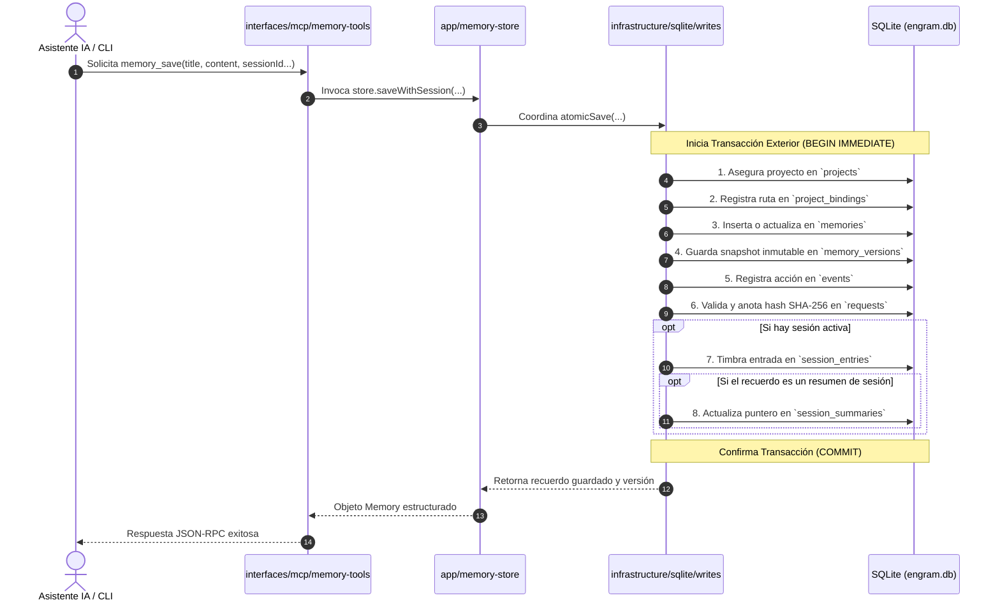

# 05. Arquitectura Interna, Monolito Modular por Funcionalidad, SQLite FTS5 y Fórmulas Matemáticas

> **Etapa:** Monolito Modular por Funcionalidad, Sesiones Progresivas de Memoria, Contexto Clasificado, MCP Local (10 Herramientas), Menú TUI de Asistentes y Réplica PostgreSQL Formato 2
> **Versiones de esta entrega:** Programa 0.5.0 | Formatos de configuración 2 (local) / 3 (con sync) | Esquemas SQLite 3 (local) / 4 (con sync) / 5 (asistentes y asociaciones locales) / 6 (sesiones progresivas y contexto clasificado) | Formatos PostgreSQL 1 y 2
> **Estado:** Vigente y Activo (369 pruebas totales en 69 archivos: 361 superadas y 8 omitidas sin binarios aislados PG; 369 superadas, 0 fallos, 1891 aserciones con `FORGE614_TEST_POSTGRES_BIN` configurado en macOS con Bun 1.3.8)
> **Traducción hermana:** [05 (EN). Internal Architecture, Modular Monolith, FTS5, and Ranking Formulas](../en/05-internal-architecture-and-formulas.md)

Este documento expone con rigor de tesis técnica la arquitectura interna de Forge614 Engram: los fundamentos de la reorganización en **monolito modular por funcionalidad**, los problemas previos y alternativas evaluadas, el árbol de directorios real y responsabilidades, las reglas de dependencias y auditoría automática mediante AST, las transacciones compuestas, la guía de colocación de cambios, la organización de pruebas colocadas (*colocated tests*), lo que se preservó inmutable, los límites del patrón, los parámetros de bajo nivel de SQLite (pragmas), los esquemas relacionales v3 a v6, el servidor MCP por stdio con 10 herramientas y las fórmulas matemáticas de BM25, recencia y presupuesto estricto de bytes.

---

## 1. El Patrón Elegido: Monolito Modular por Funcionalidad

### 1.1. Nombre y Definición del Patrón
El patrón arquitectónico adoptado en esta entrega es el **Monolito Modular por Funcionalidad (*Feature-Oriented Modular Monolith*)**.

- **Monolito (*Monolith*):** Significa que el sistema se compila, empaqueta y distribuye como un único artefacto ejecutable desplegable en el sistema operativo (`forge614-engram`), que corre en un solo proceso local en tu computadora. No se divide en múltiples microservicios remotos, ni utiliza comunicación de red interna, ni requiere demonios adicionales para funcionar.
- **Modular por Funcionalidad (*Feature-Oriented Modular*):** Significa que el código interno está dividido en fronteras lógicas cohesivas según el concepto de dominio al que sirven (memoria, proyectos, sesiones, búsqueda, sincronización, espacio central, asistentes), en lugar de agruparse únicamente por el rol técnico de los archivos. Cada módulo es dueño exclusivo de sus reglas y define una puerta de entrada explícita (`index.ts`).

> [!NOTE]
> **Elección Contextual, no Dogma Universal:** La adopción del monolito modular por funcionalidad es una decisión técnica deliberada y contextual para un CLI local y SDK síncrono que opera sobre un único archivo de configuración (`~/.forge614/.env`) y una única base SQLite (`~/.forge614/engram.db`). No se vende aquí como un estándar obligatorio ni universal para todo proyecto informático.

### 1.2. Problemas Concretos Anteriores y Razones de la Reorganización
Antes de esta entrega, el código fuente de Engram había crecido orgánicamente hasta acumular aproximadamente **3,154 líneas de código de producción** con graves problemas de cohesión:
1. **Mezcla indiscriminada en la raíz de `src/`:** Almacenamiento SQL, tipos de datos, validaciones de sesiones, búsquedas FTS5, adaptadores de configuración, menús de terminal y herramientas MCP residían juntos en el mismo directorio plano.
2. **Hipertrofia de `MemoryStore`:** La clase `MemoryStore` (en el antiguo `src/store.ts`) actuaba como un objeto dios (*God Object*), reuniendo en un solo archivo sentencias SQL DDL, manipulación de proyectos, control inmutable de versiones, transacciones de eventos, validación de sesiones progresivas, búsquedas ponderadas e instantáneas de sincronización.
3. **Acoplamiento de presentación con infraestructura:** La interfaz de terminal TUI resolvía directamente rutas ejecutables en el disco, ejecutaba procesos de autoprueba e insertaba configuraciones de clientes, dificultando probar la interfaz de usuario de forma aislada.
4. **Fragilidad en pruebas:** Diversas pruebas dependían de rutas relativas frágiles hacia archivos profundos de `src/`, rompiéndose ante cualquier ajuste cosmético.

### 1.3. Alternativas Evaluadas y sus Costes Reales

```text
┌─────────────────────────────────────────────────────────────────────────────────┐
│                       COMPARATIVA DE ENFOQUES ARQUITECTÓNICOS                   │
├───────────────────────┬───────────────────────────────┬─────────────────────────┤
│ Enfoque               │ Ventajas                      │ Costes / Desventajas    │
├───────────────────────┼───────────────────────────────┼─────────────────────────┤
│ Carpetas Globales por │ Separación técnica simple     │ Dispersión funcional:   │
│ Capas (Layered)       │ (models/, services/, repos/)  │ una sola característica │
│                       │ intuitiva al inicio.          │ (e.g. sesiones) queda   │
│                       │                               │ repartida en 4 carpetas │
├───────────────────────┼───────────────────────────────┼─────────────────────────┤
│ Hexagonal Estricta    │ Sustituibilidad abstracta     │ Sobre-ingeniería total: │
│ (Ports & Adapters con │ total de cualquier tecnología │ repositorios genéricos, │
│ DI Container)         │ mediante interfaces puras.    │ contenedores DI y 3x    │
│                       │                               │ clases para CLI local.  │
├───────────────────────┼───────────────────────────────┼─────────────────────────┤
│ Monolito Modular por  │ Cohesión por concepto, bajo   │ Requiere disciplina de  │
│ Funcionalidad         │ acoplamiento, SDK síncrono    │ imports, barriles       │
│ (ELEGIDO)             │ transparente, SQL directo y   │ explícitos y auditoría  │
│                       │ verificación AST automática.  │ continua con TypeScript.│
└───────────────────────┴───────────────────────────────┴─────────────────────────┘
```

- **Por qué se descartó la Arquitectura por Capas Global (*Layered Architecture*):** Agrupar todo el sistema en carpetas técnicas globales (`src/models/`, `src/services/`, `src/repositories/`) fragmenta cada funcionalidad. Para modificar cómo funciona una sesión de memoria, un desarrollador debía editar archivos en tres extremos distantes del proyecto, perdiendo visión de conjunto.
- **Por qué se descartó la Arquitectura Hexagonal Estricta (*Strict Hexagonal Architecture*):** Introducir puertos formales para cada consulta, repositorios abstractos genéricos, entidades desconectadas de SQLite y un contenedor de inyección de dependencias (*Dependency Injection Container*) para un programa CLI que corre de forma local y síncrona representaba una sobre-ingeniería innecesaria que multiplicaba la complejidad sin aportar valor al usuario.
- **No es DDD completo ni Microservicios:** No se pretende etiquetar a Engram como *Domain-Driven Design* (DDD) purista, ni se utilizan eventos de integración distribuidos ni microservicios. Se toman los límites y fronteras útiles de diseño modular sin asumir la parafernalia dogmática.
- **Costes reales asumidos:** Mantener este patrón exige disciplina de exportaciones (`index.ts` por módulo), impedir activamente imports cruzados y auditar el código mediante un analizador de sintaxis (*AST auditor*).

---

## 2. Árbol Final Real y Responsabilidades por Directorio

El árbol de código fuente de producción en `src/` se organiza en cuatro capas conceptuales concéntricas, más una entrada ejecutable mínima y una biblioteca pública compartida:

```text
src/
├── cli.ts                         # [Arranque Mínimo] 2 líneas exactas de delegación
├── index.ts                       # [API Pública SDK] Barril único y estable
│
├── app/                           # [Coordinación de Flujos]
│   ├── index.ts                   # Exportaciones de coordinación
│   ├── memory-store.ts            # Fachada compatible con MemoryStore histórico
│   ├── workspace.ts               # Ciclo de vida y apertura del espacio central
│   ├── project-context.ts         # Resolución de identidad Git y vinculaciones
│   ├── synchronization.ts         # Coordinación de réplica y snapshots (sin I/O terminal)
│   ├── setup.ts                   # Secuencia de inicialización asistida (SetupIO)
│   └── assistants.ts              # Coordinación de detección y configuración de asistentes
│
├── modules/                       # [Reglas de Negocio Puras y Tipos] (Sin I/O)
│   ├── memory/                    # Tipos, validación y reglas de recuerdos y temas
│   ├── projects/                  # Identidad inmutable de proyectos (UUID)
│   ├── sessions/                  # Ciclo de sesiones, timbrado e inferencia
│   ├── search/                    # Términos, límites Unicode/bytes y proyecciones
│   ├── synchronization/           # Validación de snapshots y reconciliación 3-way
│   ├── workspace/                 # Contratos de configuración global del entorno
│   └── assistants/                # Catálogo, protocolo de memoria y ganchos
│
├── infrastructure/                # [Adaptadores de Entrada/Salida Concretos]
│   ├── sqlite/                    # Conexión, esquemas y operaciones especializadas
│   │   ├── connection.ts          # Apertura con WAL y pragmas estrictos
│   │   ├── schema.ts              # DDL de Esquemas 3, 4, 5 y 6
│   │   ├── projects.ts            # Consultas de proyectos y vínculos
│   │   ├── memory.ts              # Consultas de recuerdos y versiones
│   │   ├── writes.ts              # Transacciones compuestas atómicas exteriores
│   │   ├── sessions.ts            # Consultas de sesiones y entradas
│   │   ├── search.ts              # Consultas SQLite FTS5 y proyecciones
│   │   ├── snapshots.ts           # Lectura/escritura de instantáneas locales
│   │   └── workspace-database.ts  # Ciclo de vida de la base de datos
│   ├── postgres/                  # Adaptador de red y réplica remota CAS (replica.ts)
│   ├── filesystem/                # Rutas (paths.ts), configuración (.env) y backups
│   ├── git/                       # Resolución canónica por --git-common-dir
│   └── assistants/                # Lectura/escritura de configs y autoprueba de procesos
│
├── interfaces/                    # [Presentación y Entrega al Usuario/Asistente]
│   ├── cli/                       # Parser de argumentos, comandos y salida JSON
│   ├── mcp/                       # Servidor stdio, esquemas, herramientas y despacho
│   ├── tui/                       # Estado de terminal interactiva, renderizado y teclado
│   └── terminal/                  # Preguntas de setup, señales y reloj de sync-watch
│
└── shared/                        # [Primitivas Compartidas Fundamentales]
    └── errors.ts                  # Clase única MemoryError para todo el sistema
```

### Funciones de los Componentes Clave:
1. **`src/cli.ts` (Arranque Mínimo del Ejecutable):**
   Contiene exactamente **dos líneas de código**: importa `main` desde `./interfaces/cli/main` y lo ejecuta pasando `process.argv.slice(2)`. No contiene lógica de negocio ni manipula errores. Se verifica mediante pruebas de instalación autónoma en un entorno temporal.
2. **`src/index.ts` (Barril Público del SDK):**
   Punto de entrada inmutable para consumidores de TypeScript. Exporta únicamente las clases y tipos documentados oficialmente. **El código interno del repositorio jamás importa `src/index.ts`**, evitando dependencias circulares hacia la raíz.
3. **`src/app/memory-store.ts` (Fachada Compatible):**
   Implementa el patrón de diseño Fachada (*facade*). Mantiene el 100% de la interfaz pública y firmas que los clientes del SDK conocen de `MemoryStore`, pero delega internamente la persistencia a las operaciones atómicas de `src/infrastructure/sqlite/`.
4. **`src/infrastructure/sqlite/writes.ts` (Coordinador de Transacciones Compuestas):**
   Gestiona la conexión compartida de SQLite y ejecuta las transacciones exteriores atómicas para guardar recuerdos, versiones, eventos, peticiones idempotentes y timbrado de sesiones bajo una única unidad indivisible.

---

## 3. Mapa Antes/Después y Ubicación de la API Pública

La siguiente tabla detalla la correspondencia exacta entre los antiguos archivos planos de `src/` y su nueva ubicación modular:

| Archivo Original (Plano) | Destino Modular (Estructurado) | Responsabilidad Extraída |
| :--- | :--- | :--- |
| `src/domain.ts` | `src/modules/memory/` y `src/modules/projects/` | Tipos del dominio (`Memory`, `Project`, etc.). `MemoryError` se trasladó a `src/shared/errors.ts`. |
| `src/identity.ts` | `src/modules/projects/identity.ts` | Validación y generación de identificadores UUID v4. |
| `src/session-types.ts` y `src/sessions.ts` | `src/modules/sessions/` y `src/infrastructure/sqlite/sessions.ts` | Lógica de sesión separada de las consultas SQL y transacciones de sesión. |
| `src/retrieval-types.ts` y `src/retrieval.ts` | `src/modules/search/` y `src/infrastructure/sqlite/search.ts` | Términos, presupuestos y límites en módulo; sentencias FTS5 en infraestructura. |
| `src/store.ts` | `src/app/memory-store.ts` + `src/infrastructure/sqlite/*` | Fachada de coordinación en `app/` y operaciones SQL particionadas funcionalmente. |
| `src/schema.ts` | `src/infrastructure/sqlite/schema.ts` | Sentencias DDL y validaciones de versión de esquema v3 a v6. |
| `src/sync-snapshot.ts` | `src/modules/synchronization/` | Estructuras de datos de snapshots y algoritmo de conciliación 3-way. |
| `src/sync-local.ts` | `src/infrastructure/sqlite/snapshots.ts` | Extracción y aplicación de instantáneas en SQLite local. |
| `src/sync-postgres.ts` | `src/infrastructure/postgres/replica.ts` | Transporte remoto a PostgreSQL y validación de compare-and-swap (CAS). |
| `src/synchronize.ts` y `src/sync-runner.ts` | `src/app/synchronization.ts` y `src/interfaces/terminal/sync-watch.ts` | Flujo de coordinación en `app/`; reloj interactivo, señales e impresión en `interfaces/`. |
| `src/paths.ts` | `src/infrastructure/filesystem/paths.ts` | Rutas del sistema (`~/.forge614/`) y resolución de entorno. |
| `src/workspace-config.ts` | `src/infrastructure/filesystem/workspace-config.ts` | Lectura, escritura atómica y cerrojos sobre `~/.forge614/.env`. |
| `src/workspace-database.ts` | `src/infrastructure/sqlite/workspace-database.ts` | Inicialización y verificación de archivo `engram.db`. |
| `src/workspace.ts` | `src/app/workspace.ts` | Orquestación del espacio central del usuario (`MemoryWorkspace`). |
| `src/project-context.ts` | `src/app/project-context.ts` + `src/infrastructure/git/` | Coordinación de proyectos con resolución de directorios mediante Git. |
| `src/setup.ts` | `src/app/setup.ts` | Flujo lógico de configuración (`SetupFlow`) con contrato abstracto `SetupIO`. |
| `src/setup-terminal.ts` | `src/interfaces/terminal/setup.ts` | Implementación interactiva de `SetupIO` para terminal TTY (preguntas y secretos). |
| `src/cli.ts` (antiguo) | `src/cli.ts` (mínimo) + `src/interfaces/cli/*` | Parser, validadores de argumentos, ayuda y despacho organizados por comandos. |
| `src/mcp.ts` y `src/mcp-tools.ts` | `src/interfaces/mcp/*` | Servidor MCP, validadores de esquemas y controladores de herramientas. |
| `src/memory-protocol.ts` | `src/modules/assistants/protocol.ts` | Reglas y directrices de texto del protocolo de memoria para asistentes. |
| `src/assistants/catalog.ts` | `src/modules/assistants/catalog.ts` + `infrastructure/assistants/` | Metadatos y reglas en módulo; detección en disco en infraestructura. |
| `src/assistants/configuration.ts` | `src/infrastructure/assistants/configuration.ts` | Adaptadores de archivo para Claude, Codex, Cursor, OpenCode y Gemini. |
| `src/assistants/files.ts` | `src/infrastructure/filesystem/private-files.ts` | Operaciones seguras con respaldos UUID `0600` y cerrojos. |
| `src/assistants/hooks.ts` | `src/modules/assistants/` + `src/interfaces/terminal/hooks.ts` | Plantillas de ganchos en módulo; despacho del subcomando hook en interfaz. |
| `src/assistant-self-test.ts` | `src/infrastructure/assistants/self-test.ts` | Proceso aislado para autoprueba del servidor MCP. |
| `src/assistant-tui.ts` y `render.ts` | `src/interfaces/tui/controller.ts` y `src/interfaces/tui/render.ts` | Máquina de estados de la pantalla TUI, renderizado ANSI y gestión de teclado. |

> [!WARNING]
> **Rutas Internas Eliminadas Definitivamente:** Las rutas directas antiguas (por ejemplo `import { MemoryStore } from "./store"`) ya no existen. La API pública estable se consume exclusivamente desde `src/index.ts` o el paquete raíz.

---

## 4. Reglas de Dependencias y Auditoría AST

### 4.1. Matriz de Dependencias Permitidas y Prohibidas
Para evitar el desorden arquitectónico y el acoplamiento cruzado, se aplican reglas estrictas de importación:

```text
┌─────────────────┐       ┌─────────────────┐
│   interfaces    │ ────► │       app       │
└────────┬────────┘       └────────┬────────┘
         │                         │
         │ (tipos/shared)          ├────────────────┐
         ▼                         ▼                ▼
┌─────────────────┐       ┌─────────────────┐ ┌──────────────┐
│     modules     │ ◄──── │ infrastructure  │ │    shared    │
└─────────────────┘       └─────────────────┘ └──────────────┘
```

1. **Capa `modules` (Reglas Puras de Negocio):**
   - **Permitido:** Tipos de TypeScript, utilidades criptográficas puras (`node:crypto` para SHA-256 de hashes, `node:util`), y dependencias dirigidas entre módulos según el grafo de conceptos (e.g. `memory` depende de `projects`; `sessions` depende de `memory` y `projects`).
   - **Prohibido:** No importa `app`, `interfaces`, `infrastructure`, `bun:sqlite`, `node:fs`, `node:net` ni subprocesos.
2. **Capa `infrastructure` (Adaptadores Concretos):**
   - **Permitido:** Importa contratos públicos de `modules` y `shared`. Realiza I/O sobre bases de datos, disco o procesos.
   - **Prohibido:** No importa `app` ni `interfaces`.
3. **Capa `app` (Flujos de Coordinación):**
   - **Permitido:** Conecta y orquesta `modules`, `infrastructure` y `shared`.
   - **Prohibido:** **Jamás importa `interfaces`**. No imprime en terminal ni despacha respuestas JSON-RPC.
4. **Capa `interfaces` (Presentación y Transporte):**
   - **Permitido:** Utiliza `app`, contratos públicos de `modules` y `shared`. La interfaz CLI (`interfaces/cli/main.ts`) tiene permitido componer las interfaces hermanas `interfaces/mcp/server`, `interfaces/tui/controller` y `interfaces/terminal/setup`.
   - **Prohibido:** **Nunca importa `infrastructure` directamente**. No ejecuta consultas SQL directas ni manipula conexiones.
5. **Aislamiento de la Entrada del SDK:**
   - **Regla Estricta:** Ningún archivo interno dentro de `src/` puede importar `src/index.ts`. Esto garantiza que el punto de exportación no genere dependencias circulares hacia los componentes que exporta.

### 4.2. ¿Qué es un Ciclo de Dependencias y Cómo se Detecta?
Un ciclo de dependencias ocurre cuando el módulo A importa al módulo B, y el módulo B (directa o indirectamente a través de C) vuelve a importar al módulo A ($A \to B \to C \to A$). Esto crea acoplamiento indestructible, hace imposible probar los componentes por separado y causa errores de ejecución por referencias indefinidas (*circular reference TDZ*).

Para impedir esto de forma automatizada, Engram incluye un **auditor de arquitectura basado en el AST (*Abstract Syntax Tree*) de TypeScript** (`tests/architecture/import-rules.ts`):
- Lee el código fuente y extrae todas las declaraciones de `import`, `export`, tipos `import(...)` y llamadas a `require`.
- Construye un grafo dirigido entre componentes (`graph.set(origen, destino)`).
- Ejecuta una búsqueda en profundidad (*Depth-First Search - DFS*) rastreando caminos activos mediante dos conjuntos: `visiting` (nodos en la pila actual) y `visited` (nodos ya validados).
- Si durante la exploración se encuentra un nodo que ya está en `visiting`, el auditor aborta la suite reportando: `component cycle: A -> B -> C -> A`.

---

## 5. Flujos Completos de Ejecución y Transacciones Compuestas

### 5.1. Flujo de Guardado (`Save`) y Transacción Exterior Atómica
Cuando un usuario guarda un recuerdo desde el CLI o un asistente lo solicita mediante la herramienta MCP `memory_save`, la operación involucra múltiples tablas que deben actualizarse como una sola unidad atómica:



- **Transacción Exterior Compartida:** Todas las escrituras de persistencia se canalizan a través de `infrastructure/sqlite/writes.ts`. Los ayudantes de tabla (`memory.ts`, `projects.ts`, `sessions.ts`) reciben la **misma conexión de base de datos activa** y participan dentro de la transacción exterior (`BEGIN IMMEDIATE; ... COMMIT;`). Ningún ayudante confirma transacciones de forma aislada, garantizando consistencia absoluta ante cualquier fallo.

### 5.2. Flujo de Búsqueda (`Search`)
1. **Interfaz (`interfaces/mcp/` o `interfaces/cli/`):** Recibe la consulta, el límite y la bandera de vista previa (`--preview`).
2. **Coordinación (`app/memory-store.ts`):** Delega en el motor de búsqueda síncrono.
3. **Módulo (`modules/search/`):** Normaliza términos, verifica presupuestos de bytes y límites Unicode.
4. **Infraestructura (`infrastructure/sqlite/search.ts`):** Ejecuta la consulta FTS5 sobre `memories_fts` con pesos trigram, calcula la fórmula matemática de BM25 combinada con recencia y proyecta la salida truncada o completa según corresponda.

### 5.3. Flujo de Sincronización (`Sync`) y Reconciliación
1. **Coordinación (`app/synchronization.ts`):** Solicita la instantánea local a `infrastructure/sqlite/snapshots.ts` y el estado remoto a `infrastructure/postgres/replica.ts`.
2. **Módulo (`modules/synchronization/`):** Ejecuta el algoritmo de reconciliación determinista de tres vías (*3-way merge*) sin conexión de red.
3. **Infraestructura (`infrastructure/postgres/replica.ts`):** Publica la instantánea resultante en PostgreSQL utilizando un bloqueo optimista CAS (*Compare-And-Swap*) sobre el hash de cabecera. Si otra máquina publicó una versión concurrente, el CAS falla de forma segura con `SYNC_CONFLICT` sin sobreescrituras ciegas.

---

## 6. Guía Práctica «Dónde Poner un Cambio»

Para mantener la integridad modular en futuros desarrollos, utiliza esta tabla de correspondencia para ubicar exactamente en qué archivo debe agregarse o modificarse cada tipo de funcionalidad:

| Tipo de Cambio o Necesidad | Capa Responsable | Directorio y Archivos Concretos |
| :--- | :--- | :--- |
| **Nueva regla de validación de recuerdos** (ej. límite de caracteres en títulos) | `modules` | `src/modules/memory/validation.ts` (lógica pura sin SQL ni disco). |
| **Nuevo tipo de memoria** (ej. categoría `checklist`) | `modules` | `src/modules/memory/types.ts` y actualizar arreglo `memoryTypes`. |
| **Nuevo comando en la terminal CLI** | `interfaces` | `src/interfaces/cli/commands.ts` (ejecución) y `src/interfaces/cli/arguments.ts` (parser de banderas). |
| **Nueva herramienta en el servidor MCP** | `interfaces` | `src/interfaces/mcp/memory-tools.ts` o `sessions-tools.ts`, esquema en `schemas.ts` y registro en `server.ts`. |
| **Nueva consulta o tabla en SQLite** | `infrastructure` | `src/infrastructure/sqlite/<tema>.ts` y actualizar DDL en `schema.ts`. |
| **Nueva pantalla o menú interactivo TUI** | `interfaces` | `src/interfaces/tui/render.ts` (dibujo ANSI) y `src/interfaces/tui/controller.ts` (gestión de teclas y estados). |
| **Nuevo flujo interactivo de terminal** (preguntas / confirmaciones) | `interfaces` | `src/interfaces/terminal/<nombre>.ts`, coordinado a través de una interfaz abstracta en `app/`. |
| **Nuevo proveedor de Embeddings Vectoriales (Fase 5)** | `modules` e `infrastructure` | Contratos y ordenación en `src/modules/search/`, y adaptador de cálculo de vectores o llamadas externas en `src/infrastructure/search/` (o adaptador específico en infraestructura). **No mezclar con comandos ni afirmar que ya existe.** |

---

## 7. Organización de Pruebas Colocadas (*Colocated Tests*) y Evidencias de Verificación

### 7.1. Filosofía de Pruebas Colocadas
La unidad de organización de las pruebas en Forge614 Engram es el **dueño del comportamiento**, no el tipo abstracto de prueba:
- **Pruebas Hermanas Colocadas (*Colocated Sibling Tests*):** Cada archivo de implementación que contiene lógica de negocio (`.ts`) tiene un archivo de prueba hermano ubicado exactamente a su lado (`<nombre>.test.ts`). Por ejemplo, `src/infrastructure/sqlite/memory.ts` tiene a su lado `src/infrastructure/sqlite/memory.test.ts`. Los **46 archivos con lógica** cuentan con su prueba hermana individual.
- **Pruebas de Colaboración Locales (`__tests__/`):** Cuando varios componentes de una funcionalidad colaboran estrechamente (por ejemplo, la fachada `MemoryStore` con SQLite y sesiones), la prueba de colaboración se ubica en una subcarpeta `__tests__/` dentro del directorio dueño de esa funcionalidad (ej. `src/app/__tests__/sessions.integration.test.ts`).
- **Regla Estricta de Suites:** Las pruebas importan código de implementación de producción; **las suites de pruebas jamás importan otras suites de pruebas**.
- **Pruebas Transversales en `tests/`:** Solo permanecen en la carpeta raíz `tests/` las suites que evalúan aspectos transversales de todo el repositorio:
  - `tests/architecture/`: Auditoría de reglas de importación, ausencia de ciclos (`import-rules.ts`) y distribución de pruebas (`test-layout.ts`).
  - `tests/e2e/`: Pruebas de instalación del ejecutable autónomo, servidor MCP por stdio y terminales virtuales interactivas (PTY).
  - `tests/fixtures/`: Ayudas y datos de prueba sintéticos compartidos (ej. instantáneas de Formato 1).
  - `src/index.test.ts`: Verificación del contrato público y exportaciones inmutables del SDK.

> [!IMPORTANT]
> **Correspondencia Física $\neq$ 100% de Cobertura:** Tener una prueba hermana colocada junto a cada archivo demuestra que cada componente con lógica tiene un dueño de prueba formal, pero **no equivale a una afirmación de 100% de cobertura de ramas (*branch coverage*)**. Las pruebas de colaboración y aserciones significativas siguen siendo indispensables.
>
> **Excepciones Justificadas sin Prueba Hermana:** Los archivos que contienen exclusivamente declaraciones de tipos (`types.ts`), constantes estáticas o reexportaciones no requieren pruebas artificiales. El archivo de arranque mínimo `src/cli.ts` (2 líneas) delega en `interfaces/cli/main.ts` y se verifica mediante la prueba de instalación de binario en terminal virtual.

### 7.2. Comandos de Verificación y Evidencias Observadas

Los comandos oficiales de verificación de la arquitectura modular son:

```bash
# 1. Ejecución de la suite completa de pruebas
bun test

# 2. Verificación de reglas arquitectónicas de imports y distribución
bun test tests/architecture

# 3. Comprobación estricta de tipos de TypeScript (cero errores)
bun run typecheck

# 4. Verificación de limpieza de código en Git (sin conflictos de formato)
git diff --check
```

### 7.3. Evolución del Conteo de Pruebas y Resultados

```text
┌─────────────────────────────────────────────────────────────────────────────────┐
│                      HISTORIAL Y VERIFICACIÓN DE PRUEBAS                        │
├───────────────────────────────┬──────────────┬───────────────┬──────────────────┤
│ Hito de Verificación          │ Pruebas      │ Archivos      │ Estado           │
├───────────────────────────────┼──────────────┼───────────────┼──────────────────┤
│ Baseline Previo (Handoff 09)  │ 250 pass     │ 18 archivos   │ 1506 aserciones  │
├───────────────────────────────┼──────────────┼───────────────┼──────────────────┤
│ Primera Reorganización Modular│ 289 pass     │ 30 archivos   │ 1583 aserciones  │
├───────────────────────────────┼──────────────┼───────────────┼──────────────────┤
│ Suite Final con Pruebas       │ 369 pass*    │ 69 archivos   │ 1891 aserciones  │
│ Colocadas (Entrega 10)        │ (361 pass /  │               │ (30.69s)         │
│                               │  8 skip PG)  │               │                  │
└───────────────────────────────┴──────────────┴───────────────┴──────────────────┘
* Nota: Los 8 casos omitidos corresponden a pruebas de réplica con servidor PostgreSQL
  aislado cuando la variable FORGE614_TEST_POSTGRES_BIN no se encuentra definida en el entorno.
  Con un binario PostgreSQL aislado temporal configurado, se ejecutan y superan 369 pass, 0 fail.
```

---

## 8. Lo que NO Cambió en Esta Entrega

Para garantizar estabilidad total a los usuarios y sistemas existentes, se mantuvieron estrictamente inmutables:
1. **Esquemas de Base de Datos SQLite:** Los Esquemas 3, 4, 5 y 6 conservan exactamente sus sentencias DDL, índices, tablas virtuales FTS5 trigram y el identificador `PRAGMA application_id = 1177956660`.
2. **Formatos de Réplica PostgreSQL:** Los Formatos de instantánea 1 y 2, sus esquemas `forge614_sync`, las funciones de hash SHA-256 y la promoción explícita CAS permanecen idénticos.
3. **Firmas Públicas del SDK de TypeScript:** Las clases `MemoryWorkspace`, `WorkspaceConfig`, `MemoryStore`, `MemoryError` y sus métodos síncronos mantienen sus nombres, parámetros y tipos de retorno exactos en `src/index.ts`.
4. **Comandos y Banderas de la Terminal CLI:** Todos los comandos (`save`, `get`, `search`, `timeline`, `context`, `session-start`, `session-end`, `session-summary`, `tui`, `setup`, `sync`, etc.) responden con la misma sintaxis, códigos de salida y formatos JSON.
5. **Protocolo y Catálogo MCP:** El servidor MCP por stdio mantiene sus **10 herramientas oficiales**, esquemas JSON-RPC idénticos y canal limpio en `stdout`.
6. **Rutas Centrales de Usuario:** El espacio central `~/.forge614/`, el archivo `.env`, la base `engram.db` y los permisos seguros (`0700` y `0600`) siguen intactos.
7. **Nombre del Ejecutable Binario:** El ejecutable autónomo compilado continúa llamándose `forge614-engram`.

---

## 9. Límites Reales del Patrón Arquitectónico

Es esencial documentar con transparencia lo que el patrón modular **no hace**:
1. **No elimina los errores por sí solo:** Separar el código en módulos y adaptadores organiza las responsabilidades, pero no previene errores de lógica, condiciones de carrera o excepciones no controladas.
2. **No distribuye procesos en la red:** El monolito sigue siendo un único ejecutable local. No convierte a Engram en una arquitectura distribuida ni en microservicios.
3. **No hace a cada componente intercambiable en caliente automáticamente:** Desacoplar código facilita sustituir implementaciones en tiempo de desarrollo, pero no significa que cualquier módulo pueda reemplazarse dinámicamente en tiempo de ejecución sin adaptar interfaces.
4. **Exige disciplina continua de importación:** Sin la auditoría constante del analizador AST en la suite de pruebas, la separación modular se degradaría rápidamente ante imports cruzados accidentales.
5. **No añade capacidades de inteligencia artificial ni búsqueda semántica:** Esta reorganización puramente estructural no incluye modelos de lenguaje en segundo plano, redes neuronales ni embeddings vectoriales; la búsqueda semántica corresponde a la futura Fase 5.

---

## 10. Parámetros de Bajo Nivel de SQLite (Pragmas) y Concurrencia WAL

Forge614 Engram opera sobre el motor nativo de SQLite integrado en Bun (`bun:sqlite`), configurado en `src/infrastructure/sqlite/connection.ts` con directivas rigurosas:

1. **`PRAGMA foreign_keys = ON;`**
   Garantiza integridad referencial absoluta. Las versiones históricas, eventos, sesiones, vinculaciones y resúmenes exigen claves foráneas válidas.
2. **`PRAGMA busy_timeout = 5000;`**
   Si dos procesos intentan escribir concurrentemente en la base, SQLite **espera hasta 5,000 milisegundos (5 segundos)** a que la transacción en curso concluya antes de emitir un fallo de concurrencia.
3. **`PRAGMA application_id = 1177956660;`**
   Identificador exclusivo de Forge614 Engram verificado antes de interactuar con cualquier base de datos.
4. **`PRAGMA user_version = 3`, `4`, `5` o `6`;**
   - **Versión 3:** Almacenamiento local puro sin sincronización ni asociaciones.
   - **Versión 4:** Almacenamiento con réplica PostgreSQL habilitada (añade `sync_checkpoints`).
   - **Versión 5:** Almacenamiento con integración de asistentes y asociaciones de carpetas (añade `project_bindings`).
   - **Versión 6:** Almacenamiento con sesiones progresivas, resúmenes y contexto clasificado (añade `sessions`, `session_entries`, `session_summaries`, `local_session_bindings`, `local_manual_sessions`).
   - **Regla de oro de apertura:** Una apertura normal de SQLite (`workspace.open()`), comandos habituales de recuerdos o el servidor MCP **jamás auto-migran la base de datos**. Las promociones de esquema son estrictamente explícitas y aditivas (`setup`, `tui`, `integration-enable`, `sessions-enable`).
5. **`PRAGMA journal_mode = WAL;` (Write-Ahead Logging)**
   - Los lectores no bloquean a los escritores y los escritores no bloquean a los lectores.
   - Lecturas en frío de solo lectura bajo macOS son garantizadas mediante una transacción inmediata inicial (`BEGIN IMMEDIATE; COMMIT;`) al crear la base.

---

## 11. Fórmulas Matemáticas de Búsqueda y Presupuesto de Datos

### 11.1. Ponderación BM25 en SQLite FTS5
SQLite FTS5 evalúa las coincidencias utilizando la función de ranking BM25 (*Best Matching 25*):

$$\text{BM25}(D, Q) = \sum_{i=1}^{N} \text{IDF}(q_i) \cdot \frac{f(q_i, D) \cdot (k_1 + 1)}{f(q_i, D) + k_1 \cdot \left(1 - b + b \cdot \frac{|D|}{\text{avgdl}}\right)}$$

- Parámetros del motor: $k_1 = 1.2$, $b = 0.75$.
- Ponderación por columnas en Engram: `title: 5.0`, `topic_key: 3.0`, `content: 1.0`.
- **Naturaleza del puntaje en SQLite FTS5:** La función nativa `bm25()` de SQLite devuelve **valores negativos**, donde un valor más negativo representa una coincidencia más fuerte y relevante.

### 11.2. Multiplicador de Fijación y Recencia
Para integrar la prioridad y la frescura temporal con el puntaje BM25 de SQLite:

$$\text{multiplier} = 1 + 0.10 \times \text{pinned} + \frac{0.06}{1 + \frac{\text{ageDays}}{30}}, \quad (\text{ageDays} \ge 0)$$

donde:
- $\text{pinned} \in \{0, 1\}$: Vale 1 si el recuerdo está fijado, 0 en caso contrario.
- $\text{ageDays} = \max\left(0, \text{julianday}('now') - \text{julianday}(m.\text{updated\_at})\right)$: Antigüedad del recuerdo en días.
- Si el recuerdo es nuevo ($\text{ageDays} = 0$) y está fijado ($\text{pinned} = 1$), el multiplicador alcanza su máximo de $1.16$.
- Conforme transcurre el tiempo, el término de recencia converge suavemente a 0 y el multiplicador converge a $1.00$ (o $1.10$ si permanece fijado).

**Cálculo de Ordenamiento:**
$$\text{orderScore} = \text{bm25} \times \text{multiplier}$$

Dado que $\text{bm25}$ es un número negativo, al multiplicarlo por $\text{multiplier} \ge 1.0$, los mejores resultados obtienen números aún más negativos. La consulta ordena ascendentemente:
```sql
ORDER BY bm25 * multiplier ASC, m.id ASC
```
lo que posiciona en primer lugar los recuerdos más relevantes y recientes, resolviendo empates de forma determinista mediante el identificador UUID `m.id`.

### 11.3. Distinción Estricta de Límites: Puntos de Código vs Bytes JSON vs Tokens
Engram aplica tres métricas de límite completamente distintas que no deben confundirse:
1. **Puntos de Código Unicode (*Unicode Code Points*):**
   - En `memory_search` con `--preview` y `memory_context`: los contenidos se acotan a **300 puntos de código Unicode**, indicando truncamiento con `truncated: true`.
   - En `memory_timeline`: el foco se acota a **500 puntos de código**, y las notas vecinas a **150 puntos de código**.
2. **Bytes UTF-8 de Serialización JSON (`--max-bytes`):**
   - En `memory_context`: acota el peso estricto del JSON resultante entre `1024` y `65536` bytes (por defecto `16384` bytes / 16 KiB).
3. **Tokens de Modelos LLM:**
   - **Ninguno de los límites anteriores es un conteo de tokens.** El cliente de IA administra su propia ventana de contexto según su tokenizador (BPE, SentencePiece, etc.). Engram garantiza techos deterministas de transporte interproceso.

---

## 12. Atribución y Linaje de Diseño

El diseño de Forge614 Engram reconoce formalmente sus raíces y diferenciación:
- **Inspiración en Gentleman Programming:** El modelo de recuperación progresiva mediante vistas previas acotadas, lectura de versiones históricas bajo demanda y reconstrucción de líneas temporales de sesión se inspira en los conceptos desarrollados por Gentleman.
- **Innovaciones Propias de Forge614:**
  - Estructuración como monolito modular por funcionalidad con auditoría estricta de imports por AST.
  - Identidad inmutable de proyectos mediante UUID desacoplada del nombre o la ruta física.
  - Resolución canónica de repositorios y *worktrees* de Git mediante `--git-common-dir`.
  - Inferencia automática y determinista de sesiones de trabajo (0, 1 o múltiples candidatos).
  - Protocolo de sincronización directa con PostgreSQL con promoción atómica CAS a Formato 2.
  - Pruebas colocadas sistemáticas con correspondencia uno a uno para cada archivo con lógica.
