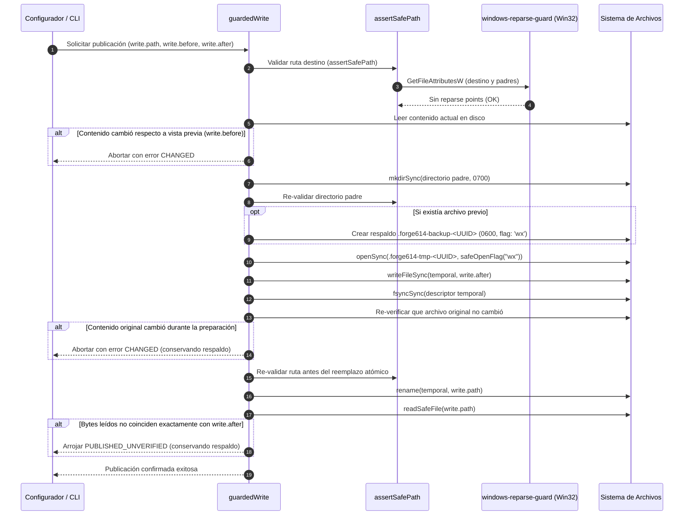

# 05. Arquitectura Interna, Monolito Modular por Funcionalidad, SQLite FTS5 y Fórmulas Matemáticas

> **Etapa:** Centro de Control TUI, FTS5 Reforzado (sin embeddings), Monolito Modular por Funcionalidad, Sesiones Progresivas de Memoria, Contexto Clasificado, MCP Local (10 Herramientas), Menú TUI de Asistentes y Réplica PostgreSQL Formatos 1, 2 y 3
> **Versiones de esta entrega:** Programa 1.0.0 | Formatos de configuración 2 (local) / 3 (con sync) | Esquemas SQLite 3 (local) / 4 (con sync) | Esquemas SQLite 5 (asistentes y asociaciones locales) / 6 (sesiones progresivas y contexto clasificado) / 7 (confirmaciones inmutables y refuerzo de búsqueda) | Formatos PostgreSQL 1, 2 y 3
> **Estado:** Vigente y Activo (504 pruebas totales en 82 archivos: 495 superadas y 9 omitidas sin binarios aislados PG; 504 superadas, 0 fallos, 2566 aserciones con `FORGE614_TEST_POSTGRES_BIN` configurado en macOS con Bun 1.3.8 en 39.76s)
> **Traducción hermana:** [05 (EN). Internal Architecture, Modular Monolith, FTS5, and Ranking Formulas](../en/05-internal-architecture-and-formulas.md)

Este documento expone con rigor de tesis técnica la arquitectura interna de Forge614 Engram: los fundamentos de la reorganización en **monolito modular por funcionalidad**, los problemas resueltos, el árbol de directorios real y responsabilidades, las reglas de dependencias y auditoría automática mediante AST, el diseño del **Centro de Control TUI**, las transacciones compuestas, la guía de colocación de cambios, la organización de pruebas colocadas (*colocated tests*), los esquemas relacionales SQLite 3 a 7, el protocolo de replicación PostgreSQL Formatos 1 a 3, y las fórmulas matemáticas exactas de BM25 ponderado, recencia de 30 días, saturación asintótica por confirmaciones inmutables y deduplicación por ventana móvil sin embeddings.

---

## 1. El Patrón Elegido: Monolito Modular por Funcionalidad

### 1.1. Nombre y Definición del Patrón
El patrón arquitectónico adoptado en Forge614 Engram es el **Monolito Modular por Funcionalidad (*Feature-Oriented Modular Monolith*)**.

- **Monolito (*Monolith*):** Significa que el sistema se compila, empaqueta y distribuye como un único artefacto ejecutable desplegable en el sistema operativo (`forge614-engram`), que corre en un solo proceso local en tu computadora. No se divide en múltiples microservicios remotos, ni utiliza comunicación de red interna, ni requiere demonios adicionales para funcionar.
- **Modular por Funcionalidad (*Feature-Oriented Modular*):** Significa que el código interno está dividido en fronteras lógicas cohesivas según el concepto de dominio al que sirven (memoria, confirmaciones, proyectos, sesiones, búsqueda, centro de control, sincronización, espacio central, asistentes), en lugar de agruparse únicamente por el rol técnico de los archivos. Cada módulo es dueño exclusivo de sus reglas y define una puerta de entrada explícita (`index.ts`).

> [!NOTE]
> **Elección Contextual, no Dogma Universal:** La adopción del monolito modular por funcionalidad es una decisión técnica deliberada y contextual para un CLI local y SDK síncrono que opera sobre un único archivo de configuración (`~/.forge614/.env`) y una única base SQLite (`~/.forge614/engram.db`). No se vende aquí como un estándar obligatorio ni universal para todo proyecto informático.

### 1.2. Problemas Concretos Anteriores y Razones de la Reorganización
Antes de la modularización, el código fuente de Engram crecía acumulando problemas de cohesión:
1. **Mezcla indiscriminada en la raíz de `src/`:** Almacenamiento SQL, tipos de datos, validaciones de sesiones, búsquedas FTS5, adaptadores de configuración, menús de terminal y herramientas MCP residían juntos en el mismo directorio plano.
2. **Hipertrofia de `MemoryStore`:** La clase `MemoryStore` actuaba como un objeto dios (*God Object*), reuniendo sentencias SQL DDL, manipulación de proyectos, control inmutable de versiones, transacciones de eventos, validación de sesiones progresivas, búsquedas ponderadas e instantáneas de sincronización.
3. **Acoplamiento de presentación con infraestructura:** La interfaz de terminal TUI resolvía directamente rutas ejecutables en el disco, ejecutaba procesos de autoprueba e insertaba configuraciones de clientes, dificultando probar la interfaz de usuario de forma aislada.
4. **Fragilidad en pruebas:** Diversas pruebas dependían de rutas relativas frágiles hacia archivos profundos de `src/`, rompiéndose ante cualquier ajuste cosmético.

### 1.3. Alternativas Evaluadas y sus Costes Reales

```text
┌─────────────────────────────────────────────────────────────────────────────────┐
│                       COMPARATIVA DE ENFOQUES ARQUITECTÓNICOS                   │
├───────────────────────┬───────────────────────────────┬─────────────────────────┤
│ Enfoque               │ Ventajas                      │ Costes / Desventajas    │
├───────────────────────┼───────────────────────────────┼─────────────────────────┤
│ Carpetas Globales por │ Separación técnica simple     │ Dispersión funcional:   │
│ Capas (Layered)       │ (models/, services/, repos/)  │ una sola característica │
│                       │ intuitiva al inicio.          │ (e.g. sesiones) queda   │
│                       │                               │ repartida en 4 carpetas │
├───────────────────────┼───────────────────────────────┼─────────────────────────┤
│ Hexagonal Estricta    │ Sustituibilidad abstracta     │ Sobre-ingeniería total: │
│ (Ports & Adapters con │ total de cualquier tecnología │ repositorios genéricos, │
│ DI Container)         │ mediante interfaces puras.    │ contenedores DI y 3x    │
│                       │                               │ clases para CLI local.  │
├───────────────────────┼───────────────────────────────┼─────────────────────────┤
│ Monolito Modular por  │ Cohesión por concepto, bajo   │ Requiere disciplina de  │
│ Funcionalidad         │ acoplamiento, SDK síncrono    │ imports, barriles       │
│ (ELEGIDO)             │ transparente, SQL directo y   │ explícitos y auditoría  │
│                       │ verificación AST automática.  │ continua con TypeScript.│
└───────────────────────┴───────────────────────────────┴─────────────────────────┘
```

- **Por qué se descartó la Arquitectura por Capas Global (*Layered Architecture*):** Agrupar todo el sistema en carpetas técnicas globales (`src/models/`, `src/services/`, `src/repositories/`) fragmenta cada funcionalidad. Para modificar cómo funciona una sesión o confirmación, un desarrollador debía editar archivos en múltiples extremos distantes del proyecto, perdiendo visión de conjunto.
- **Por qué se descartó la Arquitectura Hexagonal Estricta (*Strict Hexagonal Architecture*):** Introducir puertos formales para cada consulta, repositorios abstractos genéricos, entidades desconectadas de SQLite y un contenedor de inyección de dependencias (*Dependency Injection Container*) para un programa CLI que corre de forma local y síncrona representaba una sobre-ingeniería innecesaria que multiplicaba la complejidad sin aportar valor al usuario.
- **No es DDD completo ni Microservicios:** No se pretende etiquetar a Engram como *Domain-Driven Design* (DDD) purista, ni se utilizan eventos de integración distribuidos ni microservicios. Se toman los límites y fronteras útiles de diseño modular sin asumir la parafernalia dogmática.
- **Costes reales asumidos:** Mantener este patrón exige disciplina de exportaciones (`index.ts` por módulo), impedir activamente imports cruzados y auditar el código mediante un analizador de sintaxis (*AST auditor*).

---

## 2. Árbol Final Real y Responsabilidades por Directorio

El árbol de código fuente de producción en `src/` se organiza en cuatro capas conceptuales concéntricas, más una entrada ejecutable mínima y una biblioteca pública compartida:

```text
native/                                # [Extensiones Nativas del Sistema Operativo]
└── windows-reparse-guard/             # Componente C++ nativo Node-API para Windows
    ├── addon.cc                       # Consulta directa a Win32 GetFileAttributesW
    └── binding.gyp                    # Configuración de compilación MSBuild

src/
├── cli.ts                             # [Arranque Mínimo] 2 líneas exactas de delegación
├── index.ts                           # [API Pública SDK] Barril único y estable
│
├── app/                               # [Coordinación de Flujos de Caso de Uso]
│   ├── index.ts                       # Exportaciones de coordinación
│   ├── memory-store.ts                # Fachada compatible con MemoryStore histórico
│   ├── workspace.ts                   # Ciclo de vida y apertura del espacio central
│   ├── project-context.ts             # Resolución de identidad Git y vinculaciones
│   ├── control-center.ts              # Coordinación de lectura segura y mutaciones TUI
│   ├── synchronization.ts             # Coordinación de réplica y snapshots (sin I/O terminal)
│   ├── setup.ts                       # Secuencia de inicialización asistida (SetupIO)
│   └── assistants.ts                  # Coordinación de detección y configuración de asistentes
│
├── modules/                           # [Reglas de Negocio Puras y Tipos] (Sin I/O)
│   ├── memory/                        # Tipos, validación, confirmaciones y ranking FTS5
│   │   ├── index.ts
│   │   ├── types.ts
│   │   ├── validation.ts
│   │   ├── confirmations.ts           # Interfaces y lógica pura de confirmaciones
│   │   └── ranking.ts                 # Fórmulas de multiplicador y explicación
│   ├── control-center/                # Tipos de snapshot, capacidades y mutaciones TUI
│   │   ├── index.ts
│   │   └── types.ts
│   ├── projects/                      # Identidad inmutable de proyectos (UUID)
│   ├── sessions/                      # Ciclo de sesiones, timbrado e inferencia
│   ├── search/                        # Términos, límites Unicode/bytes y proyecciones
│   ├── synchronization/               # Validación de snapshots y reconciliación 3-way
│   │   ├── index.ts
│   │   ├── snapshot.ts
│   │   └── confirmations.ts           # Serialización y merge de confirmaciones
│   ├── workspace/                     # Contratos de configuración global del entorno
│   └── assistants/                    # Catálogo, protocolo de memoria y ganchos
│
├── infrastructure/                    # [Adaptadores de Entrada/Salida Concretos]
│   ├── sqlite/                        # Conexión, esquemas y operaciones especializadas
│   │   ├── connection.ts              # Apertura con WAL y pragmas estrictos
│   │   ├── schema.ts                  # DDL de Esquemas 3, 4, 5, 6 y 7
│   │   ├── projects.ts                # Consultas de proyectos y vínculos
│   │   ├── control-center.ts          # Consultas agregadas sin contenido para TUI
│   │   ├── memory.ts                  # Consultas de recuerdos y versiones
│   │   ├── confirmations.ts           # Persistencia y consultas de confirmaciones/requests
│   │   ├── writes.ts                  # Transacciones compuestas atómicas exteriores
│   │   ├── sessions.ts                # Consultas de sesiones y entradas
│   │   ├── search.ts                  # Consultas SQLite FTS5 y proyecciones
│   │   ├── snapshots.ts               # Lectura/escritura de instantáneas locales (Formato 3)
│   │   └── workspace-database.ts      # Ciclo de vida de la base de datos
│   ├── postgres/                      # Adaptador de red y réplica remota CAS (replica.ts)
│   ├── filesystem/                    # Acceso a disco (.env, permisos 0700/0600, locks)
│   │   ├── windows-reparse-guard.ts   # Cargador TypeScript del addon nativo Node-API
│   │   ├── private-files.ts           # Validador de rutas seguras y assertSafePath
│   │   ├── guarded-write.ts           # Protocolo atómico de publicación y respaldo
│   │   └── file-locks.ts              # Bloqueos de concurrencia en disco
│   └── assistants/                    # Adaptadores de clientes, JSONC, TOML y autoprueba
│
├── interfaces/                    # [Puntos de Entrada y Presentación]
│   ├── cli/                       # Intérprete de comandos y formateadores JSON
│   ├── mcp/                       # Servidor MCP sobre stdio (10 herramientas)
│   ├── terminal/                  # Adaptadores de ganchos nativos de asistentes
│   └── tui/                       # Centro de Control TUI y configurador de asistentes
│       ├── control-center-state.ts  # Máquina pura de estados (teclas -> páginas/intents)
│       ├── control-center-render.ts # Renderizado acotado y saneamiento de salida
│       ├── control-center.ts        # Ciclo de vida de terminal TTY y orquestación
│       ├── controller.ts            # Subflujo de asistentes: selección y autoprueba
│       └── render.ts                # Renderizado del configurador de asistentes
│
└── shared/                        # [Primitivas Compartidas]
    └── errors.ts                  # Clase MemoryError y catálogo de códigos de error
```

---

## 3. Reglas de Dependencias y Auditoría Automática con AST

Para evitar acoplamientos espagueti y ciclos entre componentes, el proyecto impone un flujo unidireccional estricto:

```text
interfaces  ──►  app  ──►  modules  ──►  shared
     │            │
     ▼            ▼
infrastructure ───┘
```

### Reglas Formales de Importación:
1. `modules/` jamás importa de `infrastructure/`, `app/`, ni `interfaces/`. Contiene TypeScript puro sin I/O.
2. `infrastructure/` implementa persistencia y adaptadores concretos; no depende de `interfaces/` ni de `app/`.
3. `app/` orquesta casos de uso invocando `modules/` e `infrastructure/`.
4. `interfaces/` recibe peticiones del usuario o asistente y delega en `app/`.
5. `src/index.ts` es la única puerta de entrada para consumidores externos; el código interno tiene prohibido importar desde `src/index.ts`.

### Auditor de Arquitectura AST (`tests/architecture/import-rules.ts`):
- Lee los archivos fuente y extrae todas las declaraciones de `import`, `export`, tipos `import(...)` y llamadas a `require`.
- Construye un grafo dirigido entre componentes (`graph.set(origen, destino)`).
- Ejecuta una búsqueda en profundidad (*Depth-First Search - DFS*) rastreando caminos activos mediante dos conjuntos: `visiting` (nodos en la pila actual) y `visited` (nodos ya validados).
- Si durante la exploración se encuentra un nodo que ya está en `visiting`, el auditor aborta la suite reportando: `component cycle: A -> B -> C -> A`.

---

## 4. Esquemas Relacionales SQLite (Esquemas 3 a 7)

SQLite almacena el estado de esquema en `PRAGMA user_version`.

```text
┌─────────────────────────────────────────────────────────────────────────────────┐
│                     EVOLUCIÓN DE ESQUEMAS SQLITE EN ENGRAM                      │
├─────────┬───────────────────────────────────┬───────────────────────────────────┤
│ Esquema │ Tablas Añadidas                   │ Propósito                         │
├─────────┼───────────────────────────────────┼───────────────────────────────────┤
│ 3       │ projects, memories,               │ Almacenamiento local básico con   │
│         │ memory_versions, events, requests │ control inmutable de versiones.   │
├─────────┼───────────────────────────────────┼───────────────────────────────────┤
│ 4       │ sync_checkpoints                  │ Soporte de réplica PostgreSQL.    │
├─────────┼───────────────────────────────────┼───────────────────────────────────┤
│ 5       │ project_bindings                  │ Ganchos de asistentes y carpetas  │
│         │                                   │ locales vinculadas a proyectos.   │
├─────────┼───────────────────────────────────┼───────────────────────────────────┤
│ 6       │ sessions, session_entries,        │ Sesiones progresivas de trabajo,  │
│         │ session_summaries,                │ líneas temporales y contexto      │
│         │ local_session_bindings,           │ clasificado en tres particiones.  │
│         │ local_manual_sessions             │                                   │
├─────────┼───────────────────────────────────┼───────────────────────────────────┤
│ 7       │ confirmations,                    │ Confirmaciones inmutables de      │
│         │ confirmation_requests             │ observaciones repetidas y ranking │
│         │                                   │ FTS5 reforzado sin embeddings.    │
└─────────┴───────────────────────────────────┴───────────────────────────────────┘
```

### 4.1. DDL del Esquema 7 (Confirmaciones y Refuerzo de Búsqueda)

```sql
-- Registro de confirmaciones inmutables de recuerdos
CREATE TABLE IF NOT EXISTS confirmations (
  confirmation_id TEXT PRIMARY KEY,
  memory_id TEXT NOT NULL REFERENCES memories(id) ON DELETE CASCADE,
  version INTEGER NOT NULL,
  recorded_at TEXT NOT NULL,
  session_id TEXT REFERENCES sessions(session_id) ON DELETE SET NULL
);

CREATE INDEX IF NOT EXISTS idx_confirmations_memory_id ON confirmations(memory_id);
CREATE INDEX IF NOT EXISTS idx_confirmations_recorded_at ON confirmations(recorded_at);

-- Registro de peticiones idempotentes por clave
CREATE TABLE IF NOT EXISTS confirmation_requests (
  memory_id TEXT NOT NULL REFERENCES memories(id) ON DELETE CASCADE,
  request_key TEXT NOT NULL,
  payload_hash TEXT NOT NULL,
  expected_version INTEGER,
  confirmation_id TEXT NOT NULL,
  response_json TEXT NOT NULL,
  created_at TEXT NOT NULL,
  PRIMARY KEY (memory_id, request_key)
);

CREATE INDEX IF NOT EXISTS idx_confirmation_requests_key ON confirmation_requests(request_key);
```

---

## 5. Fórmulas Matemáticas de Búsqueda FTS5 Reforzada (Sin Embeddings)

El motor de búsqueda de Forge614 Engram optimiza la recuperación de información mediante SQLite FTS5 combinando la ponderación léxica de BM25 con factores de recencia y estabilidad basados en confirmaciones inmutables.

### 5.1. Ponderación Léxica BM25 en SQLite FTS5

SQLite FTS5 evalúa las coincidencias utilizando la función BM25 (*Best Matching 25*):

$$\text{BM25}(D, Q) = \sum_{i=1}^{N} \text{IDF}(q_i) \cdot \frac{f(q_i, D) \cdot (k_1 + 1)}{f(q_i, D) + k_1 \cdot \left(1 - b + b \cdot \frac{|D|}{\text{avgdl}}\right)}$$

- **Parámetros del motor:** $k_1 = 1.2$, $b = 0.75$.
- **Ponderación por columnas en Engram:**
  - `title`: peso $5.0$
  - `topic_key`: peso $3.0$
  - `content`: peso $1.0$
- **Naturaleza del puntaje en SQLite FTS5:** La función nativa `bm25(memories_fts, 5.0, 3.0, 1.0)` devuelve **valores negativos**, donde un valor más negativo representa una coincidencia más fuerte y relevante.

### 5.2. Los Tres Factores del Multiplicador de Refuerzo

Para cada recuerdo candidato, Engram calcula tres variables de soporte evaluadas contra un reloj único determinista (`request_clock = nowMs`):
1. $\text{revisionCount} = \text{version} - 1$ (revisiones históricas excluyendo la creación inicial).
2. $\text{duplicateCount} = \text{count}(\text{confirmations})$ (número de confirmaciones inmutables registradas).
3. $\text{lastSeenAt} = \max(\text{updatedAt}, \max(\text{recordedAt}))$ (último momento en que el dato fue visto o confirmado).
4. $\text{ageDays} = \max\left(0, \frac{\text{nowMs} - \text{lastSeenAtMs}}{86,400,000}\right)$ (antigüedad en días decimales).
5. $n = \text{revisionCount} + \text{duplicateCount}$ (número total de observaciones y revisiones acumuladas).

El multiplicador total de refuerzo combina tres impulsos complementarios:

$$\text{multiplier} = 1 + \underbrace{0.10 \times \text{pinned}}_{\text{Impulso de Fijado}} + \underbrace{\frac{0.06}{1 + \frac{\text{ageDays}}{30}}}_{\text{Impulso de Recencia}} + \underbrace{0.04 \times \frac{n}{n + 4}}_{\text{Impulso de Estabilidad}}$$

```text
┌─────────────────────────────────────────────────────────────────────────────────┐
│                     DESGLOSE DEL MULTIPLICADOR DE REFUERZO                      │
├─────────────────────┬──────────────┬──────────────┬─────────────────────────────┤
│ Componente          │ Factor Máx.  │ Rango        │ Comportamiento              │
├─────────────────────┼──────────────┼──────────────┼─────────────────────────────┤
│ Base                │ 1.00         │ 1.00         │ Valor neutral mínimo.       │
│ Impulso Fijado      │ +0.10        │ {0, 0.10}    │ 0.10 si pinned es verdadero;│
│                     │              │              │ 0 si es falso.              │
│ Impulso Recencia    │ +0.06        │ (0, 0.06]    │ Escala de 30 días:          │
│                     │              │              │ 0.06 al instante 0;         │
│                     │              │              │ 0.03 a los 30 días;         │
│                     │              │              │ converge a 0 con el tiempo. │
│ Impulso Estabilidad │ +0.04        │ [0, 0.04)    │ Saturación asintótica:      │
│                     │              │              │ n=0 -> 0.00                 │
│                     │              │              │ n=1 -> 0.008                │
│                     │              │              │ n=4 -> 0.020                │
│                     │              │              │ n=8 -> 0.0267               │
│                     │              │              │ converge a 0.04 al infinito.│
├─────────────────────┼──────────────┼──────────────┼─────────────────────────────┤
│ Multiplicador Total │ 1.20         │ [1.00, 1.20] │ Rango dinámico acotado.     │
└─────────────────────┴──────────────┴──────────────┴─────────────────────────────┘
```

### 5.3. Puntaje de Ordenamiento (*Order Score*) y Dirección ASC

$$\text{orderScore} = \text{BM25} \times \text{multiplier}$$

**Por qué se ordena en dirección ASC:**
- Dado que el valor BM25 de SQLite es **negativo** (ej. $-2.0$), al multiplicarlo por un $\text{multiplier} > 1.0$, el resultado se vuelve **más negativo** (menor algebraicamente).
- **Ejemplo práctico de desempate:**
  - Recuerdo A: $\text{BM25} = -2.0$, $\text{multiplier} = 1.18$ $\implies \text{orderScore} = -2.36$.
  - Recuerdo B: $\text{BM25} = -2.0$, $\text{multiplier} = 1.06$ $\implies \text{orderScore} = -2.12$.
  - Comparación: $-2.36 < -2.12$.
  - Al ordenar de menor a mayor (`ORDER BY orderScore ASC, id ASC`), el Recuerdo A (más reforzado) aparece **antes** que el Recuerdo B.

### 5.4. Evaluación Determinista y Ordenación Antes del LIMIT
- **Reloj Único de Consulta:** Engram evalúa una sola marca temporal `request_clock(nowMs)` por consulta de búsqueda. No utiliza llamadas repetidas a funciones de reloj de sistema por fila, impidiendo distorsiones de tiempo en bases de datos extensas.
- **Ordenación Previa a LIMIT:** El cálculo del multiplicador y el ordenamiento `orderScore ASC` se aplican en la sentencia SQL **antes de la cláusula `LIMIT`**. Esto garantiza que los mejores $K$ resultados sean globalmente exactos y no una muestra truncada arbitrariamente.
- **Búsqueda Literal:** Si la consulta no produce coincidencias FTS5 o se realiza una búsqueda exacta literal, `bm25` y `orderScore` son `null`. El ordenamiento recurre a:
  ```sql
  ORDER BY m.pinned DESC, last_seen_at DESC, m.id ASC
  ```

---

## 6. Deduplicación por Ventana Móvil, Replay y Manejo de Conflictos

### 6.1. Ventana Móvil de 15 Minutos para Recuerdos sin Tema
Cuando se guarda un recuerdo sin tema (`topicKey: null`):
- Engram busca notas candidatas activas cuyo contenido, título, tipo y estado fijado coincidan exactamente.
- **Restricción temporal estricta:** Solo se consideran candidatos observados en los últimos **15 minutos** (rango inclusivo entre `nowMs - 900,000` y `nowMs`).
- Se descartan marcas temporales futuras.
- Si existen múltiples candidatos dentro de la ventana, se selecciona el que tenga mayor `lastSeenAt`, resolviendo empates por `id ASC`.
- Si han transcurrido más de 15 minutos, Engram crea un recuerdo completamente nuevo para preservar la independencia de hechos temporalmente separados.

### 6.2. Reintento Idempotente por Clave de Petición (*Request Key Replay*)
- Si se reenvía una petición con una `requestKey` existente y el hash criptográfico SHA-256 de su carga coincide exactamente con el registrado en `confirmation_requests`, Engram devuelve inmediatamente la respuesta previamente almacenada.
- **No añade confirmaciones ni incrementa versiones.**

### 6.3. Conflicto de Carga en Reintento (`REQUEST_CONFLICT`)
- Si se reutiliza una `requestKey` existente pero con un contenido o título diferente (hash SHA-256 divergente), la operación se cancela arrojando `REQUEST_CONFLICT`.

### 6.4. Protección de Reloj Local (*Clock Skew*) (`CLOCK_SKEW`)
- Si el reloj local del sistema indica una fecha anterior a la fecha registrada en la versión del recuerdo existente que se pretende confirmar, la operación aborta con `CLOCK_SKEW` para preservar la causalidad cronológica inmutable.

---

## 7. Protocolo de Sincronización PostgreSQL y Formato 3

### 7.1. Tabla Remota Física Invariable (`state.format = 1`)
En el servidor PostgreSQL, la tabla física de sincronización `forge614_sync.state` conserva su columna estructural `format = 1`:
- El esquema relacional físico de PostgreSQL no requiere alteraciones DDL destructivas ni migraciones en producción.
- Lo que evoluciona es la cabecera del snapshot encapsulado en el payload JSON.

### 7.2. Snapshot en Formato 3
El Formato 3 extiende la estructura de la instantánea añadiendo dos colecciones serializadas:
- `confirmations`: Arreglo con todos los registros inmutables de confirmación (`confirmationId`, `memoryId`, `version`, `recordedAt`, `sessionId`).
- `confirmationRequests`: Arreglo con las peticiones idempotentes cacheadas.

### 7.3. Promoción Explícita CAS y Rechazo en `sync-watch`
- **Promoción Controlada:** La promoción a Formato 3 exige ejecutar explícitamente `forge614-engram sync --upgrade-format`.
- **Rechazo en Modo Continuo:** El comando `sync-watch` rechaza terminantemente `--upgrade-format` con `INVALID_INPUT` para evitar que un proceso automático no supervisado promueva formatos sin conocimiento del operador.
- **Compatibilidad con Pares:** Todos los equipos pares deben haberse actualizado a Esquema 7 (`reinforcement-enable`) antes de sincronizar con una réplica promovida a Formato 3. Si un cliente no reforzado recibe un snapshot en Formato 3, aborta con `REINFORCEMENT_REQUIRED`.

---

## 8. Organización de Pruebas Colocadas (*Colocated Tests*) y Conteo Oficial

### 8.1. Correspondencia Uno a Uno
Cada uno de los **58 archivos de producción que contienen lógica de negocio** cuenta con un archivo hermano colocado de prueba (`<nombre>.test.ts`):
- `src/infrastructure/sqlite/confirmations.ts` $\leftrightarrow$ `confirmations.test.ts`
- `src/infrastructure/sqlite/control-center.ts` $\leftrightarrow$ `control-center.test.ts`
- `src/modules/memory/ranking.ts` $\leftrightarrow$ `ranking.test.ts`
- `src/modules/memory/confirmations.ts` $\leftrightarrow$ `confirmations.test.ts`
- `src/modules/synchronization/confirmations.ts` $\leftrightarrow$ `confirmations.test.ts`
- `src/app/control-center.ts` $\leftrightarrow$ `control-center.test.ts`
- `src/interfaces/tui/control-center-state.ts` $\leftrightarrow$ `control-center-state.test.ts`
- `src/interfaces/tui/control-center-render.ts` $\leftrightarrow$ `control-center-render.test.ts`
- `src/interfaces/tui/control-center.ts` $\leftrightarrow$ `control-center.test.ts`
- Pruebas de integración de colaboración en `src/app/__tests__/` y `src/interfaces/tui/__tests__/`:
  - `confirmations.integration.test.ts`
  - `confirmations-sync.integration.test.ts`
  - `control-center.integration.test.ts`

### 8.2. Historial Oficial de Pruebas

```text
┌─────────────────────────────────────────────────────────────────────────────────┐
│                      HISTORIAL Y VERIFICACIÓN DE PRUEBAS                        │
├───────────────────────────────┬──────────────┬───────────────┬──────────────────┤
│ Hito de Verificación          │ Pruebas      │ Archivos      │ Estado           │
├───────────────────────────────┼──────────────┼───────────────┼──────────────────┤
│ Baseline Previo (Handoff 09)  │ 250 pass     │ 18 archivos   │ 1506 aserciones  │
├───────────────────────────────┼──────────────┼───────────────┼──────────────────┤
│ Monolito Modular (Handoff 10) │ 369 pass*    │ 69 archivos   │ 1891 aserciones  │
├───────────────────────────────┼──────────────┼───────────────┼──────────────────┤
│ FTS5 Reforzado (Entrega 11)   │ 439 pass**   │ 76 archivos   │ 2274 aserciones  │
│                               │ (430 pass /  │               │ (38.62s)         │
│                               │  9 skip PG)  │               │                  │
├───────────────────────────────┼──────────────┼───────────────┼──────────────────┤
│ Centro de Control (Entrega 12)│ 504 pass***  │ 82 archivos   │ 2566 aserciones  │
│                               │ (495 pass /  │               │ (39.76s)         │
│                               │  9 skip PG)  │               │                  │
└───────────────────────────────┴──────────────┴───────────────┴──────────────────┘
* Nota: Con binario PG temporal configurado (361 pass / 8 skip sin binario).
** Nota: 430 superadas y 9 omitidas sin binarios aislados PG. Con FORGE614_TEST_POSTGRES_BIN
   configurado, se ejecutan y superan 439 pass, 0 fail, 2274 aserciones en 38.62s.
*** Nota: 495 superadas y 9 omitidas sin binarios aislados PG. Con FORGE614_TEST_POSTGRES_BIN
    configurado, se ejecutan y superan 504 pass, 0 fail, 2566 aserciones en 39.76s.
```

### 8.3. Instalador de Windows: Parseo Confiable de Metadatos de Release y Pruebas Nativas (`scripts/install.ps1` / `scripts/__tests__/install.ps1.test.ps1`)

Como una pista de pruebas hermética con un túnel de viento a escala para ensayar el comportamiento de un vehículo en condiciones extremas sin salir a la autopista real: la suite de validación de Windows ejecuta pruebas aisladas de extremo a extremo para garantizar que el instalador de PowerShell (`scripts/install.ps1`) opere con idéntica fiabilidad atómica y seguridad que su contraparte de Unix (`scripts/install.sh`).

#### 1. Propósito y Descarga de Metadatos de Release
El instalador de Windows (`scripts/install.ps1`) descarga los metadatos de una GitHub Release para localizar dos *assets* esenciales:
1. `SHA256SUMS` (el archivo oficial de firmas criptográficas).
2. El binario exacto para la arquitectura del equipo (`forge614-engram-windows-x64.exe` para AMD64 o `forge614-engram-windows-arm64.exe` para ARM64).

#### 2. Causa Raíz del Fallo: Desenrollado de Bytes en Tuberías de PowerShell
En Windows PowerShell (particularmente en Desktop PowerShell 5.1 y ciertas configuraciones de PowerShell Core), el cmdlet `Invoke-WebRequest` puede entregar la respuesta HTTP en su propiedad `.Content` como un arreglo de bytes (`System.Byte[]`) en lugar de texto plano (`System.String`).

El código anterior enviaba esos bytes directamente por una tubería a `ConvertFrom-Json`:
```powershell
# Código anterior vulnerable
$releaseResponse = Invoke-WebRequest -Uri $releaseJsonUrl -UseBasicParsing
$release = $releaseResponse.Content | ConvertFrom-Json
```
Al operar con una tubería (`|`), PowerShell procesaba cada byte individualmente (desenrollando el arreglo elemento a elemento), por lo que el JSON dejaba de convertirse en un objeto de release válido. Como consecuencia, la propiedad `assets` quedaba vacía o nula y el instalador mostraba erróneamente:
```text
The release is missing SHA256SUMS.
```
a pesar de que el archivo estuviera efectivamente disponible en la release.

#### 3. Corrección Implementada: Decodificación UTF-8 e Invocación Escalar
La corrección convierte primero el arreglo completo de bytes a una sola cadena UTF-8 y después invoca `ConvertFrom-Json` usando el parámetro `-InputObject`:
```powershell
# Corrección robusta
$releaseResponse = Invoke-WebRequest -Uri $releaseJsonUrl -UseBasicParsing
$releaseRawContent = $releaseResponse.Content
$releaseJson = if ($releaseRawContent -is [byte[]]) {
  [System.Text.Encoding]::UTF8.GetString($releaseRawContent)
} else {
  [string]$releaseRawContent
}
$release = ConvertFrom-Json -InputObject $releaseJson
```
Si PowerShell ya entrega texto, el instalador conserva esa ruta sin conversión adicional.

#### 4. Preservación Estricta de Medidas de Seguridad
Esta corrección no reduce ninguna medida de seguridad:
- El instalador sigue requiriendo HTTPS en producción (`Test-ReleaseUri` rechaza cualquier esquema que no sea `https://`, salvo servidores loopback con puerto explícito durante pruebas locales).
- Sigue verificando `SHA256SUMS` antes de publicar el binario.
- Sigue rechazando sobrescrituras sin la opción `-Force`.
- No ejecuta `forge614-engram setup`.
- No modifica la variable de entorno `PATH`.
- No crea el directorio `~/.forge614` ni la base `engram.db`.
- No modifica configuraciones de asistentes (`.claude`, `.codex`, etc.).

#### 5. Arquitectura de Simulación de Release por Servidor HTTP Efímero en Loopback
Para no depender de conectividad externa con la API de GitHub ni agotar cuotas de red durante la integración continua, la prueba inicia un trabajo en segundo plano (`Start-Job`) que levanta un servidor HTTP local efímero mediante `[System.Net.HttpListener]` escuchando exclusivamente en la dirección de bucle local (`127.0.0.1`) en un puerto aleatorio no privilegiado (rango `49152`–`65535`):
- **Simulación completa de API y assets:** El servidor responde a las peticiones del instalador entregando metadatos de release en formato JSON (`/releases/tags/v1.2.3`), el archivo oficial de firmas criptográficas `SHA256SUMS` (`/download/SHA256SUMS`) y binarios ejecutables de prueba (*fixture binaries*).
- **Aislamiento absoluto:** Todo el entorno se ejecuta bajo una carpeta temporal desechable (`[System.IO.Path]::GetTempPath()\forge614-installer-<GUID>`), configurando una variable `HOME` temporal para garantizar que jamás se toque la configuración real del usuario ni se cree prematuramente la carpeta `~/.forge614`.
- **Objetivo de la prueba:** Asegurar que el instalador funciona cuando PowerShell recibe los metadatos como bytes, no solo como texto.

#### 6. Matriz Exhaustiva de Casos Validados
El script de prueba ejecuta y verifica cinco escenarios operacionales críticos:
1. **Instalación en arquitectura AMD64:** Simula `$env:PROCESSOR_ARCHITECTURE = 'AMD64'`, descargando `forge614-engram-windows-x64.exe`, verificando que el binario instalado coincida byte a byte con el hash SHA-256 esperado.
2. **Instalación en arquitectura ARM64:** Simula `$env:PROCESSOR_ARCHITECTURE = 'ARM64'`, verificando la descarga e instalación correcta de `forge614-engram-windows-arm64.exe`.
3. **Rechazo estricto por discrepancia de suma de comprobación (*Checksum Mismatch*):** Simula una descarga corrupta a través de la ruta `/mismatch/` (donde `SHA256SUMS` contiene un hash inválido); valida que el instalador finalice inmediatamente con error (`ExitCode != 0`) y que **no se cree ningún archivo ejecutable en el directorio destino**.
4. **Protección contra sobrescritura no autorizada:** Intenta instalar sobre un destino preexistente sin la opción `-Force`; valida que el instalador falle y que el archivo preexistente permanezca 100% inalterado.
5. **Inexistencia de almacenamiento prematuro:** Verifica expresamente que el instalador no cree el directorio de datos `~/.forge614` en la máquina local.

#### 7. Instrumentación Diagnóstica Exclusiva de Pruebas ante Fallos Reales
A raíz del incidente en Windows donde el instalador reportó erróneamente la ausencia de `SHA256SUMS`, se implementó un canal de telemetría de diagnóstico exclusivo para el entorno de pruebas, el cual escribe en `$diagnosticFile` (`fixture-server.log`):
1. **Registro de rutas HTTP solicitadas:** Cada petición recibida por el servidor local queda registrada cronológicamente (`request-path=$path`).
2. **Nombres de assets emitidos en los metadatos:** Lista explícita de los archivos incluidos en el arreglo de release (`release-asset-names=$assetNames`).
3. **Carga útil JSON íntegra:** La cadena JSON exacta generada y servida al cliente (`release-json=$payload`).

Antes de validar la instalación de AMD64, la prueba realiza aserciones previas sobre este registro:
- Comprueba que se haya solicitado la ruta canónica esperada (`/good/repos/jotredev/forge614-engram/releases/tags/v1.2.3`).
- Comprueba que la lista de assets incluya con exactitud: `SHA256SUMS`, `forge614-engram-windows-x64.exe` y `forge614-engram-windows-arm64.exe`.
- Permite diferenciar claramente entre fallas de enrutamiento HTTP, serialización JSON o parseo en PowerShell.

```powershell
# Aserciones diagnósticas previas a la verificación del instalador
$amd64Diagnostics = Get-FixtureDiagnostics
Assert-That ($amd64Diagnostics.Contains('/good/repos/jotredev/forge614-engram/releases/tags/v1.2.3')) `
  "AMD64 fixture route mismatch: $amd64Diagnostics"
Assert-That ($amd64Diagnostics.Contains('release-asset-names=SHA256SUMS,forge614-engram-windows-x64.exe,forge614-engram-windows-arm64.exe')) `
  "AMD64 fixture asset names mismatch: $amd64Diagnostics"
Assert-That ($amd64.ExitCode -eq 0) `
  "AMD64 installer failed: $($amd64.Output) Fixture diagnostics: $amd64Diagnostics"
```

#### 8. Validación en CI y Criterio de Estabilidad Multiplataforma
La suite se invoca dentro de los flujos de trabajo de integración continua mediante:
```powershell
pwsh -NoProfile -File scripts/__tests__/install.ps1.test.ps1
```

> [!NOTE]
> **Estado de Validación en CI:** La suite de pruebas del instalador en PowerShell fue ejecutada y verificada exitosamente en GitHub Actions sobre ejecutores `windows-latest` (**Verify Run ID `35427426902`**, commit `f047693b9e27368d104cfc945c0e419af4a1d4b9`). La suite utiliza abstracciones `PathReader` y `PathWriter` en memoria, asegurando que las pruebas no alteren el registro ni el PATH real del usuario del runner, e incluye pruebas de regresión contra descriptores de asistentes bloqueados.

---

## 9. Arquitectura del Guardián Nativo de Reparse Points en Windows y Protocolo de Publicación Protegida (`guardedWrite`)

### 9.1. Justificación del Componente C++ Nativo (Node-API vs FFI vs Subprocesos)
En sistemas Unix (macOS y Linux), la seguridad contra enlaces simbólicos maliciosos se resuelve de forma nativa mediante permisos octales POSIX (`0700` y `0600`) y banderas de apertura directas del kernel (`O_NOFOLLOW`). En Windows, los permisos POSIX no existen de forma nativa (se mapean sobre listas de control de acceso NTFS, ACLs) y Bun en Windows carece de banderas equivalentes a `O_NOFOLLOW` en la apertura ordinaria de archivos.

Para resolver este desafío de seguridad en Windows sin comprometer el rendimiento, se evaluaron tres alternativas:
1. **Invocación de subprocesos (`powershell.exe` o `fsutil.exe`):** Descartada. Invocar un subproceso de PowerShell o utilidades de consola por cada ruta a validar consume entre 150 ms y 400 ms por llamada, degrada la experiencia de usuario y requiere privilegios elevados en ciertas variantes de `fsutil`.
2. **Bun FFI (*Foreign Function Interface*):** Descartada. Aunque permite invocar bibliotecas dinámicas en tiempo de ejecución, la documentación oficial de Bun califica su subsistema FFI como experimental y desaconseja su uso en binarios compilados independientes destinados a producción.
3. **Módulo Nativo C++ Node-API (`native/windows-reparse-guard/addon.cc`):** **Elegida.** Bun soporta Node-API (.node) como la interfaz binaria nativa estable para extensiones C/C++. Se compila como una biblioteca compartida ultraligera que se carga en memoria en el mismo proceso de Engram y consulta directamente la Win32 API oficial de Microsoft:
   ```c
   DWORD attributes = GetFileAttributesW(path);
   bool isReparsePoint = (attributes != INVALID_FILE_ATTRIBUTES) &&
                         ((attributes & FILE_ATTRIBUTE_REPARSE_POINT) != 0);
   ```

### 9.2. Cobertura de Redirecciones y Modelo a Prueba de Fallos (*Fail-Closed*)
El atributo `FILE_ATTRIBUTE_REPARSE_POINT` (código hexadecimal `0x400`) identifica cualquier objeto del sistema de archivos NTFS cuyo comportamiento haya sido alterado por un controlador de filtro del sistema. Esto permite detectar y bloquear de forma exhaustiva:
- **Enlaces simbólicos de archivo** (*file symlinks*, `symlinkSync(..., 'file')`).
- **Enlaces simbólicos de directorio** (*directory symlinks*).
- **Uniones de directorio NTFS** (*directory junctions*, `symlinkSync(..., 'junction')` o `mklink /J`).
- **Puntos de montaje de volumen** (*volume mount points*, generados con `mountvol.exe`).

#### Inspección Recursiva Ascendente:
El validador `assertNoWindowsReparsePoints` en `src/infrastructure/filesystem/private-files.ts` no se limita a examinar el archivo final, sino que recorre iterativamente la jerarquía completa de directorios existentes hacia arriba hasta alcanzar la raíz del volumen (`while (current !== root)`):
- Si el destino o cualquiera de sus ancestros existentes posee el atributo de reparse point, la operación se aborta de inmediato con `UNSAFE_PATH`.
- **Arquitectura *Fail-Closed*:** Si el binario nativo no puede ser cargado, arroja una excepción no controlada de Win32, o la función devuelve un valor no booleano, la validación falla cerrando el acceso y arrojando `UNSAFE_PATH`.
- **Límites de Concurrencia y TOCTOU (*Time-of-Check to Time-of-Use*):** La inspección estricta previa a la escritura certifica que no existan desvíos en el momento del chequeo. Sin embargo, no proporciona una garantía matemática absoluta frente a condiciones de carrera concurrentes donde otro proceso con privilegios modifique la estructura del directorio exactamente entre la verificación y la apertura del archivo.

### 9.3. Diagrama de Secuencia del Protocolo de Publicación Protegida (`guardedWrite`)

El protocolo de escritura protegida garantiza que la configuración de asistentes (como Antigravity, Cursor o Claude Code) nunca quede en estado corrupto ni sea interceptada:



### 9.4. Diferencias de Plataforma en Apertura de Archivos e Incidente en CI
Para materializar el archivo temporal y los respaldos en disco, Engram utiliza descriptores seguros gestionados por `safeOpenFlag`:
* **Modos textuales en Windows (`"r"` y `"wx"`):**
  - `"r"`: Apertura en modo solo lectura.
  - `"wx"`: Escritura con creación exclusiva (*write exclusive*). La bandera `"x"` exige que el archivo no exista previamente en disco; si ya existe, el sistema operativo rechaza la llamada inmediatamente arrojando `EEXIST`.
* **Banderas numéricas en Unix (macOS y Linux):**
  - Lectura: `constants.O_RDONLY | constants.O_NOFOLLOW`.
  - Creación exclusiva: `constants.O_WRONLY | constants.O_CREAT | constants.O_EXCL | constants.O_NOFOLLOW` con permisos octales `0600`.
* **Incidente Técnico en CI de Windows:**
  Durante las pruebas automatizadas en GitHub Actions, la llamada `openSync` en Bun sobre Windows devolvía `ENOENT` cuando se le suministraban las constantes numéricas bit a bit (`O_WRONLY | O_CREAT | O_EXCL`). Sin embargo, en ese mismo entorno, la creación de respaldos con modo textual `{ flag: 'wx' }` operaba con total éxito. La resolución consistió en centralizar la apertura segura bajo la función auxiliar `safeOpenFlag(unixFlags, windowsFlag)`, aplicando `"r"` y `"wx"` en Windows y banderas POSIX con `O_NOFOLLOW` en sistemas Unix. *(Nota: no se asume que Windows carezca de apertura segura ni que todas las banderas numéricas fallen; la incompatibilidad fue específica del puente entre Bun y el sistema operativo en esa llamada).*

### 9.5. Privacidad del Espacio Central y Reparación Automática de Permisos (`repairExistingRoot`)

El directorio de usuario `~/.forge614/` alberga información de máxima confidencialidad: la base de datos SQLite `engram.db`, diarios temporales WAL con transacciones en texto plano, archivos de bloqueo de concurrencia (`.config-lock`) y el archivo de variables `.env`, el cual puede contener credenciales sensibles de conexión a réplicas remotas de PostgreSQL.

#### Justificación del Modelo de Privacidad Estricto (`0700` y `0600`)
En entornos multiusuario (como servidores compartidos, estaciones de trabajo de laboratorio o computadoras compartidas en equipos de desarrollo), un directorio con permisos estándar `0755` (`rwxr-xr-x`) permite que cualquier otra cuenta local del sistema operativo liste, inspeccione o copie los recuerdos y credenciales del usuario. Para garantizar la privacidad:
- El directorio contenedor debe poseer permisos octales estrictos `0700` (`rwx------`, solo lectura, escritura y ejecución para el propietario).
- El archivo de configuración `.env` debe poseer permisos `0600` (`rw-------`, solo lectura y escritura para el propietario).

#### Reparación Automática sin Fricción Técnica
Anteriormente, si la carpeta `~/.forge614/` ya existía con permisos estándar (por ejemplo `0755`), Engram rechazaba la ejecución arrojando `CONFIG_INVALID` y obligaba al usuario a comprender y ejecutar manualmente `chmod 0700 ~/.forge614`.

Para eliminar esta barrera sin comprometer la seguridad, `WorkspaceConfig` incorpora el método `repairExistingRoot()`:
1. **Invocación previa en `setup` e `init`:** Tanto el asistente interactivo `setup` (antes de desplegar preguntas o leer configuración) como el comando no interactivo `init` y el método `MemoryWorkspace.init()` invocan `config.repairExistingRoot()`.
2. **Inspección sin creación:** `repairExistingRoot()` invoca internamente `directory(create: false, repair: true)`. Si el directorio no existe (`ENOENT`), retorna `false` de inmediato sin crear ninguna carpeta en disco.
3. **Validación estricta de propiedad:** Obtiene los metadatos con `lstatSync` (sin seguir enlaces simbólicos) y comprueba que sea un directorio ordinario, no un symlink y que pertenezca al usuario del proceso actual (`stat.uid === process.getuid()`).
4. **Restricción automática:** Si los bits de grupo u otros están abiertos (`(stat.mode & 0o077) !== 0`), ejecuta `chmodSync(this.root, 0o700)`.
5. **Re-verificación estricta:** Vuelve a leer los metadatos con `lstatSync` para certificar que el directorio resultante sea ordinario, no sea un symlink y sea estrictamente privado (`privateOwned`).
6. **Arquitectura Fail-Closed:** Si la ruta es un symlink, un archivo regular, pertenece a otro usuario o el sistema de archivos no permite restringir los permisos, aborta inmediatamente arrojando `failure("CONFIG_INVALID")`.
7. **Semántica de cancelación:** Si el usuario cancela en `setup` tras la reparación de permisos, `.env`, `engram.db`, proyectos y recuerdos permanecen inexistentes; únicamente se habrán asegurado los permisos de privacidad del directorio preexistente.

### 9.6. Cadena de Herramientas de Compilación y Resolución de Ejecutables
Para compilar el módulo nativo en Windows se utiliza el script oficial `scripts/build-windows-reparse-addon.ps1`:
- **Node.js (22.14.0 en CI):** Utilizado exclusivamente en tiempo de compilación para ejecutar el gestor de compilación nativa `node-gyp`. No es necesario para el usuario final en tiempo de ejecución.
- **`node-gyp` (versión 12.1.0 fijada en `devDependencies`):** Versión fijada requerida para asegurar compatibilidad completa entre Node.js 22 y Visual Studio 2026.
- **Python (3.12+):** Intérprete requerido internamente por GYP para la generación de soluciones MSBuild.
- **Visual Studio 2026 Build Tools (v18):** Conjunto oficial de compiladores C++ de Microsoft provisto en los ejecutores `windows-latest`.
- **Resolución Unívoca de `node.exe` (`Resolve-NodeExecutable`):** En máquinas virtuales de integración continua con múltiples versiones de Node.js instaladas, la función filtra la salida del comando y selecciona estrictamente una sola ruta ejecutable válida, previniendo errores de concatenación de cadenas en PowerShell.

### 9.7. Empaquetado en Release, Incrustación de Addon y Verificación Reforzada de Humo (release.yml)
Para distribuir ejecutables autónomos de un solo archivo sin exigir herramientas de desarrollo al usuario final, el flujo de trabajo de release (`.github/workflows/release.yml`) implementa una arquitectura rigurosa:
* **Doble Modo de Disparo (Manual y Oficial):**
  - Disparo manual (`workflow_dispatch`): Permite fabricar los 6 instaladores, ejecutar comprobaciones en perfiles aislados y validar sumas criptográficas `SHA256SUMS` sin crear una GitHub Release ni tocar tags.
  - Disparo oficial (`push: tags: ['v*']`): Publica formalmente los artefactos en GitHub Releases únicamente ante una decisión humana deliberada de versionado.
* **Orden Estricto de Compilación en Windows:**
  1. Instalación de dependencias (`bun install --frozen-lockfile --ignore-scripts`).
  2. Compilación del módulo nativo C++ Node-API (`scripts/build-windows-reparse-addon.ps1 -Architecture ${{ matrix.addon_architecture }}`) para la arquitectura correspondiente (`x64` o `arm64`).
  3. Creación del ejecutable único con Bun (`bun build ./src/cli.ts --compile ...`). Bun incrusta automáticamente el archivo `.node` en el binario standalone gracias a la sentencia `require()` directa en el cargador.
* **Prueba de Ejecución Empaquetada y Smoke Test Reforzado Fuera del Repositorio:**
  En los runners de Windows, cada `.exe` recién compilado se prueba bajo un perfil temporal aislado (`RUNNER_TEMP`, GUID aleatorio) invocando `assistant-list`:
  - **Defecto observado y resolución:** Se descubrió que `assistant-list` devolvía los cinco identificadores de asistentes incluso si la carga del complemento nativo fallaba (capturando el error y marcando `configuration.status = "blocked"`). Comprobar meramente código de salida e identificadores no garantizaba que el addon nativo estuviera cargando en memoria.
  - **Aserción estricta de estado `absent`:** La prueba de humo en release exige que, en un perfil temporal limpio, los 5 asistentes (`claude-code`, `codex`, `cursor`, `opencode`, `antigravity`) reporten exactamente un resultado con estado `absent`. Cualquier resultado `blocked`, faltante o duplicado hace fallar inmediatamente el trabajo.
  - **Validación de aislamiento:** Certifica la ausencia de almacenamiento residual (no genera la carpeta `~/.forge614/`).
* **Prueba de Protección de Contrato de Release:**
  El archivo `scripts/__tests__/release-windows-native-addon.test.ts` valida que el workflow mantenga intacto el contrato de empaquetado, la precedencia de compilación, el perfil aislado y la comprobación ante descriptores bloqueados.
* **Evidencia Verificada en CI:**
  1. Flujo `Verify` (**Run ID `35427426902`**, commit `f047693b9e27368d104cfc945c0e419af4a1d4b9`): Pasó con éxito en Ubuntu, macOS y Windows x64 nativo (543/545 pruebas, 0 fallos).
  2. Flujo `Release standalone artifacts` (**Run ID `35427429725`**, y referencia `35428406085`): Completó con éxito la compilación de los 6 binarios (macOS x64/ARM64, Linux x64/ARM64, Windows x64/ARM64 con addon incrustado), ensamblado y validación de `SHA256SUMS` (seis verificaciones `OK`), omitiéndose correctamente la publicación de release.
* **Suite Local de Pruebas:**
  La suite completa finalizó con **545 pass, 15 skip, 0 fail**, 2,671 aserciones en 88 archivos; `bun run typecheck`, `git diff --check` y `bash -n` finalizaron con código 0.

### 9.8. Tareas Pendientes para la Versión Estable (v1.0.0)
Habiéndose superado la incrustación del módulo nativo en los ejecutables de release, la cobertura de Windows ARM64, el smoke test reforzado y la verificación de `SHA256SUMS` en CI, los requisitos pendientes para v1.0.0 son:
1. **Validación en máquina Windows física limpia:** Probar la instalación y ejecución del binario en un entorno Windows sin herramientas de desarrollo (sin Node.js, Python ni Visual Studio instalados previamente).
2. **Certificación de independencia de tiempo de ejecución (MSVC CRT):** Certificar que el binario autónomo cargue sin requerir paquetes externos redistribuibles de Visual C++ en esa instalación base.
3. **Publicación deliberada de la versión oficial:** Crear y enviar la etiqueta oficial `v1.0.0` (`git tag v1.0.0 && git push origin v1.0.0`) para activar la publicación final en GitHub Releases tras la aprobación humana.

---

## 10. Atribución y Linaje de Diseño

- **Inspiración en Gentleman Programming:** El modelo de recuperación progresiva mediante vistas previas acotadas, lectura de versiones históricas bajo demanda, reconstrucción de líneas temporales de sesión y refuerzo de relevancia se inspira en los conceptos desarrollados por Gentleman (vinculado al commit `2cdda9041c1bff86f6b769171fd407fa677027cb`).
- **Innovaciones Propias de Forge614:**
  - Centro de Control interactivo en terminal con navegación de solo lectura por defecto, confirmación estricta de dos pasos (`confirm` + Enter), saneamiento exhaustivo de caracteres ANSI/bidi/URLs, y subflujo secuencial de asistentes sin lectores anidados en crudo.
  - Fórmula matemática exacta de ordenamiento $BM25 \times \text{multiplier}$ con saturación asintótica $\frac{n}{n+4}$ y decaimiento suave en escala de 30 días.
  - Reloj único de evaluación de consulta `request_clock(nowMs)` para evitar derivas mid-query.
  - Confirmaciones inmutables en tabla dedicada `confirmations` sin fabricar versiones redundantes de recuerdos.
  - Deduplicación por ventana móvil de 15 minutos para recuerdos sin tema.
  - Caché de peticiones idempotentes por hash criptográfico SHA-256 con detección de conflicto `REQUEST_CONFLICT`.
  - Promoción explícita CAS atómica a Formato 3 en réplica PostgreSQL con invariabilidad del esquema físico (`state.format = 1`).
  - Monolito modular con 58 componentes lógicos respaldados por pruebas hermanas colocadas y verificación estricta de imports por AST.
  - Guardián nativo C++ de reparse points y protocolo atómico `guardedWrite` para publicación segura de herramientas y configuraciones en Windows y Unix.
