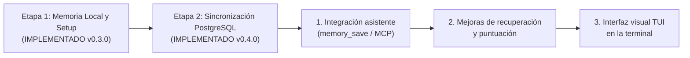

# 08. Límites de la Etapa y Hoja de Ruta Futura

> **Etapa:** Memoria Local y Sincronización PostgreSQL Opcional
> **Versiones de esta entrega:** Programa 0.4.0 | Formato de configuración 2 (local) / 3 (con sync) | Esquema SQLite 3 (local) / 4 (con sync)
> **Estado:** Vigente y Verificado (90 pruebas totales: 86 superadas y 4 omitidas sin binarios PG; 90 superadas, 0 fallos, 645 aserciones con PostgreSQL 17.6 aislado en macOS con Bun 1.3.8)
> **Traducción hermana:** [08 (EN). Stage Boundaries and Evolutionary Roadmap](../en/08-boundaries-and-roadmap.md)

Este documento declara con total transparencia qué capacidades se encuentran completamente implementadas en esta entrega (incluyendo el asistente interactivo `setup` y la sincronización opcional con PostgreSQL), qué límites técnicos existen actualmente, la política futura aprobada para asistentes inteligentes, cómo se compara nuestra arquitectura con Gentleman Programming y Softmax Data, y el orden oficial de las 3 fases de desarrollo pendientes.

---

## 1. Capacidades Completadas y Verificadas (Entrega Actual)

Las siguientes funciones se encuentran 100% implementadas en `src/`, probadas y verificadas por la suite de 90 pruebas automatizadas:

- [x] **Asistente Interactivo de Configuración Inicial (`setup`):** Guía visual paso a paso para personas que ejecutan la herramienta en su terminal interactiva (TTY), mostrando las rutas globales (`~/.forge614/.env` y `~/.forge614/engram.db`), ofreciendo sincronización opcional con PostgreSQL mediante las opciones exactas `No` y `Sí, configurar PostgreSQL`, aceptando la URL de conexión en entrada oculta (`[oculto]`), advirtiendo el alcance completo de réplica, solicitando confirmación explícita (`¿Confirmar? [si/NO]:`), devolviendo código de salida estándar `130` si se cancela y rechazando entornos no interactivos con el error controlado `INTERACTIVE_REQUIRED` (código `1`).
- [x] **Sincronización Opcional Directa con PostgreSQL:** Réplica completa del espacio de trabajo hacia un servidor PostgreSQL configurado por el usuario, sin servidores propietarios en la nube ni plataformas intermedias.
- [x] **Comandos de Sincronización Seguros:** Comando `sync` para una ronda única bajo demanda con salida JSON estructurada, y comando `sync-watch` para observación periódica en primer plano con intervalo configurable (`--interval <1..3600>`, por defecto 30 segundos) y salida limpia con `Ctrl+C` (código `130`).
- [x] **Resiliencia Fuera de Línea (Offline Resilience):** SQLite y FTS5 son siempre locales. Todas las operaciones de guardado, búsqueda, lectura e historial se ejecutan localmente en SQLite con cero latencia; una caída o desconexión de PostgreSQL jamás bloquea las operaciones locales ni transforma un guardado local en error de red.
- [x] **Migración Aditiva Segura en SQLite (Esquema 4):** Adición validada de la tabla `sync_checkpoints` al habilitar sincronización en `setup`, sin eliminar, truncar ni reconstruir tablas existentes. Deshabilitar la réplica conserva el esquema 4 y los datos locales intactos.
- [x] **Esquema Dedicado y Validación Exhaustiva en PostgreSQL (`forge614_sync`):** Creación y comprobación estricta de las tablas canónicas `revisions` y `state`, adquisición de bloqueo consultivo (`pg_advisory_xact_lock`) durante la inicialización DDL y verificación de que no existan disparadores, procedimientos ni reglas ajenas.
- [x] **Control de Concurrencia CAS y Revisiones Inmutables:** Bloqueo de cabecera en PostgreSQL mediante `SELECT head ... FOR UPDATE` (Compare-And-Swap) para evitar colisiones entre réplicas concurrentes, y almacenamiento inmutable de fotografías por hash SHA-256 (`ON CONFLICT (hash) DO NOTHING`).
- [x] **Protocolo Determinista de Fusión de Tres Vías (*3-Way Snapshot Merge*):** Reconciliación matemática entre el punto de control base (`base`), el estado local (`local`) y la cabeza remota (`remote`), combinando pacíficamente modificaciones de entidades independientes y verificando mediante `assertExtension` que ningún historial sea recortado o reescrito.
- [x] **Una Sola Configuración y Una Sola Base:** Almacén central en `~/.forge614/` con archivo de configuración única `.env` (formato 2 local o formato 3 con sync, permisos `0600`) y base SQLite única `engram.db` (permisos `0600`) bajo directorio privado (permisos `0700`).
- [x] **Identidad Estable de Proyecto (`projectId`):** Catálogo formal de proyectos en la tabla `projects` con identificador único universal (UUIDv4) en minúsculas. El nombre visible es cosmético; cambiar el nombre con `project-rename` no altera recuerdos ni identificador.
- [x] **Dos Alcances de Memoria (`scope`):** Separación lógica entre recuerdos de proyecto (`scope: "project"`, asociado a `projectId`) y recuerdos compartidos universales (`scope: "shared"`, con `projectId: null`, guardados una sola vez).
- [x] **Búsqueda Combinada con Excepciones por Tema (*Topic Override*):** La búsqueda en proyecto (`search --project-id <UUID>`) utiliza por defecto `--scope all`. Si el proyecto cuenta con un recuerdo activo con el mismo `topicKey` que una regla compartida, la decisión del proyecto sustituye a la general en ese proyecto sin alterar la regla compartida.
- [x] **Reversibilidad de Excepciones:** Archivar la excepción del proyecto reexpone la regla compartida; restaurarla reinstaura la prioridad del proyecto.
- [x] **Historial Inmutable y Auditoría:** Guardado de copias fotográficas (*snapshots*) en `memory_versions` para cada actualización temática y registro de eventos (`events`).
- [x] **Control Optimista de Concurrencia:** Obligatoriedad de `--expected-version` para actualizar notas temáticas existentes, impidiendo sobreescrituras desfasadas.
- [x] **Prevención de Duplicados (Idempotencia):** Soporte para `--request-key` con huella digital SHA-256 del contenido normalizado, con índices únicos parciales por alcance.
- [x] **Búsqueda Explicable con SQLite FTS5 Local:** Índice trigram con ponderación por campos (título 5.0, tema 3.0, contenido 1.0), multiplicador de prioridad (`pinned`) y curva de recencia suave (vida media de 30 días).
- [x] **Modo Literal de Respaldo:** Búsqueda automática y eficiente con plegado Unicode para términos de menos de 3 caracteres.
- [x] **SDK Síncrono para TypeScript:** Módulo `runSetup` y clases `MemoryWorkspace`, `WorkspaceConfig` y `MemoryStore` síncronas listas para su integración en código fuente, manteniendo los módulos de sincronización como infraestructura interna.

---

## 2. Límites y Restricciones Vigentes

Para mantener expectativas realistas, es indispensable tener presentes las siguientes restricciones de la etapa actual:

1. **Límite de tamaño de fotografía (8 MiB):**
   Cada snapshot completo tiene un tope máximo estricto de 8 MiB (`SYNC_TOO_LARGE`). Si el tamaño acumulado de todos los proyectos, recuerdos e historial supera este límite, la sincronización se detiene para evitar consumos desmedidos de memoria.
2. **Sin resolución automática de conflictos de sincronización:**
   Si dos réplicas modificaron de forma diferente la misma entidad respecto a la base, el sistema arroja `SYNC_CONFLICT` y detiene la ronda. **No existe en esta versión un comando interactivo o heurística automática para fusionar textos en conflicto**. Nunca borres tablas ni puntos de control para forzar la sincronización.
3. **Costo de fotografías completas (sin transporte incremental):**
   La sincronización transmite fotografías completas del espacio de trabajo, no deltas ni flujos incrementales por evento. Tampoco incluye compresión gzip en tránsito ni cifrado de extremo a extremo adicional al TLS de la conexión.
4. **`sync-watch` es un proceso en primer plano (sin servicios de sistema):**
   No se instalan servicios en segundo plano (*systemd*, *launchd*) ni demonios permanentes. Si cierras la ventana de terminal donde corre `sync-watch`, los reintentos se detienen. Los datos locales permanecen seguros en SQLite y se sincronizarán en la próxima ejecución.
5. **SQLite y FTS5 son estrictamente locales:**
   PostgreSQL no cuenta con un índice `tsvector`, ni consultas `ts_rank_cd`, ni modo `postgres-fts`. La búsqueda de texto completo se ejecuta **siempre en SQLite local**.
6. **Sin comprensión semántica ni vectores de IA (*Embeddings*):**
   El buscador actual se basa en coincidencias de caracteres exactos mediante trigramas y BM25. No comprende sinónimos de manera contextual.
7. **Sin presupuesto de contexto (Tokens de IA):**
   El comando `search` devuelve notas completas sin recortarlas ni ajustarlas a un límite de tokens de una ventana de contexto.
8. **Sin servidor MCP ni integración proactiva con asistentes:**
   No existe todavía un servidor MCP (*Model Context Protocol*) ni ganchos automáticos para que los asistentes guarden recuerdos solos en segundo plano. El guardado es estrictamente manual o programático.
9. **Sin permisos multiusuario ni contraseñas dentro de la base:**
   El `projectId` organiza la información dentro de la base, pero no es una contraseña ni un mecanismo de autenticación. Cualquier programa ejecutado por tu usuario en el sistema operativo puede consultar el archivo local.

---

## 3. Comparativa de Arquitectura frente a Gentleman y Softmax

<table header-row="true">
<tr>
<td>Criterio</td>
<td>🎩 Gentleman Programming</td>
<td>🧩 Softmax Data</td>
<td>🧠 Forge614 Engram (Entrega Actual)</td>
</tr>
<tr>
<td>**Ubicación de Datos**</td>
<td>Bases SQLite por proyecto o carpetas locales.</td>
<td>Servidor central en la nube propietaria.</td>
<td>**Base local única (`~/.forge614/engram.db`) con réplica de sincronización PostgreSQL opcional y directa.**</td>
</tr>
<tr>
<td>**Configuración Inicial**</td>
<td>Manual o scripts ad-hoc.</td>
<td>Registro y aprovisionamiento en la nube.</td>
<td>**Asistente interactivo amigable (`setup`) con soporte opcional de PostgreSQL y salida estándar.**</td>
</tr>
<tr>
<td>**Recuerdos Compartidos**</td>
<td>No nativos (aislados por proyecto).</td>
<td>Espacios de trabajo en la nube.</td>
<td>**Nativo (`scope: shared`): guardados una sola vez, visibles en todos los proyectos y sincronizados en la réplica.**</td>
</tr>
<tr>
<td>**Sustitución de Reglas**</td>
<td>Manual por el usuario en prompts.</td>
<td>Reglas ponderadas por vectores.</td>
<td>**Sustitución por tema (*Topic Override*) en SQL con reversibilidad inmediata.**</td>
</tr>
<tr>
<td>**Sincronización Multi-equipo**</td>
<td>No disponible (archivos aislados).</td>
<td>Centralizada en sus servidores.</td>
<td>**Directa a tu propio PostgreSQL (`sync` / `sync-watch`) sin servidores intermediarios.**</td>
</tr>
<tr>
<td>**¿Quién decide qué guardar?**</td>
<td>El asistente de IA mediante *skills* y herramientas `mem_save`.</td>
<td>Un modelo extractor en segundo plano (*Reflector*).</td>
<td>**Etapa actual:** Manual / SDK. **Etapa futura:** Integración proactiva vía `memory_save` con directriz de alcance estricta.</td>
</tr>
<tr>
<td>**Costo y Privacidad**</td>
<td>0 USD en almacenamiento; consume tokens en el chat.</td>
<td>Consume llamadas de API de pago (OpenAI embeddings).</td>
<td>**0 USD:** 100% local, cero tokens, sin intermediarios en la nube ni telemetría.</td>
</tr>
</table>

---

## 4. Política Futura Aprobada para Asistentes Inteligentes

> [!IMPORTANT]
> **ESTADO: POLÍTICA APROBADA PENDIENTE DE IMPLEMENTACIÓN.**
> Cuando los asistentes inteligentes (Claude Code, Cursor, Antigravity) cuenten con herramientas automáticas (`memory_save` / MCP), deberán regirse bajo las siguientes reglas operativas estrictas para evitar contaminación de recuerdos:

1. **Ámbito por defecto a nivel de proyecto (`scope: "project"`):**
   Cualquier decisión técnica, arquitectura, comando de compilación, ruta de archivo o corrección de error descubierta durante la sesión de trabajo se asocia obligatoriamente al `projectId` del espacio activo.
2. **Promoción a compartido (`scope: "shared"`) exclusivamente con intención global explícita:**
   Un recuerdo sólo podrá guardarse como compartido si el usuario manifiesta de manera inequívoca que la regla aplica a nivel global o entre proyectos (evaluado dentro del contexto de la conversación, nunca por la presencia aislada de palabras como *"siempre"* o por mera repetición).
3. **Cero caídas automáticas a compartido ante ambigüedad:**
   Si el asistente no puede determinar con certeza el `projectId` activo o si una regla debe ser universal, está terminantemente prohibido asumir `scope: "shared"` por descarte. El asistente debe solicitar confirmación al usuario antes de registrar la memoria.

---

## 5. Hoja de Ruta Oficial (3 Fases Pendientes de Implementación)

> [!NOTE]
> Las etapas previas **Asistente interactivo de configuración** (v0.3.0) y **Sincronización opcional con PostgreSQL** (v0.4.0) han sido **COMPLETADAS SATISFACTORIAMENTE**. Las siguientes 3 fases representan el orden cronológico estricto de desarrollo para las próximas entregas:

### 1. Integración del asistente mediante `memory_save`
Desarrollo de las herramientas MCP (*Model Context Protocol*) y ganchos (*hooks*) para que los asistentes de inteligencia artificial (Claude Code, Cursor, Antigravity) reconozcan hitos en la conversación y guarden recuerdos de forma proactiva bajo la directriz de alcance aprobada.

### 2. Mejoras adicionales de recuperación y puntuación
Implementación de algoritmos avanzados de poda de contexto, presupuestos de consumo de tokens, soporte de sinónimos mediante diccionarios y refinamiento matemático de relevancia.

### 3. Interfaz visual TUI dentro de la terminal
Una aplicación visual de texto (*Text User Interface*) construida para navegar proyectos, inspeccionar recuerdos, auditar versiones y gestionar archivos mediante el teclado sin salir de la consola.

---

## 6. Reporte Oficial de Pruebas de esta Entrega

La presente entrega documental y técnica cuenta con respaldo y verificación directa mediante la suite automatizada en **macOS con Bun 1.3.8**:

- **Pruebas unitarias y de integración:** **90 pruebas totales** distribuidas en 11 archivos de prueba:
  - **86 pruebas superadas y 4 omitidas** en ejecución estándar (las 4 pruebas omitidas corresponden a la integración con PostgreSQL real cuando la variable `FORGE614_TEST_POSTGRES_BIN` no está definida en el entorno).
  - **90 pruebas superadas (0 fallos) y 645 aserciones** al ejecutar con clúster aislado de PostgreSQL 17.6 en loopback.
- **Archivos de prueba verificados:** `store.test.ts`, `install.test.ts`, `sync.test.ts`, `workspace.test.ts`, `projects.test.ts`, `setup-terminal.test.ts`, `shared.test.ts`, `postgres-sync.test.ts`, `cli.test.ts`, `setup.test.ts`, `workspace-config.test.ts`.
- **Verificación de tipos (TypeScript):** `bun run typecheck` (`tsc --noEmit`) finalizado con **0 errores**.
- **Consistencia de código:** `git diff --check` limpio y sin espacios en blanco corruptos.
- **Pruebas de concurrencia y desconexión:** Verificado que `sync-watch` reporta la pérdida de red, permite guardar y consultar localmente en SQLite sin interrupciones, y finaliza limpiamente con código 130 al presionar `Ctrl+C`.
