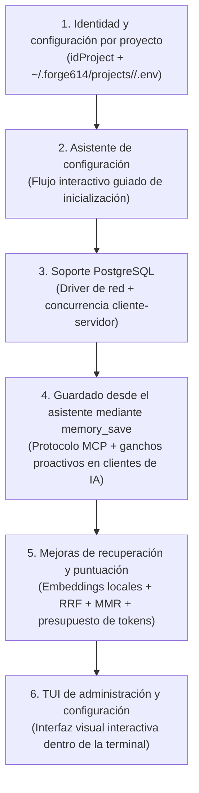

# 08. Límites de la Etapa 1 y Hoja de Ruta Futura

> **Etapa:** Etapa 1 — Memoria Local  
> **Estado:** Vigente y Activo (Incluye diseño aprobado pendiente de implementación)  
> **Traducción hermana:** [08 (EN). Stage 1 Boundaries and Evolutionary Roadmap](../en/08-boundaries-and-roadmap.md)

Este documento declara con absoluta transparencia qué capacidades se encuentran implementadas en esta **Etapa 1**, qué limitaciones técnicas existen actualmente, cómo se compara nuestro enfoque con Gentleman Programming y Softmax Data, el diseño arquitectónico aprobado para la identidad del proyecto (`idProject`), y el orden oficial de trabajo pendiente hacia las próximas etapas.

---

## 1. Capacidades Completadas y Verificadas (Etapa 1)

Las siguientes funciones están 100% implementadas en el código fuente de este repositorio y verificadas por la suite de pruebas automatizadas (`bun test`):

- [x] **Almacén centralizado de usuario:** Base SQLite en `~/.forge614/engram.db` compartida entre carpetas de trabajo con modo WAL, integridad referencial y tiempo de espera de 5000ms.
- [x] **Instalador de binario autónomo:** Script `scripts/install.sh` que compila un ejecutable independiente (`forge614-engram`) en `$HOME/.local/bin` utilizable sin requerir Bun ni Node en PATH.
- [x] **Historial inmutable de versiones:** Cada actualización de una memoria temática preserva una copia snapshot de su contenido en `memory_versions`.
- [x] **Control de concurrencia optimista:** Actualizar un tema exige especificar la versión esperada (`expectedVersion`), impidiendo que dos procesos pisen notas sin leerlas antes.
- [x] **Prevención de duplicados (Idempotencia):** Soporte para `requestKey` con verificación criptográfica de huella digital SHA-256.
- [x] **Búsqueda textual explicable:** Motor FTS5 con tokenizador trigram y ponderación por campos (título: 5.0, tema: 3.0, contenido: 1.0).
- [x] **Fórmula matemática de relevancia:** Combinación de puntuación BM25, multiplicador de notas prioritarias (`pinned`) y factor de decaimiento por antigüedad temporal ($r$).
- [x] **Modo literal de respaldo:** Búsqueda transparente para términos cortos de menos de 3 caracteres (como `"UI"` o `"DB"`), insensible a mayúsculas y acentos Unicode.
- [x] **Visibilidad reversible:** Archivar notas para retirarlas de las búsquedas activas sin borrar su historia y restaurarlas en cualquier momento.
- [x] **Herramienta de terminal robusta (CLI):** Comando `forge614-engram` con soporte para `--version`, validación estricta previa a la apertura de base de datos y salida JSON estructurada.
- [x] **SDK para TypeScript:** Clase `MemoryStore` lista para ser importada en proyectos internos con resolución automática de la base del usuario.

---

## 2. Límites y Restricciones Vigentes en la Etapa 1

Para evitar falsas expectativas, es fundamental tener presentes las siguientes restricciones actuales:

1. **Guardado manual (sin captura automática de chat):**  
   En esta Etapa 1, el programa guarda únicamente cuando tú escribes `forge614-engram save` o cuando un código llama a `store.save(...)`. No existe todavía un proceso que escuche silenciosamente tus conversaciones de IA.
2. **Identificación por nombre (`--project`):**  
   En la versión actual se utiliza el nombre textual del proyecto para aislar recuerdos. La identidad inmutable mediante `idProject` es un diseño aprobado que aún no está implementado.
3. **Búsqueda estrictamente literal (sin vectores de significado):**  
   El buscador actual analiza únicamente coincidencias de palabras exactas mediante trigramas y BM25. No comprende sinónimos ni conceptos afines (por ejemplo, buscar *"automóvil"* no encontrará notas que hablen de *"coche"*).
4. **Sin presupuesto de palabras (Tokens de IA):**  
   El comando `search` devuelve el contenido completo de cada recuerdo coincidente sin recortarlo para una ventana de contexto específica.
5. **Sin servidor de red ni protocolo MCP:**  
   No hay todavía un servidor MCP (*Model Context Protocol*) ni un servidor HTTP local para conectar Claude Desktop, Windsurf o Cursor como enchufes de red.
6. **Sin sesiones de conversación ni resúmenes de relevo:**  
   No existe el concepto de sesión de trabajo ni comandos automáticos de cierre de día.
7. **Sin sistema de estrellas ni aprendizaje por refuerzo:**  
   No hay calificación de utilidad de recuerdos (`success` / `failure`) ni cálculo de saliencia efectiva.
8. **Sin exportación ni importación de respaldo:**  
   Las funciones `archive` y `restore` solo alteran la visibilidad de las notas. No existe aún un comando para empaquetar o exportar la base de datos a archivos externos.
9. **Sin borrado permanente:**  
   No existe un comando `delete` para eliminar filas de forma destructiva; las notas obsoletas se conservan archivadas.

---

## 3. Comparativa de Enfoques: ¿Cómo Guardan Gentleman, Softmax y Forge614?

Una duda recurrente es: *¿por qué Gentleman Programming parece no exigir comandos de guardado manuales?*

<table header-row="true">
<tr>
<td>Criterio</td>
<td>🎩 Gentleman Programming</td>
<td>🧩 Softmax Data</td>
<td>🧠 Forge614 Engram</td>
</tr>
<tr>
<td>**¿Quién decide qué guardar?**</td>
<td>**El propio asistente de código** (Claude, Cursor) siguiendo instrucciones de sistema (*prompt/skill*) que le ordenan llamar a `mem_save` cuando detecta un aprendizaje.</td>
<td>**Un modelo extractor secundario** (*Reflector*) en el servidor que analiza pasivamente el chat completo.</td>
<td>**Etapa 1:** Manual (usuario o código).<br>**Etapa 2 (Planificada):** Híbrido proactivo del asistente vía MCP + reglas de extracción.</td>
</tr>
<tr>
<td>**Captura Pasiva / Ganchos**</td>
<td>Usa *hooks* (ej. `SubagentStop` en Claude Code) que envían texto a scripts con expresiones regulares (`ExtractLearnings`).</td>
<td>Envía el texto crudo a la API del servidor.</td>
<td>**Pendiente para Etapa 2.**</td>
</tr>
<tr>
<td>**Costo de Tokens**</td>
<td>Consume contexto y herramientas en el chat del asistente (no es costo cero en tokens de entrada).</td>
<td>Quema llamadas de API con OpenAI para el Reflector y los *embeddings*.</td>
<td>**0 USD:** 100% local, cero tokens en Etapa 1. En Etapa 2 utilizará herramientas locales.</td>
</tr>
</table>

> [!NOTE]
> En ningún sistema basta con instalar un ejecutable para que "adivine mágicamente" las conversaciones. Siempre se requiere un puente de integración (protocolo MCP o ganchos en el cliente de IA) que entregue los datos al almacén de memoria.

---

## 4. Diseño Aprobado: Identidad del Proyecto (`idProject`) y Configuración Segura

> [!IMPORTANT]
> **ESTADO: DISEÑO APROBADO PENDIENTE DE IMPLEMENTACIÓN.**  
> Los conceptos descritos en esta sección han sido aprobados para el desarrollo de las siguientes fases, pero **NO están implementados todavía en el código actual**. No intentes ejecutar comandos inexistentes ni asumas que la estructura `~/.forge614/projects/` ya está en uso.

### 4.1. Principios de Identidad con `idProject`
1. **Identificador único y estable (`idProject`):**  
   Cada proyecto tendrá un identificador único, inmutable y estable llamado exactamente `idProject`. Será el mismo identificador utilizado tanto en la configuración local de la máquina como en la base de datos para asociar los recuerdos al proyecto correspondiente.
2. **Separación entre nombre visible e identidad:**  
   El nombre visible del proyecto (ej. *"Tienda Virtual"*) será únicamente una etiqueta descriptiva independiente de su identificador. Cambiar el nombre visible del proyecto no cambiará su identidad ni provocará que se pierda el acceso a sus recuerdos.
3. **Nombres duplicados permitidos:**  
   Dos proyectos distintos pueden tener el mismo nombre visible y coexistir pacíficamente, ya que poseerán diferentes `idProject`.
4. **Reutilización entre computadoras:**  
   Cuando otra computadora, máquina virtual o nueva instalación deba conectarse a un proyecto existente, **deberá reutilizar el `idProject` ya asignado**, en lugar de generar un identificador nuevo.
5. **Aislamiento en servidores compartidos:**  
   Compartir un servidor o una base de datos (como una instancia central de PostgreSQL) no significa mezclar proyectos: una misma base podrá contener múltiples proyectos aislados limpiamente mediante su respectivo `idProject`.
6. **`idProject` no es una contraseña:**  
   El `idProject` identifica a qué proyecto pertenecen los datos; no es un secreto ni sustituye los mecanismos de autenticación o permisos de acceso del sistema o de la base de datos.
7. **Detalles pendientes de definición:**  
   El formato exacto del identificador (ej. UUID, prefijo alfanumérico), su algoritmo de generación y los comandos específicos de la terminal para importarlo o vincularlo se definirán formalmente durante su fase de implementación.
8. **Transición segura sin pérdida de datos:**  
   Los recuerdos ya almacenados en la Etapa 1 bajo nombres de proyecto requerirán un proceso de transición seguro hacia este nuevo esquema de identidad. Dicha migración aún no existe y será desarrollada de forma transparente para no perder ningún recuerdo histórico.

---

### 4.2. Estructura de Configuración y Seguridad de Credenciales

```text
carpeta del usuario (~/)
  └── .forge614/
        ├── engram.db                      (almacén SQLite local de usuario)
        └── projects/                      (PENDIENTE DE IMPLEMENTACIÓN)
              └── <idProject>/
                    └── .env               (configuración privada de este proyecto)
```

1. **Ubicación privada en la carpeta del usuario:**  
   La configuración de cada proyecto residirá en `~/.forge614/projects/<idProject>/.env`. Cada proyecto podrá utilizar una conexión diferente (ej. SQLite local en un proyecto y PostgreSQL en otro).
2. **Nunca dentro del repositorio:**  
   El archivo de configuración `.env` reside siempre en el directorio del usuario del sistema operativo, **jamás dentro del árbol de carpetas del repositorio Git de tu código**, evitando fugas accidentales al hacer commits.
3. **Un archivo oculto no es un archivo cifrado:**  
   Que un archivo comience con un punto (`.env`) en Linux/macOS solo significa que no se muestra por defecto en el explorador de archivos. No está cifrado. Por ende:
   - Los archivos `.env` deben contar con permisos de archivo estrictamente restringidos en el sistema operativo (ej. `chmod 600`).
   - Las credenciales y contraseñas de bases de datos **jamás deben aparecer en registros de terminal (logs), capturas de pantalla, mensajes enviados a asistentes de IA ni documentación pública**.
4. **Reglas estrictas de conexión a bases de datos:**  
   - Solo se permite inicializar automáticamente bases de datos que estén completamente **vacías y dedicadas** a Forge614 Engram.
   - Al conectar con una base de datos existente y compatible, el sistema reutilizará los datos sin borrar recuerdos existentes y **sin alterar automáticamente la estructura de tablas al momento de la conexión**.
   - La sentencia SQL `CREATE TABLE IF NOT EXISTS` **no sustituye** la verificación estricta de la estructura relacional ni la validación del número de versión de esquema (`user_version` / migraciones).

---

## 5. Orden Oficial de Trabajo Pendiente (Backlog Priorizado)

El desarrollo futuro de Forge614 Engram seguirá estrictamente el siguiente orden secuencial de fases:



1. **Identidad y configuración por proyecto:** Implementación formal de `idProject`, directorio `~/.forge614/projects/<idProject>/.env` y migración segura de datos existentes.
2. **Asistente de configuración:** Asistente interactivo por preguntas en terminal para configurar proyectos, rutas y conexiones sin editar archivos a mano.
3. **Soporte PostgreSQL:** Capacidad de conectar a bases de datos PostgreSQL para compartir recuerdos en red entre múltiples miembros o máquinas.
4. **Guardado desde el asistente mediante `memory_save`:** Conector oficial del protocolo MCP (*Model Context Protocol*) y ganchos (*hooks*) para que el asistente de IA guarde aprendizajes de forma proactiva durante la sesión de trabajo.
5. **Mejoras de recuperación y puntuación:** Búsqueda híbrida con vectores de significado (*embeddings* locales), fusión recíproca de rangos (*RRF*), diversidad con *MMR* y control de presupuesto de tokens.
6. **TUI de administración y configuración:** Interfaz visual dentro de la terminal para gestionar proyectos y conexiones cómodamente.

---

## 6. Alcance Inicial Propuesto de la TUI

### ¿Qué es una TUI?
**TUI** significa **"interfaz visual dentro de la terminal"** (*Text-based User Interface*).  
A diferencia de una CLI donde tienes que recordar y teclear comandos largos (como `forge614-engram save --project ...`), una TUI dibuja paneles, botones y listas navegables con las flechas del teclado y la tecla Enter directamente dentro de tu ventana de consola habitual, sin necesidad de abrir un navegador web ni instalar ventanas pesadas.

### Alcance Inicial Aprobado para la Fase 6:
- **Listado de proyectos:** Ver una tabla con todos los proyectos configurados localmente, mostrando su nombre descriptivo y su `idProject`.
- **Tipo de almacenamiento:** Indicar claramente si cada proyecto almacena sus datos en **SQLite local** o en **PostgreSQL**.
- **Gestión de proyectos:** Añadir proyectos nuevos o conectar proyectos existentes reutilizando su `idProject`.
- **Diagnóstico seguro de conexiones:** Revisar y probar la conectividad con la base de datos (ping y lectura de versión) sin revelar contraseñas ni credenciales en la pantalla.
- **Proyecto activo y estado:** Seleccionar cuál es el proyecto de trabajo activo en la terminal y consultar el número de memorias guardadas.
- **Desconexión segura:** Desconectar un proyecto de la máquina actual sin eliminar ni modificar sus recuerdos en la base de datos compartida.

> [!NOTE]
> Cualquier funcionalidad visual adicional para la TUI queda pendiente de definición y será evaluada durante el desarrollo de su fase correspondiente.
