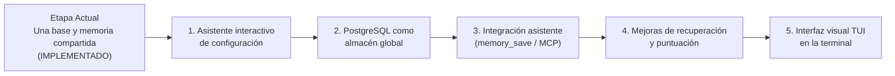

# 08. Límites de la Etapa y Hoja de Ruta Futura

> **Etapa:** Etapa 1 — Memoria Local (Una Sola Base y Recuerdos Compartidos)
> **Versiones de esta entrega:** Programa 0.2.0 | Formato de configuración 2 | Esquema SQLite 3
> **Estado:** Vigente y Verificado (65 pruebas superadas, 0 fallos en macOS con Bun 1.3.8)
> **Traducción hermana:** [08 (EN). Stage 1 Boundaries and Evolutionary Roadmap](../en/08-boundaries-and-roadmap.md)

Este documento declara con total transparencia qué capacidades se encuentran completamente implementadas en esta entrega, qué límites técnicos existen actualmente, cómo se compara nuestra arquitectura con Gentleman Programming y Softmax Data, y el orden oficial de las 5 fases de desarrollo pendientes.

---

## 1. Capacidades Completadas y Verificadas (Entrega Actual)

Las siguientes funciones se encuentran 100% implementadas en `src/`, probadas y verificadas por la suite de 65 pruebas automatizadas:

- [x] **Una Sola Configuración y Una Sola Base:** Almacén central en `~/.forge614/` con archivo de configuración única `.env` (modo `0600`) y base SQLite única `engram.db` (modo `0600`) bajo directorio privado (modo `0700`).
- [x] **Identidad Estable de Proyecto (`projectId`):** Catálogo formal de proyectos en la tabla `projects` con UUIDv4 en minúsculas. El nombre visible es una etiqueta cosmética; cambiar el nombre con `project-rename` no altera recuerdos ni identificador.
- [x] **Dos Alcances de Memoria (`scope`):** Separación lógica entre recuerdos de proyecto (`scope: "project"`, asociado a `projectId`) y recuerdos compartidos universales (`scope: "shared"`, con `projectId: null`, guardados una sola vez).
- [x] **Búsqueda Combinada con Excepciones por Tema (*Topic Override*):** La búsqueda en proyecto (`search --project-id <UUID>`) utiliza por defecto `--scope all`. Si el proyecto cuenta con un recuerdo activo con el mismo `topicKey` que una regla compartida, la decisión del proyecto sustituye a la general en ese proyecto sin alterar la regla compartida.
- [x] **Reversibilidad de Excepciones:** Archivar la excepción del proyecto reexpone la regla compartida; restaurarla reinstaura la prioridad del proyecto.
- [x] **Historial Inmutable y Auditoría:** Guardado de copias fotográficas (*snapshots*) en `memory_versions` para cada actualización temática y registro de eventos (`events`).
- [x] **Control Optimista de Concurrencia:** Obligatoriedad de `--expected-version` para actualizar notas temáticas existentes, impidiendo sobreescrituras desfasadas.
- [x] **Prevención de Duplicados (Idempotencia):** Soporte para `--request-key` con huella SHA-256 del contenido normalizado, con índices únicos parciales por alcance.
- [x] **Búsqueda Explicable con SQLite FTS5:** Índice trigram con ponderación por campos (título 5.0, tema 3.0, contenido 1.0), multiplicador de prioridad (`pinned`) y curva de recencia suave (vida media de 30 días).
- [x] **Modo Literal de Respaldo:** Búsqueda automática y eficiente con plegado Unicode para términos de menos de 3 caracteres.
- [x] **Herramienta de Consola Robusta (CLI):** Comandos `init`, `project-create`, `project-list`, `project-rename`, `save`, `search`, `get`, `history`, `archive`, `restore`, validación previa a la apertura de base y salida JSON estructurada.
- [x] **SDK para TypeScript:** Clases `MemoryWorkspace`, `WorkspaceConfig` y `MemoryStore` listas para su integración en código fuente.
- [x] **Seguridad Atómica de Archivos:** Rechazo estricto de enlaces simbólicos, enlaces duros, propietarios ajenos, directorios antiguos `projects/` (`LEGACY_CONFIG`) y esquemas SQLite previos (`MIGRATION_REQUIRED`).

---

## 2. Límites y Restricciones Vigentes

Para mantener expectativas realistas, es indispensable tener presentes las siguientes restricciones de la etapa actual:

1. **Guardado manual o por código (sin captura automática en segundo plano):**
   El sistema guarda únicamente cuando escribes `forge614-engram save` o cuando un script invoca `store.save(...)`. No hay ningún proceso o demonio que escuche pasivamente tus conversaciones de chat.
2. **Sin comprensión semántica ni vectores de IA (*Embeddings*):**
   El buscador actual se basa en coincidencias de palabras exactas mediante trigramas y BM25. No comprende sinónimos (por ejemplo, buscar *"coche"* no encontrará notas que hablen de *"automóvil"*).
3. **Sin presupuesto de contexto (Tokens de IA):**
   El comando `search` devuelve notas completas sin recortarlas ni ajustarlas a un límite de tokens de una ventana de contexto.
4. **Sin servidor MCP ni enchufes de red:**
   No existe todavía un servidor MCP (*Model Context Protocol*) ni un servidor HTTP para conectar asistentes externos como Claude Desktop o Cursor mediante la red local.
5. **Sin permisos multiusuario ni contraseñas:**
   El `projectId` organiza la información dentro de la base, pero no es una contraseña ni un mecanismo de autenticación. Cualquier programa ejecutado por tu usuario en el sistema operativo puede consultar el archivo.
6. **Sin borrado permanente:**
   No existe un comando destructivo `delete`; las notas obsoletas se retiran mediante `archive` conservando su trazabilidad.
7. **Sin migración automática de esquemas antiguos:**
   Si se detecta una base con esquema 1 o 2, el sistema la rechaza con `MIGRATION_REQUIRED`. No se ejecuta ninguna transformación destructiva sobre bases reales.

---

## 3. Comparativa de Arquitectura frente a Gentleman y Softmax

<table header-row="true">
<tr>
<td>Criterio</td>
<td>🎩 Gentleman Programming</td>
<td>🧩 Softmax Data</td>
<td>🧠 Forge614 Engram</td>
</tr>
<tr>
<td>**Ubicación de Datos**</td>
<td>Bases SQLite por proyecto o carpetas locales.</td>
<td>Servidor central en la nube.</td>
<td>**Una única base (`~/.forge614/engram.db`) y un solo `.env` en la carpeta del usuario.**</td>
</tr>
<tr>
<td>**Recuerdos Compartidos**</td>
<td>No nativos (aislados por proyecto).</td>
<td>Espacios de trabajo en la nube.</td>
<td>**Nativo (`scope: shared`): guardados una sola vez, visibles en todos los proyectos.**</td>
</tr>
<tr>
<td>**Sustitución de Reglas**</td>
<td>Manual por el usuario en prompts.</td>
<td>Reglas ponderadas por vectores.</td>
<td>**Sustitución por tema (*Topic Override*) en SQL con reversibilidad inmediata.**</td>
</tr>
<tr>
<td>**¿Quién decide qué guardar?**</td>
<td>El asistente de IA mediante *skills* y herramientas `mem_save`.</td>
<td>Un modelo extractor en segundo plano (*Reflector*).</td>
<td>**Etapa actual:** Manual / SDK. **Etapa futura:** Integración proactiva vía `memory_save`.</td>
</tr>
<tr>
<td>**Costo y Privacidad**</td>
<td>0 USD en almacenamiento; consume tokens en el chat.</td>
<td>Consume llamadas de API de pago (OpenAI embeddings).</td>
<td>**0 USD:** 100% local, cero tokens, sin llamadas a internet ni telemetría.</td>
</tr>
</table>

---

## 4. Hoja de Ruta Oficial (5 Etapas Pendientes de Implementación)

> [!IMPORTANT]
> **ESTADO: DISEÑO APROBADO PENDIENTE DE IMPLEMENTACIÓN.**
> Los siguientes 5 hitos representan el orden cronológico estricto de desarrollo para las próximas entregas. Ninguna de estas funciones existe en la versión actual.

### 1. Asistente interactivo de configuración
Un asistente interactivo por consola que guíe al usuario en la preparación inicial de su espacio, validación de permisos y configuración guiada sin edición manual de archivos.

### 2. PostgreSQL como almacenamiento global
Opción para configurar una base de datos PostgreSQL global dentro del mismo archivo `~/.forge614/.env`, sustituyendo el almacenamiento SQLite local para quienes requieran centralización en un servidor de red.

### 3. Integración del asistente mediante `memory_save`
Desarrollo de las herramientas MCP y ganchos (*hooks*) para que los asistentes de inteligencia artificial (Claude Code, Cursor, Antigravity) reconozcan hitos en la conversación y guarden recuerdos de forma proactiva.

### 4. Mejoras adicionales de recuperación y puntuación
Implementación de algoritmos avanzados de poda de contexto, presupuestos de tokens, soporte de sinónimos y refinamiento matemático de relevancia.

### 5. Interfaz visual TUI dentro de la terminal
Una aplicación visual de texto (*Text User Interface*) construida para navegar proyectos, inspeccionar recuerdos, auditar versiones y gestionar archivos mediante el teclado sin salir de la consola.

---

## 5. Reporte Oficial de Pruebas de esta Entrega

La presente entrega documental y técnica cuenta con respaldo y verificación directa mediante la suite automatizada en **macOS con Bun 1.3.8**:

- **Pruebas unitarias y de integración:** **65 pruebas superadas (0 fallos)** con **483 aserciones**.
- **Verificación de tipos (TypeScript):** `bun run typecheck` (`tsc --noEmit`) finalizado con **0 errores**.
- **Consistencia de código:** `git diff --check` limpio y sin espacios en blanco corruptos.
- **Pruebas de concurrencia y seguridad:** 45 ejecuciones concurrentes en 15 rondas sobre SQLite real, verificando atomicidad de creación, exclusión mutua de bloqueos y rechazo estricto de enlaces simbólicos y directorios antiguos.
